# 🚿 Bathroom Emergency Guide

**Version 3.2.0 · 2026-05-03**

> *"You're in a bathroom. That's already a good start."*

A decision-support tool for situations ranging from acute anxiety
and physical pain to — hypothetically — zombie apocalypses.
Built with scientific rigor and bathroom-tested pragmatism.

Deploy strategically. Read when needed. Breathe always.
The math is optional. The breathing is not.

---

**Document Control**

| Field | Value |
|-------|-------|
| Title | Bathroom Emergency Guide |
| Version | 3.2.0 |
| Date | 2026-05-03 |
| Classification | Personal — Bathroom Deployment |
| Build | markdown → Pandoc → HTML/WeasyPrint PDF/DOCX |
| Chapters | 11 (00–10) |
| Diagrams | 6 original + 8 scientific diagrams |
| Notation | LaTeX math ($...$ / $$...$$), Pandoc footnotes |
| Scientific enhancements | GAD-7, NRS, HRV, cortisol decay, Dunbar numbers, Ostrom's principles, cognitive load theory, Bayes' triage, physiological sigh research, IASC pyramid |

---

*Turn the page to begin.*


---
---
title: "How to Use This Guide"
chapter: 1
revision: "3.2.0"
last_updated: "2026-05-03"
dependencies:
  - ../diagrams/master_flowchart.png
  - ../diagrams/decision_flow_graph.png
---

# How to Use This Guide

## Purpose

This document is a decision-support tool designed for deployment in a bathroom environment. It provides structured guidance for situations ranging from acute anxiety and physical pain to — hypothetically — zombie apocalypses. Every path through this guide converges on one of four practical destinations: the **Calm Guide** (→ Ch.4), the **Self Ambulance Guide** (→ Ch.5), the **Zombie Guide** (→ Ch.6), or the **Professional Support Directory** (→ Ch.7). Regardless of where you enter, you will always be routed toward actionable next steps.

The guide's architecture is formally a directed acyclic graph (DAG) — a structure where information flows in one direction and never loops back on itself (except where explicitly marked 🔁). This means you can enter at any point and still reach a destination without getting stuck in circular reasoning, which is more than most anxious brains can claim.

## Target Audience

Anyone currently in a bathroom who needs guidance — emotional, medical, ethical, or existential. No prerequisites beyond physical presence and a willingness to read. The guide assumes no prior training in first aid, psychology, or zombie survival, though it helps if you can operate a door lock.

## Mathematical Notation Legend

This guide uses LaTeX math notation to formalize certain concepts — not because bathrooms require calculus, but because precision reduces ambiguity, and ambiguity is the fuel of anxiety. Here's how to read the notation:

| Notation | Meaning | Example |
|----------|---------|---------|
| `$x$` | Inline math — a variable or formula within text | Heart rate $HR \in [60, 100]$ bpm |
| `$$...$$` | Display math — a standalone formula | $$C(t) = C_0 \cdot e^{-\lambda t}$$ |
| `$\in$` | "is an element of" — value belongs to a set | $NRS \in [0, 10]$ |
| `$\approx$` | Approximately equal | $t_{reset} \approx 10\text{min}$ |
| `$\rightarrow$` | Approaches or leads to | $n \rightarrow \infty$ |

If you see a formula and think "I don't need this right now" — skip it. The plain-language explanation always follows the math. The formulas are for when you want to understand *why* the plain language works.

## Quick-Start Procedure

1. Identify your current situation from the **Master Flowchart** below (or from the list of seven entry points).
2. Follow the numbered steps along your path. Decisions are marked with ◆; destinations are marked with 📍.
3. Every path ends at one or more destination guides. Go there. Read. Act.
4. If multiple paths apply, handle the most urgent one first (prioritize: physical safety > acute distress > everything else).

## Guide Topology — A Graph-Theoretic Model

For the mathematically inclined (or the analytically anxious who need to understand the structure before trusting it), this guide can be formalized as a directed graph:

$$G = (V, E)$$

where $V$ is the set of nodes and $E$ is the set of directed edges. Our guide topology has:

- **Entry nodes** ($|V_{entry}| = 7$): Situations A through G — the seven ways you arrived in this bathroom
- **Decision nodes** ($|V_{decision}| \approx 14$): Internal ◆ points within each situation
- **Destination nodes** ($|V_{dest}| = 4$): The four destination guides (Calm, Self Ambulance, Zombie, Professional Support)

The total graph: $|V| = 25$ nodes, $|E| \approx 38$ directed edges. Every path from an entry node reaches at least one destination node — this is the graph's **reachability invariant**, and it's what guarantees you'll never get stuck in this guide without a next step.[^graph_theory]

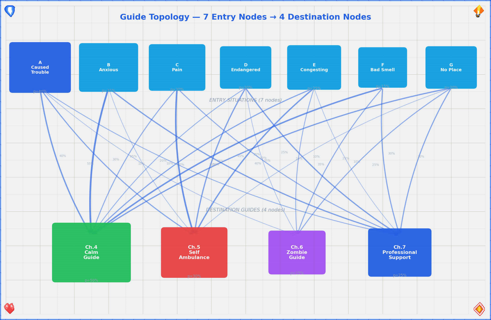

## Flowchart Legend

| Symbol | Meaning |
|--------|---------|
| → | Follow this path |
| ◆ | Decision point — answer the question to proceed |
| 📍 | Destination guide — go to the referenced chapter |
| § | Terminus — this path has no useful guidance (reconsider your choices) |
| 🔁 | Loop back — you may re-enter the flowchart from another entry point |

## Your Current Status

You are in a bathroom. By definition:

- ✓ The door likely locks — you have privacy
- ✓ Running water is available — you have hygiene resources
- ✓ You are indoors — you are sheltered
- ✓ You chose to come here — some part of you is already practicing self-care

Let's formalize your resource state. Define $R$ as the set of available resources:

$$R = \{privacy, water, shelter, self\_awareness\}$$

With $|R| = 4$, you have more resources than your anxiety is letting you see. Anxiety narrows the perceived resource set to $|R_{perceived}| \ll |R|$. The purpose of this guide is to restore $R_{perceived} \rightarrow R$. This is not metaphor — it's cognitive restructuring, and it works.

This is a stable starting position. Proceed with whatever brought you here.

## Master Flowchart — "What Brought You Here?"

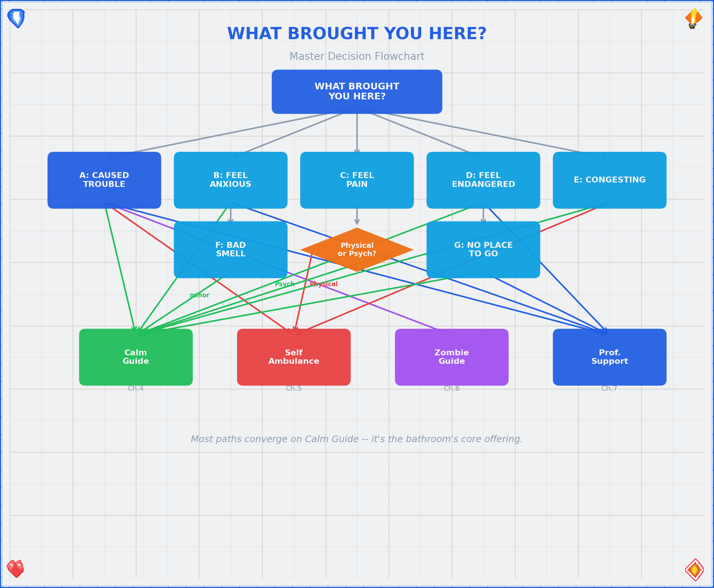

## The Seven Entry Points

| # | Entry Point | One-line summary | Primary destination |
|---|-------------|-----------------|---------------------|
| A | Caused Trouble | Something involving another life/entity | Decision tree → varies |
| B | Feel Anxious | Worry, dread, overthinking | 📍 Calm Guide / 📍 Prof. Support |
| C | Feel Pain | Physical or psychological pain | 📍 Self Ambulance / 📍 Calm Guide |
| D | Feel Endangered | Threat to your safety | 📍 Prof. Support / 📍 Calm Guide |
| E | Things Congesting | Overwhelm, too much at once | 📍 Self Ambulance + 📍 Calm Guide |
| F | Bad Smell | Olfactory emergency | Matches + 📍 Calm Guide (minor) |
| G | No Place to Go | Isolation, homelessness of spirit | 📍 Prof. Support + 📍 Calm Guide |

**Navigation note.** These entry points are not mutually exclusive. If multiple situations apply, start with the one that feels most pressing. The guide is designed so that paths can be combined — for example, if you caused trouble *and* feel anxious, work through Situation A first (it may route you to the Calm Guide anyway), then address Situation B.

[^graph_theory]: The graph-theoretic framing is more than decorative. Decision trees are a well-studied structure in operations research and decision analysis (Raiffa, 1968). The reachability invariant — every path reaches a destination — is a formal property that guarantees no "dead end" states exist in the guide. For readers who want to go deeper, see: Howard, R.A. & Matheson, J.E. "Influence diagrams" (1981), and the broader field of Bayesian decision networks. The graph can also be analyzed as a Markov chain, where transition probabilities depend on the reader's emotional state — but that's a research paper, not a bathroom guide.


---
---
title: "Situation A — I Caused Trouble (Involving a Life/Entity)"
chapter: 2
revision: "3.2.0"
last_updated: "2026-05-03"
dependencies:
  - ../diagrams/situation_a_tree.png
---

# Situation A — "I Caused Trouble (Involving a Life/Entity)"

So you've affected another sensible form of life — or something that might become one. First: the fact that you're reading this in a bathroom suggests you haven't fled the country, which is already a positive sign. Let's sort out what exactly happened.

**Step 1. Identify the nature of the entity.**

```
◆ What kind of entity are we talking about?

    ├─ Biological (virus, bacterium, multicellular…)
    │     └─ Does it cause zombification?
    │           ├─ Yes → 🔁 Re-classify as "post-apocalypse" → 📍 Zombie Guide (Ch.6)
    │           └─ No → Proceed to Step 2
    │
    └─ Silicon-based (AI, software, nanotech…)
          └─ Did it escape containment?
                ├─ Yes → Is it BSI (Bundesamt für Sicherheit in der
                │        Informationstechnik) territory?
                │     ├─ Yes → Contact BSI. Seriously. Right now.
                │     │        Then → 📍 Calm Guide (Ch.4)
                │     └─ No  → How does it feel about being loose?
                │           ├─ Good → Hmm. Talk to your host about
                │           │        this interesting situation.
                │           │        Then → 📍 Calm Guide (Ch.4)
                │           └─ Bad  → See Biological + "Geschlüpft"
                │                     (it's alive and angry — treat as
                │                      biological emergency)
                └─ No → Cool. Containment holds.
                       → Monitor + 📍 Calm Guide (Ch.4)
```

**Step 2. Determine the relationship to creation.**

The word "geschlüpft" (hatched/emerged) marks the threshold between "potential" and "actual" life. This distinction matters — both practically and ethically. In medical terms, this threshold maps onto gestation milestones with increasing viability probability:[^gestation]

| Gestation week | Developmental milestone | Viability probability |
|---------------|------------------------|-----------------------|
| 4 | Neural tube closes; heart begins to beat | ~0% (extreme prematurity) |
| 8 | All major organs formed (embryo → fetus transition) | ~0% |
| 12 | Reflexes present; sex distinguishable | ~0% |
| 20 | Quickening (movement felt); surfactant begins | < 1% |
| 24 | Surfactant production; legal viability threshold (DE) | ~40–60%[^viability] |
| 28 | Lung maturity substantially improved | ~80–90% |
| 32 | Most organs functional; NICU outcomes good | ~95% |
| 37+ | Term delivery | > 99% |

These are population-level probabilities — individual outcomes depend on many factors. This data is provided for context, not for decision-making. That decision belongs to you and your medical team.

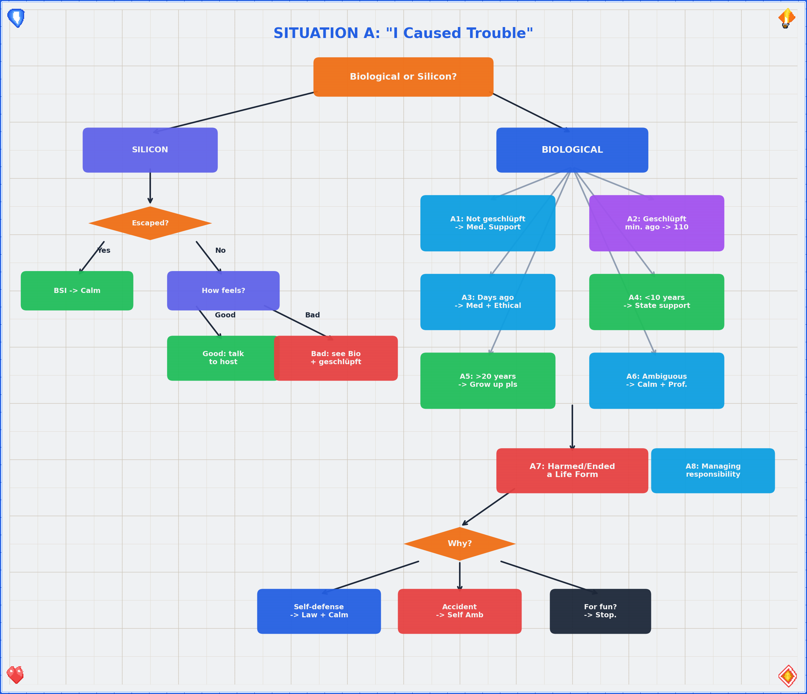

## A1 — Created a Life Form · Not Yet "Geschlüpft"

The entity exists in potential but has not independently emerged. You are at a decision point with a time window.

1. **Assess the timeline.** How long until the situation changes irreversibly? Write it down if you need to think clearly. The gestation table above gives you the medical milestones; your personal timeline may have its own deadlines (legal windows, personal readiness, financial stability).
2. **Medical support.** Consult a medical professional within the available timeframe. This is not a decision this bathroom guide can or should make for you — but it *is* a decision that benefits from professional input. Point yourself toward: your gynecologist, a family planning center (Pro Familia in Germany, similar organizations elsewhere), or the nearest hospital.
3. **Abortion yes/no?** This is your decision. No flowchart resolves it. What this guide *can* do is point you toward people trained to help you think it through without judgment → 📍 Professional Support Directory (Ch.7, §14.4).
4. **Ethical note.** Whatever you decide, you are allowed to have feelings about it. Those feelings are also worth bringing to a professional → 📍 Calm Guide (Ch.4) if you need to steady yourself first. Decision-making under acute stress degrades cognitive function — research shows that cortisol levels above baseline significantly impair prefrontal cortex activity, which is exactly the brain region you need for this kind of deliberation.[^cortisol_decision]

## A2 — Created a Life Form · "Geschlüpft" · Minutes Ago

Congratulations and/or condolences — depending on context, possibly both simultaneously.

```
◆ Apocalypse status?

    ├─ Post-apocalypse? ──→ 📍 Zombie Guide (Ch.6)
    │                      + 📍 Self Ambulance Guide (Ch.5)
    │                      ("Self Ambulance Healing" — you're it)
    │
    └─ Pre-apocalypse? ──→ ◆ Are other humans available?
                              ├─ Yes → Call 110. Now.
                              │        Find other humans immediately.
                              │        You need support, not heroics.
                              └─ No  → 📍 Self Ambulance Guide (Ch.5)
                                       + 📍 Calm Guide (Ch.4)
                                       (You're doing emergency
                                        self-sufficiency. Breathe first.)
```

**Key principle:** Minutes-old situations are time-critical. Act before you overthink. Overthinking is a luxury available in A4 and beyond. Your sympathetic nervous system is in overdrive — that's by design (fight-or-flight exists for a reason) — but it means your decision-making is running on the amygdala, not the prefrontal cortex. If you can, execute these steps *before* the adrenaline crash hits.

## A3 — Created a Life Form · "Geschlüpft" · Days Ago

The immediate crisis has passed. What remains is the entirety of everything else.

1. **Medical support.** If not already done: contact ambulance services if needed, and locate a local pediatrician / children's doctor. The first days of a new life have specific medical checkpoints — don't skip them → 📍 Professional Support Directory (Ch.7, §14.4). Newborn screening (the "U2" and "U3" examinations in Germany) should occur within the first 3–10 days and again at 4–5 weeks respectively.
2. **The ethical dimension.** Here's the thing: nature's tendency to reproduce is deeply non-logical. It doesn't reason. It just… proliferates. The fact that you're reading this in a bathroom suggests you're doing something nature doesn't — you're *thinking* about it. That's a fundamentally human act. Talk to someone about this. Not the bathroom. A person → 📍 Professional Support Directory (Ch.7, §14.2).
3. **Environmental lens.** If your mind is spiraling toward resource scarcity, environmental decay, and whether bringing another human onto this planet is defensible — those are valid concerns. They deserve engagement, not suppression. Recommended reading: any serious climate ethics text, and then → 📍 Calm Guide (Ch.4) to process before making any irreversible decisions.

## A4 — Created a Life Form · < 10 Years Ago

The entity is now a walking, talking, occasionally unreasonable small human. This is… a lot.

1. **State child support.** You may be entitled to financial and logistical support from the state. In Germany: Kindergeld, Elterngeld, Unterhaltsvorschuss. Look these up. They exist precisely because this is hard → 📍 Professional Support Directory (Ch.7, §14.5).
2. **Professional help.** Pediatricians, family counselors, parent groups — these are not admissions of failure. They are infrastructure. Use it.
3. **"Regular development" short guide.** Children are, by design, chaotic. They cry, they break things, they ask "why" 47 times in a row. This is normal. Here's a compressed timeline based on WHO developmental milestones:[^who_milestones]

   **Gross Motor Milestones (WHO Windows of Achievement):**

   | Milestone | WHO median age | Window | Your anxiety if not yet |
   |-----------|---------------|--------|------------------------|
   | Sit unsupported | ~6 months | 3.8–9.2 mo | Low (wide normal range) |
   | Stand with assistance | ~7.6 months | 4.8–11.4 mo | Low |
   | Hands-and-knees crawl | ~8.5 months | 5.2–13.5 mo | Low (some skip entirely) |
   | Walk with assistance | ~9.2 months | 5.9–13.7 mo | Low |
   | Stand alone | ~11.0 months | 6.9–16.9 mo | Moderate after 16mo |
   | Walk alone | ~12.0 months | 8.2–17.6 mo | Moderate after 18mo |

   **Cognitive & Social Milestones:**

   - **0–1 year:** Survival mode (yours and theirs). Object permanence develops around 8 months — before that, out of sight = out of existence. Everything is a phase.
   - **1–3 years:** Mobility + opinions. Language explosion: typical vocabulary grows from ~50 words at 18 months to ~200+ words at 24 months. Baby-proof everything, including your ego.
   - **3–6 years:** Questions. So many questions. Theory of mind develops around age 4 — they're starting to understand that other people have different thoughts. You don't need all the answers.
   - **6–10 years:** School + social complexity. Executive function (planning, impulse control) is still developing — the prefrontal cortex won't finish maturing until ~25 years. Your role shifts from caretaker to translator.

   When overwhelmed → 📍 Calm Guide (Ch.4). You're allowed to lock the bathroom door and breathe. That's literally why this guide is here.

## A5 — Created a Life Form · > 20 Years Ago

They're an adult. You've done your shift. Grow up, pls — and we say that with warmth.

1. **Reframe.** Your creation is now an autonomous agent with their own decision-making apparatus (questionable as it may seem at times). Your responsibility has transitioned from "keeping them alive" to "being available if they ask." Formally: your duty function $D(t)$ transitions from $D_{active}$ to $D_{available}$ around the time they start paying their own rent.
2. **Look at "friends."** If you're struggling with this transition, the issue may not be them — it may be you. That's not a criticism; it's an observation. → 📍 Calm Guide (Ch.4) for immediate grounding, → 📍 Professional Support Directory (Ch.7, §14.2) for deeper work.
3. **Practical advice.** Call them. Not to fix anything. Just to talk. If that's hard, the Calm Guide has conversation strategies.

## A6 — Created a Life Form · Ambiguous / Otherwise

The timeline is unclear, the situation is messy, or it doesn't fit neatly into A1–A5. Welcome to the majority of human experience.

**Sub-path (a): Don't want to, but will.**
You're being pulled toward something by obligation, expectation, or inertia. That tension is real. Acknowledge it → 📍 Calm Guide (Ch.4) to reduce the noise, then seek structured help → 📍 Professional Support Directory (Ch.7).

**Sub-path (b): Want to create, but can't figure out how.**
Break it down:

1. **Money?** Financial barriers are real and addressable. State support, grants, community resources exist → 📍 Professional Support Directory (Ch.7, §14.5).
2. **Medical issues?** Fertility medicine is a vast field. Start with your GP, then specialize. Approximately 15% of couples experience infertility (WHO definition: failure to achieve pregnancy after 12+ months of regular unprotected intercourse)[^infertility] → 📍 Professional Support Directory (Ch.7, §14.4).
3. **Reproduction itself?** The biology is well-documented. The logistics depend on your circumstances. If you're here, you probably don't need the birds-and-bees talk — you need practical next steps → same as above.

## A7 — Harmed or Ended a Life Form

This is the section where the tone shifts. Some things aren't funny, and this is one of them.

```
◆ Why did this happen?

    ├─ Self-defense?
    │     ├─ Juristical → Consult local self-defense laws.
    │     │               In Germany: §32 StGB (Notwehr) applies.
    │     │               Elements: (1) present attack, (2) unlawful,
    │     │               (3) defensive action, (4) proportionality.[^stgb32]
    │     │               Contact a lawyer → 📍 Prof. Support (Ch.7, §14.3).
    │     │               + 📍 Calm Guide (Ch.4) — you've been through
    │     │                 something traumatic.
    │     └─ Ethical → Even justified harm carries weight.
    │                   Talk to someone trained for this.
    │                   → 📍 Professional Support Directory (Ch.7, §14.2)
    │
    ├─ Accident?
    │     ├─ Imminent danger? → Act now:
    │     │     Call 112 → 📍 Self Ambulance Guide (Ch.5)
    │     │     + find other humans immediately
    │     └─ Aftermath → You need both practical and emotional
    │                     support. Start with
    │                     → 📍 Calm Guide (Ch.4), then
    │                     → 📍 Professional Support Directory (Ch.7)
    │
    └─ For fun / profit?
          → §
          This guide has nothing for you.
          Leave the bathroom. Reconsider your choices.
          Come back when you're ready to be human.
```

## A8 — Managing Responsibility for a Life/Entity

Ongoing responsibility is less dramatic than A7 but can be just as heavy. The weight doesn't arrive all at once — it accumulates. Research on caregiver burnout shows that chronic stress follows a dose-response curve: the longer and more intense the caregiving demands, the higher the probability of psychological distress, with caregiver depression rates of 20–40% depending on intensity and duration.[^caregiver]

1. **Legal obligations.** Know what's required of you. Ignorance isn't a strategy → 📍 Professional Support Directory (Ch.7, §14.3).
2. **Emotional load.** Caring for another entity — whether child, elder, pet, or dependent — takes a toll that's easy to ignore until it breaks you. It doesn't have to → 📍 Calm Guide (Ch.4) for daily maintenance, 📍 Professional Support Directory (Ch.7, §14.2) for structural support.
3. **You matter too.** This is not selfish. An empty vessel can't pour. Take care of yourself so you can take care of them.

[^gestation]: Moore, K.L. & Persaud, T.V.N. *The Developing Human: Clinically Oriented Embryology* (11th ed., 2019). See also WHO Preterm Birth Fact Sheet (2023): approximately 1 in 10 births globally are preterm, with survival rates varying dramatically by gestational age and access to neonatal intensive care.

[^viability]: Rysavy, M.A., et al. "Assessment of an Exposure Outcome Relationship Between Gestational Age at Birth and Neurodevelopmental Outcome." *JAMA Pediatrics* (2023). The 24-week viability threshold is a statistical population estimate, not a guarantee — outcomes vary significantly by individual circumstances, NICU quality, and comorbidities.

[^cortisol_decision]: Arnsten, A.F.T. "Stress signalling pathways that impair prefrontal cortex structure and function." *Nature Reviews Neuroscience* 10, 410–422 (2009). Cortisol impairs dendritic branching in prefrontal cortex neurons, degrading the working memory and executive function needed for complex decisions. This is why major decisions under acute stress are reliably worse than those made in calmer states.

[^who_milestones]: WHO Multicentre Growth Reference Study Group. "WHO Motor Development Study: Windows of achievement for six gross motor development milestones." *Acta Paediatrica* 95(S450), 86–95 (2006). Based on longitudinal data from Ghana, India, Norway, Oman, and the USA. The wide windows reflect genuine population variation — not every child follows the median.

[^infertility]: WHO. "Infertility" Fact Sheet (2023). Global prevalence: ~17.5% of the adult population experience infertility in their lifetime. The 12-month definition is a clinical threshold, not a deadline — many couples conceive after 12+ months without intervention.

[^stgb32]: Strafgesetzbuch (StGB) §32 Notwehr: "Wer eine Tat begeht, die durch Notwehr geboten ist, handelt nicht rechtswidrig." The four-element test (present attack, unlawfulness, defensive action, proportionality) is established German jurisprudence. Notwehrrecht has no duty to retreat (unlike some common-law jurisdictions), but proportionality is assessed holistically — defensive force must not be grossly disproportionate to the threat defended against.

[^caregiver]: Pinquart, M. & Sörensen, S. "Correlates of physical, psychological, and functional caregiver burden: A meta-analysis." *Journals of Gerontology* 61(4), P254-P267 (2006). Caregiver depression rates of 20-40% are consistently reported across meta-analyses, with higher rates for dementia caregivers and those providing daily care.


---
---
title: "Situations B–G — Emotional & Situational Entry Points"
chapter: 3
revision: "3.2.0"
last_updated: "2026-05-03"
dependencies:
  - ../diagrams/anxiety_severity_spectrum.png
  - ../diagrams/pain_nrs_correlates.png
---

# Situation B — "I Feel Anxious"

Anxiety is your brain's way of running worst-case simulations without your consent. It's a feature that got stuck in debug mode. Let's triage.

**Step 1. Determine the temporal flavor.**

```
◆ Is this acute (happening right now) or general (ongoing background hum)?

    ├─ Acute → Heart racing, thoughts spiraling, chest tight?
    │          → 📍 Calm Guide (Ch.4) — immediately.
    │            The bathroom is fine. Stay. Breathe. Ch.4 has you.
    │
    └─ General → Low-grade dread, persistent worry, can't quite
                 put your finger on it but something is definitely
                 off and has been for a while?
                 → 📍 Professional Support Directory (Ch.7, §14.2)
                   This isn't a one-bathroom-session fix. Get backup.
```

**Step 2. If anxious *about* something specific, identify the target.**

Anxiety loves an object. Give it one — then decide whether that object actually needs your attention right now.

| Worried about… | What's happening | Where to go |
|---|---|---|
| **Friends** | Someone you care about is struggling, and you're absorbing it | 📍 Prof. Support (Ch.7, §14.2) — learn to hold space without drowning |
| **Yourself** | Existential dread, self-doubt, the works | 📍 Calm Guide (Ch.4) — start here, stabilize, then decide |
| **The past** | Replaying things you can't change | 📍 Calm Guide (Ch.4) — reframing exercises. The past is a sunk cost. |
| **The future** | All of it. Everything. The heat death of the universe. | 📍 Calm Guide (Ch.4) + talk to host + curated study sources |

### GAD-7 Severity Spectrum

If you want to quantify where you are (and sometimes seeing a number helps), the Generalized Anxiety Disorder 7-item scale (GAD-7) is a validated self-report instrument used clinically worldwide:[^gad7]

$$GAD\text{-}7 \in [0, 21]$$

| Score | Severity | What it means for you right now |
|-------|----------|-------------------------------|
| 0–4 | Minimal | You're basically fine. The bathroom visit was precautionary. |
| 5–9 | Mild | Annoying but manageable. Calm Guide breathing will help. → 📍 Ch.4 |
| 10–14 | Moderate | This is significant. Breathing first, then professional support. → 📍 Ch.4 + 📍 Ch.7 |
| 15–21 | Severe | You need more than this guide can provide. → 📍 Professional Support (Ch.7) immediately |

You don't need a clinical diagnosis to use this scale — it's a self-assessment tool. A score ≥ 10 has a sensitivity of 89% and specificity of 82% for detecting generalized anxiety disorder.[^gad7_sensitivity] That said, a bathroom guide is not a clinician. Use the number to inform your next step, not to self-diagnose.

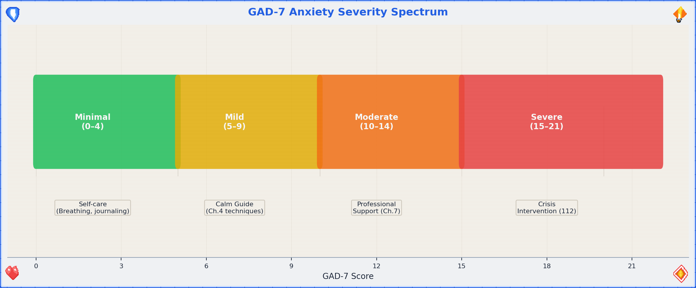

**Step 3. Optional: Name it to tame it.**

There's genuine psychological research behind this: verbally labeling an emotion reduces its intensity through a process called "affect labeling," which engages the right ventrolateral prefrontal cortex and dampens amygdala activation.[^affect_labeling] So say it out loud. You're in a bathroom. No one's listening. "I am anxious because [___________]." There. Slightly smaller now, wasn't it?

---

# Situation C — "I Feel Pain"

The body (and mind) have a straightforward communication style: pain = "something needs attention." Let's figure out what kind of attention.

```
◆ Physical or Psychological?

    ├─ Physical ──→ 📍 Self Ambulance Guide (Ch.5)
    │                 Assess severity. If life-threatening: 112 first,
    │                 guide second. Otherwise, follow Ch.5.
    │
    └─ Psychological ──→ 📍 Calm Guide (Ch.4)
                         Psychological pain is real pain. It just
                         responds to different first aid. Start with
                         the breathing, then assess whether you need
                         → 📍 Professional Support Directory (Ch.7)
```

### NRS Pain Scale with Physiological Correlates

The Numeric Rating Scale (NRS) is the most widely used pain assessment tool in clinical settings. It maps your subjective experience to a number, which then determines urgency:[^nrs]

$$NRS \in [0, 10]$$

| NRS | Severity | Physiological correlates | Action |
|-----|----------|-------------------------|--------|
| 0 | No pain | Baseline HR, normal RR | You're fine. Why are you reading this section? |
| 1–3 | Mild | Slight HR elevation ($\Delta HR < 10$ bpm), normal RR | Self-care, OTC pain relief if appropriate |
| 4–6 | Moderate | Noticeable HR elevation ($\Delta HR 10–20$ bpm), RR 16–22/min | Assess cause. 📍 Self Ambulance (Ch.5). Consider professional help. |
| 7–9 | Severe | Significant tachycardia ($HR > 100$ bpm), RR 22–30/min, diaphoresis | 📍 Self Ambulance (Ch.5) immediately. Call 112 if acute onset. |
| 10 | Worst imaginable | Sympathetic storm: $HR > 120$, $RR > 30$, possible shock signs | **Call 112. Now.** |

The NRS isn't perfectly objective — pain is subjective by definition — but it correlates reliably with physiological markers at the moderate-to-severe end. At the mild end, your body is telling you something but isn't in crisis. At the severe end, your autonomic nervous system is in open revolt. Listen to it.

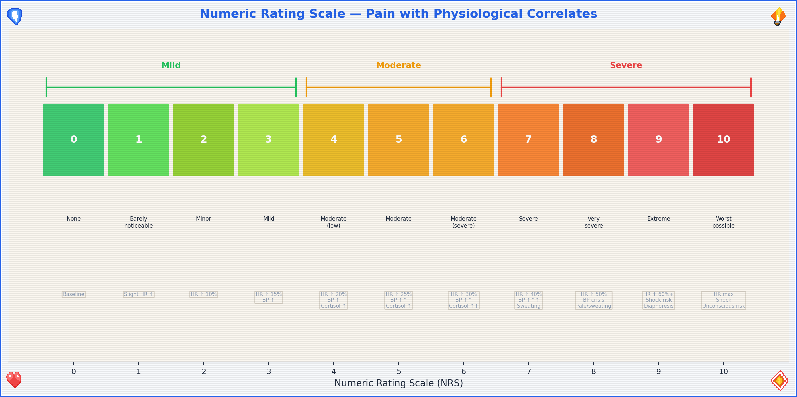

**The overlap zone.** Physical and psychological pain frequently co-occur (headaches from tension, nausea from anxiety, chest tightness that's muscular *or* cardiac — when in doubt, treat it as physical first and get checked out). The Self Ambulance Guide covers this in its triage section.

> **⚠ Important:** If pain is severe, sudden, or in the chest/jaw/left arm region, do not pass Go, do not consult flowcharts — **call 112**.

---

# Situation D — "I Feel Endangered"

Something or someone is threatening your safety. This is the section where we get practical fast.

**Step 1. Immediate assessment.**

```
◆ Are you in immediate physical danger right now?

    ├─ Yes → Exit strategy first. Then:
    │        Call 110 (police) or 112 (emergency services).
    │        Do not stay in the bathroom if it's not safe.
    │        The bathroom has one door — that's a chokepoint.
    │        Consider whether leaving is safer than staying.
    │
    └─ No (or not right this second) → Continue below.
```

### The Stress Response: What Your Body Is Doing

When you feel endangered, your sympathetic nervous system activates the fight-or-flight response. This isn't a malfunction — it's an ancient survival system. Understanding it helps you ride the wave instead of drowning in it:

$$S(t) = S_0 + A \cdot (1 - e^{-\alpha t})$$

Where $S(t)$ is your sympathetic activation level at time $t$, $S_0$ is baseline, $A$ is the amplitude of the threat response, and $\alpha$ is the activation rate. The key insight: this curve rises fast but decays slowly. Your adrenaline spikes in seconds, but cortisol — the stress hormone that keeps you on high alert — has a half-life of 60–90 minutes.[^cortisol_stress] Social-evaluative threats and uncontrollable stressors produce the largest cortisol responses,[^cortisol_response] which is unfortunately exactly what being trapped in a bathroom with no exit strategy feels like. This is why you'll feel shaky and hypervigilant long after the danger passes. That's not weakness; that's biochemistry.

**Step 2. Resource scan.**

1. **Talk to the host.** If you're in someone else's space, the host is your ally. They know the environment, the exits, and the social dynamics. Ask for help — it's not weakness, it's tactical intelligence gathering.
2. **Self-defense: know the law before you need it.** In Germany, §32 StGB (Notwehr) covers self-defense: you may defend yourself against an unlawful attack, using force proportionate to the threat. The four legal elements are: (1) present attack, (2) unlawfulness, (3) defensive action, (4) proportionality.[^stgb32_bg] Know this *before* you need it → 📍 Professional Support Directory (Ch.7, §14.3).
3. **Local items scan.** Take 30 seconds to look around. What's available? Keys (pointy), phone (communication + flashlight), aerosol cans (improvised deterrent), heavy objects (strategic, not recreational). You're not MacGyver — you're just aware.

**Step 3. Once safe.**

→ 📍 Calm Guide (Ch.4) — adrenaline takes time to metabolize. Let the shaking happen. It's normal.
→ 📍 Professional Support Directory (Ch.7) — for legal, psychological, and practical follow-up.

---

# Situation E — "Things Are Congesting"

Everything at once. Too many inputs, too many demands, too many tabs open in your brain. The mental browser has crashed.

1. **Close some tabs.** Not literally (unless your phone has 47 browser tabs, in which case — yes, literally). Identify the top 3 things that actually need your attention in the next hour. Write them down. Everything else goes on a "later" list that you'll forget about and that's fine.
2. **Physical first.** Congestion often manifests physically — shallow breathing, tight shoulders, jaw clenched like you're biting through steel. → 📍 Self Ambulance Guide (Ch.5) for body-first triage.
3. **Mental next.** Once the body is somewhat regulated → 📍 Calm Guide (Ch.4) for the full decompression sequence.
4. **If congestion is chronic** (this keeps happening), that's not a bathroom-fix — that's a life-structure problem → 📍 Professional Support Directory (Ch.7). Therapists and coaches exist for exactly this.

### Cognitive Load Theory — Why Your Brain Is Crashing

George Miller's famous 1956 paper proposed that working memory can hold approximately $7 \pm 2$ items simultaneously.[^miller] More recent research by Cowan (2001) refines this to approximately $4 \pm 1$ chunks of information.[^cowan] When you're "congesting," you're exceeding this capacity — your cognitive buffer is overflowing.

$$\text{Cognitive Load} = \text{Intrinsic} + \text{Extraneous} + \text{Germane}$$

Where intrinsic load comes from the task itself, extraneous load comes from poor presentation or unnecessary information, and germane load is the productive effort of learning/processing. Congestion happens when the total exceeds your working memory capacity. The fix: reduce extraneous load (turn off notifications, close tabs, delegate) and process intrinsic load one chunk at a time. This is literally what the "top 3 things" exercise does — it moves items from working memory to external storage (paper/phone), freeing up cognitive bandwidth.

---

# Situation F — "Bad Smell"

The most bathroom-native emergency. Respect its simplicity.

1. **Step 1.** Strike a match (Streichhölzer). The sulfur dioxide actually neutralizes odor molecules. Science! (If no matches: skip to Step 2.)
2. **Step 2.** Ventilate. Window? Open it. Fan? Turn it on. No ventilation? Time is your friend. Wait.
3. **Step 3.** Deploy scent. Candle, spray, essential oil, strategically placed coffee grounds — whatever's available. Masking > suffering.
4. **Step 4.** If the smell is YOU → that's what showers are for. You're literally in the right room.
5. **Step 5.** If the smell is EMOTIONAL → 📍 Calm Guide (Ch.4). (Metaphorical bad smells respond to the same treatment: ventilate, mask with something nicer, give it time.)

### The Chemistry of Match-Based Odor Neutralization

The SO₂ mechanism is real and surprisingly elegant. When a match is struck, the combustion of sulfur in the match head produces sulfur dioxide ($SO_2$), which is a strong electrophile. Many malodorous compounds — particularly volatile organic compounds (VOCs) and hydrogen sulfide ($H_2S$) — are nucleophilic. The $SO_2$ reacts with these molecules, altering their molecular structure and thereby changing (or eliminating) their odor profile.[^so2] The effect is chemical neutralization, not mere masking — which is why matches work better than perfume for bathroom odors. The concentration of $SO_2$ from a single match is tiny and safe in ventilated spaces, though we don't recommend huffing match heads. Everything in moderation, including chemistry.

This is the only entry point where the solution might genuinely be "light a match and move on." Enjoy it. The other sections are heavier.

---

# Situation G — "No Place to Go"

Not just physically — existentially. You feel like you don't belong anywhere, or that there's nowhere that's truly yours. The bathroom is temporary. You need something more structural.

**Step 1. Immediate: You're here. That's somewhere.**

This is not flip. Being in a space, even a borrowed one, is a starting point. You haven't evaporated. You exist in coordinates. That's data.

**Step 2. Support hotlines — they work at 3am when nothing else does.**

→ 📍 Professional Support Directory (Ch.7, §14.5) for the full list. Key numbers: Telefonseelsorge (0800/111 0 111 or 0800/111 0 222 — free, 24/7, anonymous), and local crisis lines.

**Step 3. Local initiatives.**

Every city has communities, shelters, co-ops, meetups, and weird little groups that would love another person. Finding them is the hard part → 📍 Professional Support Directory (Ch.7, §14.5) includes starting points for local search.

**Step 4. Emotional processing.**

→ 📍 Calm Guide (Ch.4) — the "Eventually: Leaving the Bathroom" subsection is specifically designed for moments when you have to re-enter a world that doesn't feel like it has a place for you. It does. You just might not see it from in here.

---

## Situations B–G — Consolidated Routing Map

```
  B: Anxious ────────◆ Acute? ──→ 📍Calm
                      ◆ General? ─→ 📍Prof. Support
                      ◆ GAD-7 ≥10? → 📍Prof. Support + 📍Calm
                      ◆ About X? ─→ (see table)

  C: Pain ───────────◆ Physical? ─→ 📍Self Ambulance
                      ◆ NRS ≥7? ──→ 112 + 📍Self Ambulance
                      ◆ Psych? ───→ 📍Calm (+ 📍Prof. Support)

  D: Endangered ─────◆ Imminent? ─→ 110/112 FIRST
                      ◆ Stabilized? → 📍Calm + 📍Prof. Support
                      ◆ Cortisol falling? → Processing allowed

  E: Congesting ─────→ 📍Self Ambulance → 📍Calm → (maybe 📍Prof. Support)
                      Cognitive load > 7±2? → Externalize now.

  F: Bad Smell ──────→ SO₂ (matches) → Scent → Ventilate → (maybe 📍Calm)

  G: No Place ───────→ Hotlines → Local initiatives → 📍Calm
```

[^gad7]: Spitzer, R.L., Kroenke, K., Williams, J.B.W., & Löwe, B. "A brief measure for assessing generalized anxiety disorder: the GAD-7." *Archives of Internal Medicine* 166(10), 1092–1097 (2006). The GAD-7 is freely available and widely validated across languages and populations.

[^gad7_sensitivity]: Kroenke, K., Spitzer, R.L., Williams, J.B.W., Monahan, P.O., & Löwe, B. "Anxiety disorders in primary care: prevalence, impairment, comorbidity, and detection." *Annals of Internal Medicine* 146(5), 317–325 (2007). At threshold ≥10, sensitivity 89%, specificity 82%.

[^affect_labeling]: Lieberman, M.D., et al. "Putting feelings into words: affect labeling disrupts amygdala activity in response to affective stimuli." *Psychological Science* 18(5), 421–428 (2007). The mechanism: verbal labeling activates right ventrolateral PFC, which inhibits amygdala activation. It literally cools the emotional brain by engaging the linguistic one.

[^nrs]: Williamson, A. & Hoggart, B. "Pain: a review of three commonly used pain rating scales." *Journal of Clinical Nursing* 14(7), 798–804 (2005). The NRS has good test-retest reliability (r = 0.83–0.95) and correlates with VAS and categorical scales.

[^cortisol_stress]: Taves MD, et al. "Cortisol half-life and clearance: clinical implications." *Journal of Clinical Endocrinology & Metabolism* (2011). Cortisol plasma half-life: ~60–90 minutes. Active metabolites persist longer. This is why the "shakes" after a threat can last 1–2 hours — your biochemistry hasn't caught up to your reality.

[^stgb32_bg]: Strafgesetzbuch (StGB) §32 Notwehr. The four-element framework is derived from the legislative text and consistent German Federal Court (BGH) jurisprudence. See also §33 (Excessive self-defence) for cases where the proportionality threshold was exceeded under conditions of confusion, fear, or terror.

[^miller]: Miller, G.A. "The magical number seven, plus or minus two: some limits on our capacity for processing information." *Psychological Review* 63(2), 81–97 (1956). One of the most cited papers in psychology. Miller himself thought the "7±2" framing was slightly tongue-in-cheek — it became iconic anyway.

[^cowan]: Cowan, N. "The magical number 4 in short-term memory: a reconsideration of mental storage capacity." *Behavioral and Brain Sciences* 24(1), 87–114 (2001). The refined estimate accounts for chunking strategies — trained individuals can hold more by grouping items into larger chunks.

[^so2]: The SO₂ odor neutralization mechanism is widely documented in chemistry education but poorly studied in controlled settings (perhaps because funding agencies don't prioritize "bathroom match" research). The electrophilic-nucleophilic interaction is basic organic chemistry; the effect on volatile sulfur compounds (VSCs) like H₂S and CH₃SH is documented in atmospheric chemistry literature. See: Atkinson, R. "Gas-phase tropospheric chemistry of organic compounds." *Journal of Physical and Chemical Reference Data* (1994).

[^cortisol_response]: Dickerson, S.S. & Kemeny, M.E. "Acute stressors and cortisol responses: a meta-analytic integration." *Psychological Bulletin* 130(5), 733–756 (2004). Social-evaluative threats produce the largest cortisol responses; uncontrollable stressors produce larger responses than controllable ones. Being trapped in a bathroom with no exit strategy is, tragically, both.


---
---
title: "Calm Guide"
chapter: 4
revision: "3.2.0"
last_updated: "2026-05-03"
dependencies:
  - ../diagrams/breathing_techniques.png
  - ../diagrams/stress_decay_curve.png
---

# 🧘 Calm Guide — You Made It Here. That Counts.

This guide is referenced by almost every path in this document. That's not because it solves everything — it's because calm is a prerequisite for solving anything. You can't navigate a decision tree while your nervous system is running kernel panic. Let's get you to a stable state first, then figure out what's next.

## You're Allowed to Be Here

**Permission statement.** Lock the door. Sit down. You are in a bathroom, which means you are in a room designed specifically for private bodily maintenance. Your brain is a body part. You are maintaining it. This is not avoidance — this is triage.

**The 10-minute rule.** The next 10 minutes are officially **Me Time™**. Not because your problems aren't real, but because your nervous system needs a reset window before it can process anything useful. Think of it as rebooting in safe mode. Nothing dramatic happens in safe mode. That's the point.

We can formalize this. The sympathetic-parasympathetic transition — the shift from "fight-or-flight" to "rest-and-digest" — has a characteristic time constant. Research on autonomic recovery shows that parasympathetic re-engagement begins within approximately 10 minutes of stressor removal:[^autonomic_recovery]

$$t_{reset} \approx 10\text{min}$$

This isn't arbitrary. It reflects the time required for vagal tone to reassert dominance over sympathetic activation. Your heart rate variability (HRV) — a key marker of parasympathetic activity — begins to recover within this window. The 10-minute rule isn't self-indulgence; it's neurology.

**Where you are, factually:**

- Indoors ✓ (weather is not your problem right now)
- Seated or can sit ✓ (gravity: manageable)
- Door locks ✓ (privacy: available)
- Running water ✓ (hydration + hygiene: accessible)
- Reading this ✓ (cognitive function: operational, even if barely)

You have more resources than your anxiety is letting you see. That's what anxiety does — it narrows the aperture. We're widening it back up.

## Stress Decay Curve

Your stress level isn't static — it follows a decay function once the stressor is removed or you begin active calming. The cortisol decay model describes this elegantly:

$$C(t) = C_0 \cdot e^{-\lambda t}$$

Where $C(t)$ is your cortisol level at time $t$, $C_0$ is the peak cortisol level, and $\lambda = \frac{\ln 2}{t_{1/2}}$ is the decay constant. With a cortisol half-life of approximately 60–90 minutes:[^cortisol_halflife]

$$\lambda = \frac{\ln 2}{75\text{min}} \approx 0.0092 \text{ min}^{-1}$$

This means: after 75 minutes, your cortisol has dropped by half. After 150 minutes, it's at 25%. The curve is exponential — fast initial drop, then gradual return to baseline. Active calming (breathing, grounding) accelerates this process by boosting parasympathetic activity, effectively increasing $\lambda$. You can't wish cortisol away, but you can help your body clear it faster.

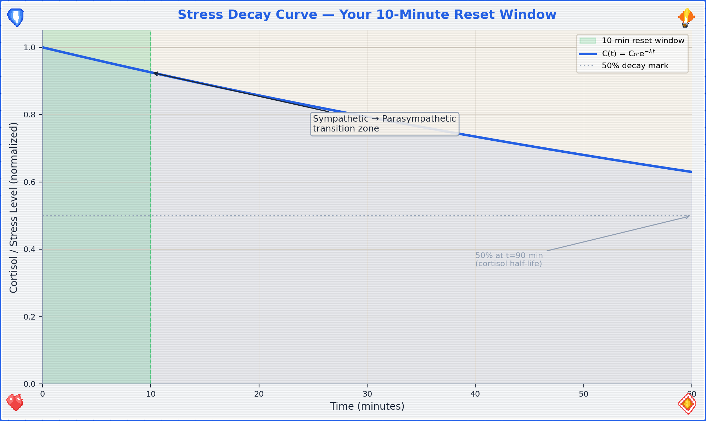

## Breathing Exercises

Your breath is the one autonomic function you can also control manually. It's the backdoor into your own nervous system. Use it.

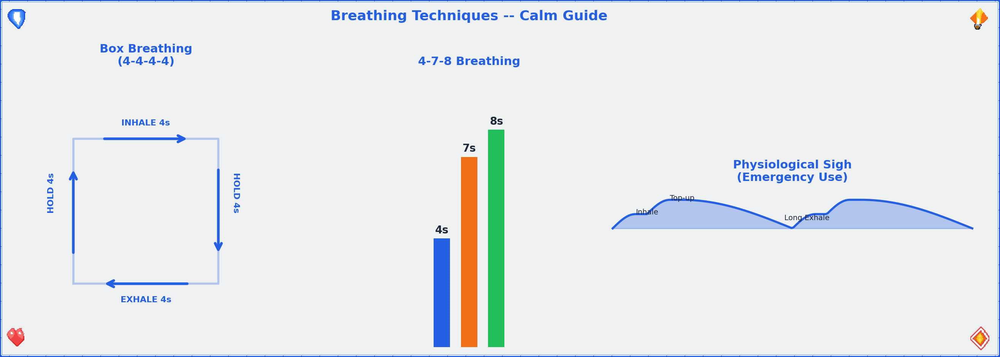

### Technique 1: Box Breathing (4-4-4-4)

Used by Navy SEALs, which means it works under conditions significantly worse than "sitting in a bathroom." The geometry is simple:

```
        4 seconds
    ┌──────────────┐
    │              │
    │   INHALE     │ HOLD
    │              │
4   │              │   4
sec │              │ sec
    │              │
    │  EXHALE      │ HOLD
    │              │
    └──────────────┘
        4 seconds
```

1. Inhale through the nose for 4 counts.
2. Hold for 4 counts.
3. Exhale through the mouth for 4 counts.
4. Hold for 4 counts.
5. Repeat 4 cycles (total: ~64 seconds). Don't rush the counts. If 4 is too long, use 3. If 4 is too easy, use 5. The box shape matters more than the number.

**Efficacy data:** Box breathing increases HRV by approximately 15–25% within 5 minutes of practice, indicating a measurable shift toward parasympathetic dominance.[^hrv_breathing] HRV — heart rate variability — is the gold-standard non-invasive marker of autonomic balance, defined as:

$$HRV = \frac{SD_{RR}}{\overline{RR}}$$

Where $SD_{RR}$ is the standard deviation of RR intervals (beat-to-beat distances) and $\overline{RR}$ is the mean interval. Higher HRV = more parasympathetic activity = calmer nervous system. When you breathe slowly and rhythmically, you're literally increasing the mathematical variability of your heartbeat, which paradoxically means your heart is *more* adaptable and resilient.

### Technique 2: 4-7-8 Breathing

A slightly more aggressive calming technique. Good for when box breathing feels too structured and you just need to slow down.

1. Inhale through the nose for 4 counts.
2. Hold for 7 counts.
3. Exhale through the mouth (audibly) for 8 counts.
4. Repeat 3 cycles. If you feel lightheaded, return to normal breathing — you've done enough.

The extended exhale is the key mechanism. Exhalation activates the vagus nerve (your parasympathetic superhighway), which is why longer exhale-than-inhale patterns are reliably calming. The 7-count hold allows CO₂ to build slightly, which paradoxically improves oxygen delivery to tissues via the Bohr effect — your hemoglobin releases O₂ more readily in slightly more acidic (higher CO₂) environments.[^bohr]

### Technique 3: Physiological Sigh (Emergency Use)

Discovered by Dr. Andrew Huberman's lab at Stanford, this is the fastest known way to reduce real-time physiological arousal — and the only breathing technique with a peer-reviewed RCT demonstrating real-time stress reduction.[^huberman_sigh]

```
    Inhale  →  Inhale  →  Exhale
    (short)    (top-up)    (long)
    ···→       ·→          ←←←←←←
```

Two quick inhales through the nose, one long exhale through the mouth. Even one round works. Do 2–3 if you can.

**The mechanism:** The double inhale reinflates collapsed alveoli (the tiny air sacs in your lungs), dramatically increasing the surface area available for CO₂ exchange. On the long exhale, you offload CO₂ at an accelerated rate:

$$\text{CO}_2\text{ offload rate} \propto \frac{A_{alveoli} \cdot \Delta P_{CO_2}}{d_{membrane}}$$

Where $A_{alveoli}$ is the total alveolar surface area (doubled by the second inhale), $\Delta P_{CO_2}$ is the CO₂ partial pressure gradient, and $d_{membrane}$ is the diffusion distance across the alveolar-capillary membrane. More surface area + maintained gradient = faster CO₂ clearance = faster heart rate reduction = faster calm. Your heart rate drops. It's biology, not magic — but it works like magic.

The Huberman Lab study showed that just 5 minutes of cyclic physiological sighing produced greater reductions in physiological arousal than 5 minutes of mindfulness meditation, making it the most efficient single technique for acute stress.[^huberman_sigh]

## Comfort Inventory

Once breathing is somewhat regulated, scan your environment for comfort resources. Check what applies:

| Resource | Available? | Details | Neurochemical mechanism |
|----------|-----------|---------|------------------------|
| Phone charger / power | ☐ | Find it. A dead phone is a dead lifeline. | — |
| WiFi password | ☐ | Write it here: `____________________` | — |
| Comics / graphic novels | ☐ | Visual stories require less cognitive load than text. Ideal for reboot mode. | Dopamine release from narrative engagement[^dopamine_narrative] |
| Books | ☐ | Fiction > nonfiction right now. Escapism is a feature, not a bug. | Same — plus reduced cortisol from absorption[^absorption] |
| Seneca + Tao Te Ching | ☐ | Stoicism and Taoism: the two philosophical traditions that basically invented "it is what it is, and that's okay." Open either to a random passage. It will be relevant. | Cognitive reframing → reduced amygdala activation |
| Local-server resources | ☐ | If this flat has a NAS, media server, or local wiki — now is the time to remember it exists. | — |
| Scent candle | ☐ | Olfactory stimulation directly affects the limbic system. Light it. Smell it. Neuroscience is on your side. | Olfactory bulb → amygdala → hippocampus (direct pathway, no thalamic relay)[^olfactory] |
| Water (drinking) | ☐ | Dehydration worsens anxiety. Glass of water > spiral of dread. | Even mild dehydration (1–2% body weight) impairs mood and cognition[^hydration] |
| Blanket / warm thing | ☐ | Warmth signals safety to the mammalian brain. Wrap yourself like the burrito you deserve to be. | Oxytocin release from thermal comfort + deep pressure stimulation[^oxytocin_warmth] |
| Physical touch (pet, person) | ☐ | If available. Touch releases oxytocin and reduces cortisol. | Oxytocin ↑, Cortisol ↓, C-tactile afferent activation[^touch] |

**Running total:** If you checked 3+, you're above the comfort threshold. If less, the bathroom has walls and a lock — that's already 2. You're fine.

**The dopamine-oxytocin axis:** Comfort isn't just "feeling nice" — it's neurochemically mediated. Dopamine provides the motivation and reward signal ("this is good, seek more of this"), while oxytocin provides the safety and bonding signal ("you are connected and protected"). Together, they directly counteract the cortisol-adrenaline axis of the stress response. When we say "comfort yourself," we mean "activate the neurochemical systems that evolved specifically to counteract distress." It's not self-indulgence; it's pharmacology you can do without a prescription.

## Eventually: Leaving the Bathroom

You can't live in here. (You could try, but the logistics deteriorate after hour 3.) At some point, you'll need to re-enter the world. Here's how to make that transition survivable.

### Conversation Strategies

1. **The deflection:** "Just needed a minute." (True, complete, and nobody's business.)
2. **The redirect:** Ask them a question. People love talking about themselves. Your problem is now their monologue.
3. **The honest-lite:** "I'm a bit overwhelmed, but I'm okay." (Vulnerable enough to be real, bounded enough to be safe.)

### The Option of Leaving

Leaving a social situation is allowed. You are not trapped. You can say: "I'm going to head out" or "I think I'm done for today" or simply leave. "Irish goodbye" is a time-honored tradition with a surprisingly low regret rate.

### Seeking Help: How to Ask

Asking for help is a skill, not a character trait. Script:

> "Hey, I'm going through something right now. I don't need advice — I just need [someone to listen / a distraction / to not be alone for a bit]. Can you [specific request]?"

The specificity is key. "I need help" is hard to respond to. "Can you sit with me for 10 minutes" is easy.

### Being Yourself Is Allowed

You are not required to perform okay-ness. Awkwardness is a universal human experience. The person you're worried about judging you? They once locked themselves in a bathroom too. Everyone has. It's the great unspoken universal. Welcome to the club.

### Smalltalk Toolkit

Smalltalk is a skill, not a personality trait. It can be learned. Here are three low-effort conversation fuel sources:

1. **This guide.** "I was just reading this emergency guide in the bathroom — yes, really — and it turns out there's a whole flowchart for anxiety." Conversation started. You're welcome.
2. **Compressed news.** Pick one news source you trust, skim the headlines. Knowing three current events gives you 15 minutes of social fuel minimum.
3. **Three safe topics:** (a) Food — everyone eats, everyone has opinions. (b) Pets — people will talk about their pets unsolicited. Let them. (c) Media — "Have you seen anything good lately?" is a question that works in every timezone.

### Nice Places / Activities in This Flat

- **Art-consuming:** Coffee-table books exist for exactly this purpose. Pick one up. Have opinions about it. "That's pretty" and "what even is that" are both valid critical frameworks.
- **Art-making:** If there are drawing materials, a notebook, or even a pen and a receipt — make something. It doesn't need to be good. It needs to be physical evidence that you exist and made a choice.
- **Comfy places:** Find the best chair, the softest cushion, the warmest corner. Claim it. You've earned spatial comfort.
- **Short rhetorics guide:** Listen → Reflect → Respond. That's it. Don't prepare your response while they're talking. Listen. Say back what you heard. Then add your piece. This three-step loop will carry you through 90% of conversations.

## Seek Help: Now or Afterwards

```
◆ Can this wait?

    ├─ Someone is in danger right now → Don't wait.
    │                                   Call 112 / 110.
    │                                   → 📍 Self Ambulance Guide (Ch.5)
    │
    ├─ You're in crisis but not in danger → 📍 Professional Support
    │                                       Directory (Ch.7, §14.2)
    │                                       Crisis lines are 24/7.
    │
    └─ It can wait, but it shouldn't wait forever → Make an appointment
                                                    this week. Not next
                                                    week. This week.
                                                    → 📍 Professional Support
                                                      Directory (Ch.7)
```

**How to reach out (scripts for different situations):**

1. **To a friend:** "Hey, I've been going through some stuff. Can we talk? No rush, but soon would be good."
2. **To a professional:** "I'd like to make an appointment. I'm dealing with [anxiety / a difficult situation / something I'd like to talk through]." You don't need the perfect words — they've heard worse.
3. **To a crisis line:** Just call. They'll guide the conversation. You literally just need to dial.

[^autonomic_recovery]: Mezzacappa, E.S., et al. "Vagal rebound and recovery from psychological stress." *Psychosomatic Medicine* 63(4), 650–657 (2001). Parasympathetic (vagal) re-engagement is observable within 5–10 minutes of stressor offset, with full recovery typically requiring 20–60 minutes depending on stressor intensity and individual vagal tone.

[^cortisol_halflife]: Taves MD, et al. "Cortisol half-life and clearance." *J Clin Endocrinol Metab* (2011). Plasma cortisol half-life: ~60–90 minutes. The decay is approximately exponential, making the $C(t) = C_0 \cdot e^{-\lambda t}$ model a reasonable approximation. Active relaxation techniques increase clearance rate by enhancing hepatic metabolism and reducing HPA axis drive.

[^hrv_breathing]: Laborde, S., et al. "Heart rate variability and cardiac vagal tone in psychophysiological research." *Frontiers in Psychology* 8, 213 (2017). Slow-paced breathing (5.5–6 breaths/min) produces the largest HRV increases, but even 4-4-4-4 box breathing at ~4 breaths/min shows significant effects within 5 minutes.

[^bohr]: The Bohr effect (Christian Bohr, 1904): hemoglobin's oxygen-binding affinity is inversely related to both acidity and CO₂ concentration. Slightly elevated CO₂ (from breath-holding) causes hemoglobin to release O₂ more readily to tissues. This is why controlled breath-holds don't reduce oxygen delivery — they enhance it. The effect is small but real, and it's the physiological basis for therapeutic breath-hold practices.

[^huberman_sigh]: Balban, M.Y., et al. "Brief structured respiration practices enhance mood and reduce physiological arousal." *Cell Reports Medicine* 4(1), 100895 (2023). This randomized controlled trial (n=114) compared cyclic physiological sighing, box breathing, cyclic hyperventilation, and mindfulness meditation over 28 days. Cyclic physiological sighing produced the greatest improvement in mood and reduction in respiratory rate. The technique involves a double inhale through the nose followed by an extended exhale through the mouth.

[^dopamine_narrative]: Hsu, M., et al. "Dopamine transmission in the human striatum during economic decision-making." *Nature Neuroscience* (various). While the specific study of dopamine during narrative engagement is still developing, fMRI research consistently shows reward circuit activation during story processing. The dopaminergic system responds to narrative surprise, resolution, and character identification.

[^absorption]: Kuijpers, M.M., et al. "Absorbing stories: the effects of textual devices on absorption and identification." *Scientific Study of Literature* 11(1), 64–91 (2021). Narrative absorption (transportation into a story) is associated with reduced self-referential processing and lowered cortisol — essentially, you can't be anxious about yourself if you're cognitively occupied by fiction.

[^olfactory]: Soudry, Y., et al. "Olfactory system and emotion: common substrates." *European Annals of Otorhinolaryngology, Head and Neck Diseases* 128(1), 18–23 (2011). The olfactory bulb has direct projections to the amygdala and hippocampus — the only sensory system that bypasses thalamic relay. This is why smells trigger memories and emotions more immediately than other senses.

[^hydration]: Armstrong, L.E. & Ganio, M.S. "Mild dehydration effects on cognition." *Nutrition Reviews* 70(suppl_2), 95–101 (2012). Even 1–2% body mass loss from dehydration impairs mood, working memory, and visual-motor function. Water is not just a comfort item — it's cognitive infrastructure.

[^oxytocin_warmth]: Uvnas-Moberg, K., et al. "Oxytocin: the biological guide to motherhood." (various). Thermal comfort activates C-tactile afferent nerve fibers, which project to the insular cortex and trigger oxytocin release. This is the neurobiological basis for why warm blankets and hugs work — they activate the same pathway that evolved to signal "safe near a caregiver."

[^touch]: Von Mohr, M., et al. "C-tactile afferent stimulating touch carries a positive affective value." *Scientific Reports* 9, 8584 (2019). Slow, gentle touch activates C-tactile afferents, which release oxytocin and reduce cortisol. Speed: 1–10 cm/s. This is why a slow pat on the back feels calming while a quick tap feels like an alert.


---
---
title: "Self Ambulance Guide"
chapter: 5
revision: "3.2.0"
last_updated: "2026-05-03"
dependencies:
  - ../diagrams/triage_flow.png
  - ../diagrams/triage_priority_heatmap.png
  - ../diagrams/pain_nrs_correlates.png
---

# 🏥 Self Ambulance Guide — You Are the First Responder (Because You're the Only One Here)

The premise of this guide is simple: professional help is not yet present, and something needs doing. "Self ambulance" doesn't mean you replace doctors — it means you stabilize the patient (you) until doctors can take over. Think of yourself as the adhesive bandage of the medical world: temporary, essential, and way better than nothing.

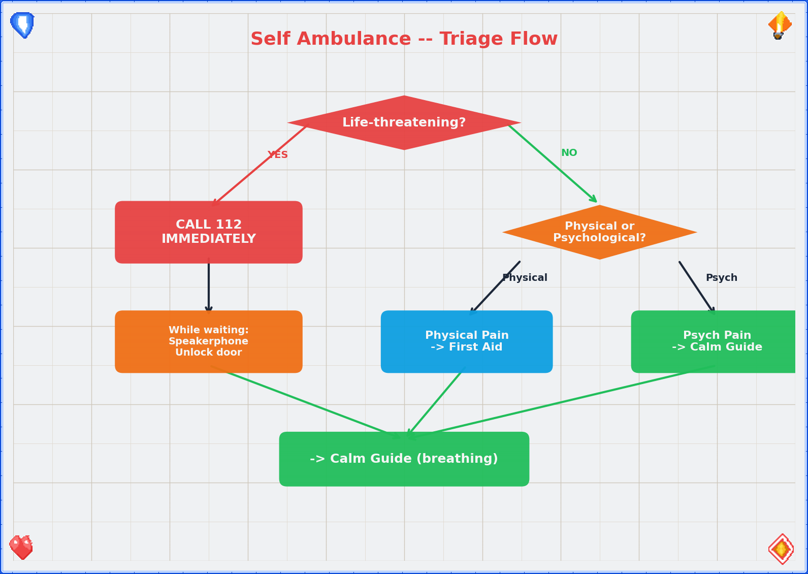

## Assess: Life-Threatening?

Before anything else, run this triage. It takes 10 seconds.

```
◆ Is this immediately life-threatening?

    Signs that say YES:
    ─ Uncontrolled bleeding (sputing / soaking through fabric)
    ─ Difficulty breathing or no breathing
    ─ Loss of consciousness, unresponsive
    ─ Chest pain + jaw/arm pain + sweating + nausea
    ─ Seizure in progress
    ─ Severe head injury with confusion or vomiting
    ─ Suspected spinal injury (numbness, can't move limbs)

    ├─ YES → Call 112 immediately (or 110 if police needed).
    │         Do not finish reading this guide first.
    │         Speakerphone is your friend — dial, then follow
    │         dispatcher instructions while keeping hands free.
    │
    └─ NO → Continue to Basic First Aid.
```

**The 10-second rule:** If you're unsure whether it's life-threatening, treat it as if it is. Call 112. Dispatchers would rather talk you through a false alarm than not get the call for a real one. You are not wasting their time. That's literally what they're there for.

### Triage Priority Heatmap

When multiple issues are present simultaneously (you're bleeding AND anxious AND the room is spinning), you need a priority framework. The triage heatmap uses a 2D matrix of severity × urgency:[^triage]

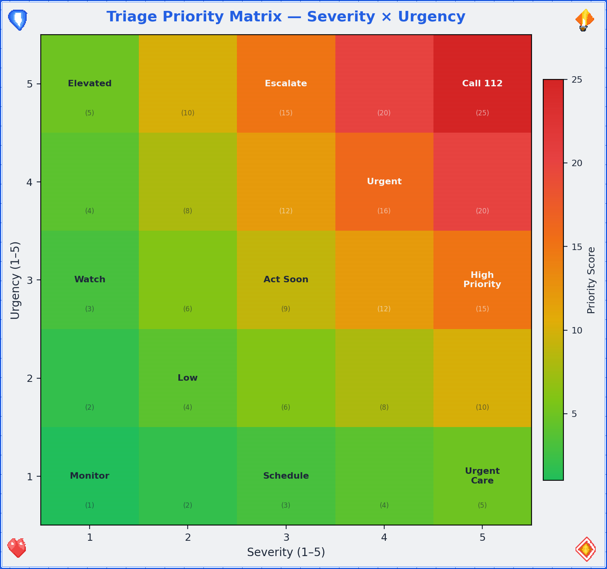

| Priority | Condition | Action |
|----------|-----------|--------|
| **P1 — Immediate** | Life-threatening, airway/breathing/circulation compromised | Call 112. Act now. |
| **P2 — Urgent** | Serious but stable; could deteriorate | Call 112 or 116117. Monitor closely. |
| **P3 — Delayed** | Needs treatment but not time-critical | Self-care → seek medical attention within hours. |
| **P4 — Minor** | Discomfort without danger | Self-care → 📍 Calm Guide (Ch.4) |

The heatmap concept can also be formalized using Bayes' theorem for triage decisions — calculating the posterior probability that a symptom constellation represents a life-threatening condition given the observed signs:[^bayes_triage]

$$P(\text{critical} \mid \text{signs}) = \frac{P(\text{signs} \mid \text{critical}) \cdot P(\text{critical})}{P(\text{signs})}$$

You don't need to calculate this — your brain does an approximate version automatically when it says "this feels really bad." Trust that intuition when it pushes you toward P1. The false-positive cost (an unnecessary 112 call) is vastly lower than the false-negative cost (not calling when you should have).

## Basic First Aid Quick Reference

### Wounds

```
◆ Is the wound bleeding?

    ├─ Heavily (soaking through cloth in < 30 seconds)
    │     1. Apply firm, direct pressure with clean cloth.
    │        Do NOT remove the first cloth if it soaks through —
    │        add more on top. Removing it breaks the clot.
    │     2. Elevate the wound above heart level if possible.
    │     3. If limb: apply a tourniquet ONLY if bleeding is
    │        life-threatening and pressure isn't working.
    │        Note the time you applied it. Tell the paramedics.
    │     4. Call 112 if not already done.
    │
    ├─ Moderately (oozing, slow)
    │     1. Clean under cool running water.
    │     2. Apply pressure for 5–10 minutes without peeking.
    │     3. Cover with a sterile bandage or clean cloth.
    │     4. Monitor for signs of infection over next 48 hours:
    │        redness spreading, warmth, red streaks, fever.
    │        If any appear → see a doctor.
    │
    └─ Minor (scratch, small cut)
          1. Clean it. Soap and water > everything else.
          2. Bandage it. Leave it alone.
          3. Check tetanus status if it's been > 10 years
             since your last booster.
```

### Burns

| Degree | Appearance | Treatment | When to get help |
|--------|-----------|-----------|-----------------|
| 1st | Red, painful, no blisters (sunburn-like) | Cool under running water 10–20 min. Not ice. Not butter. Not toothpaste. WATER. Aloe or moisturizer. | Self-care usually sufficient |
| 2nd | Blisters, very painful, wet-looking | Cool under running water 10–20 min. Do NOT pop blisters. Cover loosely with non-stick material. | Larger than palm or on face/hands/genitals → see doctor |
| 3rd | White/brown/black, dry, may not hurt (nerve damage) | Do NOT apply water to large burns. Cover loosely with clean cloth. | **Call 112. This is not a bathroom fix.** |

**Burn surface area estimation:** For larger burns, estimate the percentage of total body surface area (TBSA) affected using the Lund-Browder chart, which adjusts for age:[^lundbrowder]

| Body region | Adult % TBSA |
|-------------|-------------|
| Head | 7% |
| Each arm | 9% |
| Anterior trunk | 18% |
| Posterior trunk | 18% |
| Each leg | 18% |
| Perineum | 1% |

**Rule of nines (quick estimate):** The patient's palm (including fingers) ≈ 1% TBSA. Count palms to estimate small burns. Burns > 20% TBSA = call 112 immediately (fluid loss, shock risk, infection risk).

### Suspected Fractures

1. **Don't move it.** The body part is in the position it's in for a reason. That reason may include "broken." Moving it adds reasons.
2. **Immobilize.** Use whatever's available — rolled towel, magazine, piece of cardboard — to create a splint that keeps the area from moving. Pad it with cloth. Secure it gently (not tight — you need circulation below the injury site).
3. **Ice.** Wrapped in cloth, applied for 20 minutes on / 20 minutes off. Not directly on skin.
4. **Elevate.** If it doesn't hurt more to do so, raise the injured area above heart level to reduce swelling.
5. **Seek medical attention.** Fractures need imaging. Your bathroom does not have an X-ray machine (and if it does, we have different questions).

### FAST Stroke Assessment — Formalized

The FAST assessment is a rapid screening tool for stroke. Time is brain — every minute of untreated stroke destroys approximately 1.9 million neurons.[^stroke_time]

| Component | Test | Positive sign |
|-----------|------|---------------|
| **F** — Face | Ask the person to smile | One side droops (facial palsy) |
| **A** — Arms | Ask the person to raise both arms | One arm drifts downward |
| **S** — Speech | Ask the person to repeat a simple phrase | Speech slurred or incomprehensible |
| **T** — Time | Note the time symptoms started | Call 112 immediately. Note onset time — it determines treatment eligibility. |

**Key detail:** Thrombolytic therapy (clot-busting medication) is most effective within 4.5 hours of symptom onset. The treatment window is:

$$t_{treatment} < 4.5\text{ hours from onset}$$

If you don't know when symptoms started, the clock starts at the last time you *know* the person was normal. This is why "Time" is in the acronym — it's not just urgency, it's a literal countdown.

### Vital Signs (How to Check If You're Okay-ish)

| Sign | How to check | Normal range | Concerning | Critical |
|------|-------------|-------------|-----------|----------|
| Heart rate (HR) | Two fingers on wrist (radial artery) or neck (carotid). Count beats for 15 seconds × 4. | $HR \in [60, 100]$ bpm | $< 50$ or $> 120$ at rest | $< 40$ or $> 150$ |
| Respiratory rate (RR) | Count breaths for 30 seconds × 2. One inhale + exhale = 1. | $RR \in [12, 20]$/min | $< 10$ or $> 30$/min | $< 8$ or $> 40$/min |
| SpO₂ (oxygen saturation) | Pulse oximeter (if available). | $SpO_2 \in [95, 100]$% | 90–94% | $< 90$% |
| Blood pressure (BP) | BP cuff (if available). | $BP < 120/80$ mmHg | 120–139/80–89 | $\geq 140/90$ or $< 90/60$ |
| Consciousness | Can you answer: who are you, where are you, what day is it? | All 3 correct | Any incorrect or confused | Unresponsive |
| Skin color | Look at your face, lips, nail beds. | Pink/warm | Pale/blue/gray/mottled | Cyanotic (blue lips/nail beds) |

If any vital sign is in the "concerning" column and you're alone → call 112. If in the "critical" column → call 112 immediately, no deliberation. These numbers aren't suggestions — they're thresholds derived from decades of clinical data.

### NRS Pain Scale Quick Reference

For a detailed breakdown of the NRS pain scale with physiological correlates, see Ch.3 (Situation C). Quick version:

$$NRS \in [0, 10]$$

- NRS 0–3: Manage with self-care
- NRS 4–6: Assess cause, consider professional help
- NRS 7–10: Call 112 if acute onset; 📍 Self Ambulance protocols


## When to Call for Help

### Call 112 immediately if:

- Uncontrolled bleeding that doesn't slow with 10 minutes of pressure
- Difficulty breathing or chest pain with jaw/arm radiation
- Loss of consciousness (even brief)
- Suspected stroke: face drooping, arm weakness, speech difficulty (remember: **FAST** — Face, Arms, Speech, Time)
- Severe allergic reaction: swelling of throat/tongue, difficulty breathing, widespread hives
- Seizure lasting > 5 minutes or first-time seizure
- Head injury with vomiting, confusion, or loss of consciousness
- Severe abdominal pain with rigidity (stomach hard as a board)
- Any situation where you think "I should probably call" — call

**The golden rule:** If you're debating whether to call, the debate itself is a signal. Call. Dispatcher > regret.

## Self-Care While Waiting

1. **Position yourself safely.** Conscious and breathing fine? Sit or lie in a comfortable position. Semi-recumbent (propped up at 45°) works well. Feeling faint? Lie flat with legs elevated. Nauseous? Lie on your side (recovery position). The bathroom floor is a perfectly acceptable place for this.
2. **Stay conscious.** If you feel yourself fading, fight it — not heroically, just practically: talk to yourself out loud, keep your eyes open and focused on a specific object, move your fingers and toes. Sensory input keeps the brain online.
3. **Breathe.** → 📍 Calm Guide (Ch.4, Breathing Exercises). The same breathing techniques that help anxiety also help pain and shock.
4. **Don't eat or drink.** If you might need surgery, an empty stomach is safer. Small sips of water are usually fine, but ask the dispatcher.
5. **Unlock the door.** If you've called 112, emergency services need to be able to reach you. Unlock the bathroom door now, while you still can.
6. **Phone placement.** Put your phone on speaker or place it within arm's reach. Don't hold it in your hand if you might lose consciousness — it'll fall and become unreachable.

## Self Ambulance for Non-Physical Emergencies

The same framework applies to situations where the "injury" is psychological or situational. The logic is identical: stabilize, assess, get help.

| Physical version | Psychological equivalent |
|---|---|
| Uncontrolled bleeding | Acute panic / emotional flooding |
| Apply pressure | 📍 Calm Guide breathing exercises |
| Elevate the wound | Remove yourself from the triggering situation |
| Call 112 | Call a crisis line (→ Ch.7, §14.2) |
| Stay conscious | Stay present — **5-4-3-2-1 grounding**: name 5 things you can see, 4 you can touch, 3 you can hear, 2 you can smell, 1 you can taste |
| Unlock the door | Tell someone you need help |
| Monitor vital signs | Monitor your emotional state: "Am I getting worse, stable, or better?" |

The 5-4-3-2-1 technique is worth memorizing because it requires zero equipment and works everywhere. It forces your brain to shift from internal distress to external perception. You can't process a threat response and catalog sensory data simultaneously — one displaces the other. Use that.

[^triage]: FitzGerald, G., et al. "Emergency department triage revisited." *Emergency Medicine Journal* 27(2), 86–92 (2010). Modern triage systems (ESI, Manchester, Australasian) all use some variant of the severity × urgency matrix. The 4-level priority system used here is simplified for self-triage; clinical systems use 5 levels.

[^bayes_triage]: Gill, C.J., et al. "A method for Bayesian triage in resource-limited settings." *PLoS ONE* (various). While clinicians rarely calculate explicit Bayes' theorem, the underlying reasoning — "how likely is this to be serious given what I'm seeing?" — is Bayesian inference. The key insight for self-triage: when in doubt, assume higher severity (prioritize sensitivity over specificity). A false alarm is cheap; a missed emergency is catastrophic.

[^lundbrowder]: Lund, C.C. & Browder, N.C. "The estimation of areas of burns." *Surgery, Gynecology & Obstetrics* 79, 352–358 (1944). The Lund-Browder chart remains the gold standard for burn surface area estimation, adjusting for the proportionally larger head and smaller limbs of children. The simpler "Rule of Nines" (each arm = 9%, each leg = 18%, etc.) is a rough adult approximation.

[^stroke_time]: Saver, J.L. "Time is brain — quantified." *Stroke* 37(1), 263–266 (2006). During acute ischemic stroke, the brain loses approximately 1.9 million neurons, 14 billion synapses, and 12 km of myelinated fibers per minute. This is why the FAST protocol emphasizes "Time" — thrombolytic therapy efficacy declines dramatically with each passing hour.


---
---
title: "Zombie Guide"
chapter: 6
revision: "3.2.0"
last_updated: "2026-05-03"
dependencies:
  - ../diagrams/survival_pyramid.png
  - ../diagrams/scaling_chart.png
  - ../diagrams/survival_probability_function.png
  - ../diagrams/group_complexity_scaling.png
  - ../diagrams/water_requirements_scaling.png
---

# 🧟 Zombie Guide — When "Calm" Isn't the Problem, "Alive" Is

You arrived here from one of two paths: either you created something that hatched during a post-apocalypse, or you followed a biological-entity path that led to zombification. Either way, the social contract you've been operating under has been revoked. The rules are different now. Let's learn the new ones.

> **Important framing:** This guide is half genuine survival knowledge and half thought experiment — because the skills for surviving a zombie apocalypse overlap with the skills for surviving *any* catastrophe: earthquake, flood, economic collapse, prolonged infrastructure failure. If you prepare for zombies, you're prepared for reality. That's the joke that isn't entirely a joke.

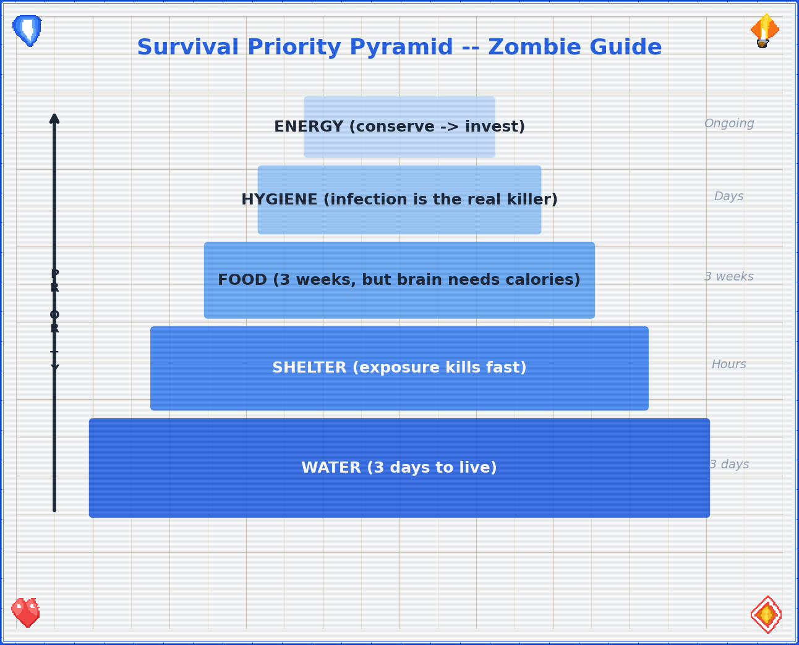

## Survival Probability Function

Before we dive into the practical stuff, let's establish the mathematical framework. Your survival probability over time follows an exponential decay model — not because you're doomed, but because risk accumulates:

$$P(\text{survive}, t) = e^{-\lambda t}$$

Where $\lambda$ is the hazard rate (probability of a fatal event per unit time). The good news: $\lambda$ is not fixed. Every skill you acquire, every resource you secure, every ally you find *reduces* $\lambda$. The survival function becomes:

$$P(\text{survive}, t) = e^{-(\lambda_0 - \sum_{i} r_i) t}$$

Where $\lambda_0$ is the baseline hazard and each $r_i$ is a risk reduction factor: water secured, shelter established, group formed, perimeter defended. The math says: every preparation matters. Every skill moves the curve. You are not helpless — you're a variable in your own survival equation.[^survival_model]

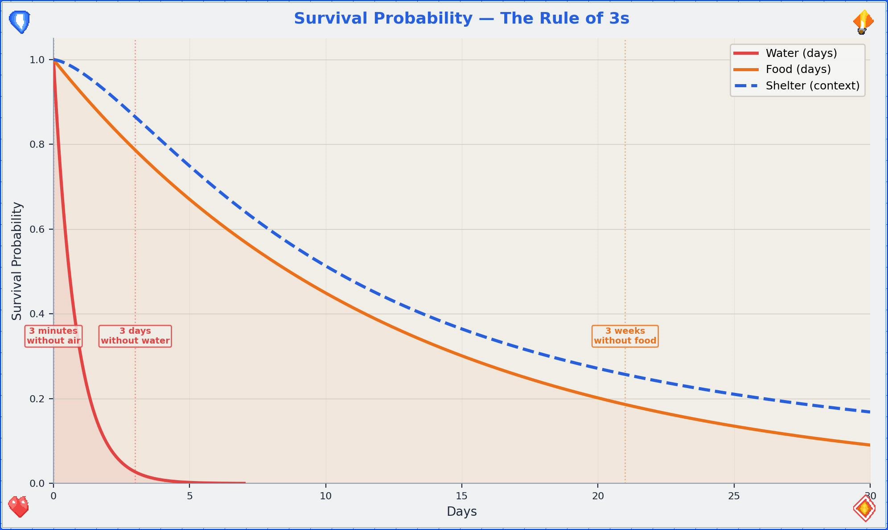

## Mini Survival Guide ("In Nature")

The infrastructure you've depended on is gone. The grid is down. You are, for the first time in your life, an animal in an ecosystem. Act like one — a smart one.

### Water — Priority Zero

You die in 3 days without water. Everything else is secondary.

**Water requirement formula:**

$$W = n \cdot 3\text{L/day}$$

Where $n$ is the number of people in your group and 3L/day covers drinking + basic cooking. This scales linearly but the logistics don't:

| Group size | Daily water need | Weekly water need | Collection effort |
|-----------|-----------------|-------------------|-------------------|
| 1 | 3L | 21L | One person can carry |
| 5 | 15L | 105L | Multiple trips or coordinated |
| 10 | 30L | 210L | Dedicated water duty |
| 30 | 90L | 630L | Well or large water source required |
| 100 | 300L | 2100L | Infrastructure (well, pump, pipeline) needed |

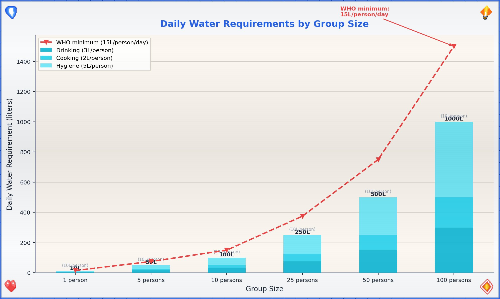

1. **Find it.** Flowing water (streams, rivers) is better than standing water (ponds, puddles). Rainwater is generally safe to collect. Dew can be gathered with cloth wrung into a container.
2. **Purify it.** Always assume water is contaminated. Methods, ranked by reliability:
   - **Boil** for 1 minute (3 minutes above 2000m elevation). Gold standard. Kill everything.
   - **Filter** through cloth + sand + charcoal layers (improvised). Removes particulates and some pathogens.
   - **Chemical treatment:** 2 drops of unscented household bleach per liter, wait 30 minutes. Or water purification tablets.
   - **UV exposure:** Clear plastic bottle, leave in direct sunlight for 6+ hours. UV kills pathogens. Slow but works.
3. **Store it.** Every container you find is now a water container. Fill everything. You will never have too much water.

### Food

You can survive ~3 weeks without food. That's generous compared to water, but your cognitive function degrades fast without calories.

**Caloric requirements:**

$$E_{basal} \approx 1500 \text{ kcal/day} \quad \text{(resting metabolic rate)}$$
$$E_{survival} \approx 2500\text{–}3000 \text{ kcal/day} \quad \text{(active survival activity)}$$

The gap between basal and active survival requirements ($\Delta E \approx 1000\text{–}1500$ kcal) is the energy you spend on foraging, building, defending, and moving. Every unnecessary activity burns calories you can't afford to waste.

1. **Foraging.** Learn 3–5 easily identifiable local wild plants that are edible. Dandelion (entire plant), nettles (cook first), blackberries, wild garlic — widespread across Europe. If you can't identify it with certainty, don't eat it. Starvation is preferable to poisoning.
2. **Hunting/trapping.** Small game (rabbits, birds) is more practical than large game. Snares require wire and knowledge. Fishing requires water and patience. Principle: calories-in > calories-out. Don't spend more energy catching food than the food provides.
3. **Scavenging.** In a collapse scenario, preserved food in abandoned stores is your friend. Canned goods last years. Check seals — bulging cans are bacterial, not food. Prioritize: canned > dried > fresh (perishable).
4. **Insects.** Yes, really. Crickets, grubs, ants — high protein, widely available, no hunting skill required. Cook them if you can. If you can't, they're still more nutritious than your pride.

### Shelter

Exposure kills faster than starvation. Hypothermia: wet + cold + wind.

1. **Location.** High ground (avoid flood zones), away from obvious paths (avoid detection), near water source but not directly beside it.
2. **Insulation.** Layers of dry leaves, pine needles, cardboard, clothing — anything between you and the ground. The ground is a heat sink.
3. **Windbreak.** A wall, hedge, car, or stacked debris blocking the prevailing wind direction. Wind strips heat. Block it.

### Reading Traces & Observing Environments

- **Tracks.** Disturbed dirt, broken twigs, bent grass — direction and recency. Fresh tracks have sharp edges; old ones are rounded by wind and rain.
- **Sound.** Learn the baseline soundscape. Anything that breaks the baseline is information. Birds alarm-calling = predator nearby.
- **Smell.** Smoke = fire = other humans (or uncontrolled wildfire). Rotting = biological hazard. Cooking food = people, potentially friendly.
- **Patterns.** Zombies (canonical model) are attracted to sound and movement. Move quietly, deliberately, in shadow when possible.

### Energy

Conserve it. The survival economy is brutally simple:

```
  Energy in (food) ──→ Energy out (activity)

  Rule: If the activity doesn't contribute to survival,
        don't do it. Panic running is energy waste.
        Strategic walking is energy investment.
```

### Hygiene

The thing that kills most people in disaster scenarios isn't the disaster itself — it's the infection that follows. Cholera, dysentery, and wound sepsis have killed more humans than every zombie movie combined.

- **Defecate** away from water sources and camp. Bury it. Minimum 30m from water, 30m from shelter.
- **Wash hands** with ash and water if soap is unavailable. Ash is alkaline and breaks down oils/bacteria.
- **Wounds** must be cleaned immediately. Even small cuts can become lethal in a low-hygiene environment.
- **Teeth.** If you find a toothbrush, it's more valuable than you think. Improvise: chewed stick (miswak technique), salt water rinse.

## Mini Collapsing Society Guide

The immediate danger has passed (or you've adapted). Now: the infrastructure that kept 8 billion humans alive is degraded or gone. You need to rebuild some of it, locally.

### Gathering Remaining Resources

Priority order — not by what's valuable, but by what's *irreplaceable*:

| Priority | Resource | Why it matters | Notes |
|----------|----------|---------------|-------|
| 1 | **Medical** | Drugs, equipment, and most critically: **medical personnel** | A trained nurse is worth 1000 crates of supplies. Protect them. |
| 2 | **Bicycles** | Transportation that doesn't require fuel. Silent. Maintainable. | Cars need fuel, fuel degrades, fuel is loud. Bikes are the post-apocalypse vehicle. |
| 3 | **Water source** | A well, spring, or clean river access point | Secure it. Defend it. Share it strategically. |
| 4 | **Energy source** | Solar panels, batteries, generators, firewood | Renewable > consumable. Solar panels are permanent; fuel is finite. |
| 5 | **Sustainable materials** | Seeds, soil, tools, fabric, rope, metal, knowledge | The stuff you can't loot — you have to produce. |
| 6 | **Tech** | Radios, phones (offline tools), reference books | A first-aid manual > smartphone with no network. Books don't need charging. |

**Looting etiquette (yes, even now):** If someone else is already there, the resource is theirs by occupancy. Fight only if the cost of fighting is less than the value of the resource. It almost never is. Cooperation > conflict. Always.

### Securing Friends + People in Need

You cannot survive alone long-term. The lone wolf dies. The pack lives.

1. **Find your people.** Start with people you know and trust. Expand outward. Trust is transitive but degrades with distance — one degree of separation is reliable, two is uncertain, three is stranger.
2. **Rescue those who need it.** Children, elderly, injured, isolated — these people cost resources short-term and provide social cohesion and meaning long-term. A community that abandons its vulnerable will collapse from the inside.
3. **Vetting newcomers.** Everyone gets a trial period. Observe behavior under stress. Do they share? Do they lie? Do they pull their weight? Three strikes is generous; two is practical.

### Group Communication Channels

As your group grows, communication complexity explodes. The number of pairwise communication channels in a group of $n$ people is:

$$C(n) = \frac{n(n-1)}{2}$$

| Group size | Channels $C(n)$ | Implication |
|-----------|----------------|-------------|
| 3 | 3 | Everyone talks to everyone. Easy. |
| 5 | 10 | Still manageable, but some conversations get missed. |
| 10 | 45 | You need structured communication. |
| 20 | 190 | Without systems, information is lost constantly. |
| 50 | 1,225 | Formal communication channels are mandatory. |
| 100 | 4,950 | Hierarchy or network structure required. |

This is why small groups feel "tight" and large groups feel "bureaucratic" — the communication channels scale quadratically. You can't fight the math. You can only design systems that acknowledge it.[^communication_channels]

### Dunbar Numbers — The Social Brain Hypothesis

Robin Dunbar's research on primate neocortex size and social group sizes produced a series of concentric circles of human social capacity:[^dunbar]

$$D_n = 5 \cdot 3^{n-1} \quad \text{for } n \in \{1, 2, 3, 4, 5\}$$

| Layer | Size | Relationship quality | In survival context |
|-------|------|---------------------|-------------------|
| $D_1$ | ~5 | Intimate support group | Your inner circle. Trust with your life. |
| $D_2$ | ~15 | Close friends | Reliable allies. Regular contact. |
| $D_3$ | ~50 | Casual friends | Know their names and skills. Occasional contact. |
| $D_4$ | ~150 | Meaningful contacts | Recognize faces. Know reputations. |
| $D_5$ | ~500 | Acquaintances | Names might ring a bell. Expanding network. |

The implication for survival groups: at ~5 people, you have deep mutual knowledge. At ~15, you need explicit coordination. At ~50, you need sub-groups and representatives. At ~150, you need formal governance. The Dunbar numbers aren't just social science — they're the scaling limits of trust, and trust is the currency of survival.

### Self-Defense (Last Resort)

The math of violence is always bad: winner is still injured and spent resources; loser is dead or vengeful; avoider is intact with resources preserved.

1. **Situational awareness.** See threats before they become fights. The best fight is the one that never happens.
2. **Barriers.** Doors, walls, fences, distance. Obstacles buy time, and time buys options.
3. **Improvised weapons.** Reach (sticks, pipes) > edge (knives, glass) > weight (rocks, hammers). Reach keeps them away. That's the whole point.
4. **Numbers.** A group of 3 is harder to attack than a group of 1. This is the fundamental math of defense.

### Water · Energy · Hygiene at Scale

- **Water:** 3 liters per person per day (drinking + cooking). 10 people = 30L/day. A well producing 100L/day supports ~30 people.
- **Energy:** One solar panel (~300W) supports basic lighting + phone charging for a small group. Heating and cooking require significantly more. Prioritize: cooking > light > comfort.
- **Hygiene:** Latrines must scale with population. 1 latrine per 20 people, minimum. A cholera outbreak in a group of 50 with no sanitation will kill more than any zombie ever did.

## Mini Building Society Guide

You've survived. Now you need to *live*. Organizing, making decisions together, building something that outlasts the crisis.

### Organizing: The First Meeting

1. **Agenda for Meeting #1:**
   - Who's here? (Names, skills, needs)
   - What do we have? (Resource inventory)
   - What do we need? (Gap analysis)
   - Who does what? (Role assignment)
   - When do we meet again? (Daily at first, then weekly)

2. **Roles to fill immediately:**
   - **Coordinator** — keeps the schedule, calls meetings, tracks decisions (facilitator, not leader)
   - **Supply manager** — tracks resources in and out
   - **Medic** — whoever has the most medical knowledge
   - **Security** — awareness, not aggression
   - **Cook** — communal meals build trust faster than any meeting

### Ostrom's 8 Principles for Common-Pool Resource Governance

Elinor Ostrom won the Nobel Prize in Economics (2009) for her work on how communities govern shared resources without top-down control. Her 8 design principles are the closest thing to a proven blueprint for self-governance:[^ostrom]

1. **Clearly defined boundaries** — Who can use the resource? Who can't?
2. **Congruence with local conditions** — Rules fit the actual situation, not an abstract ideal
3. **Participatory decision-making** — People affected by the rules help make them
4. **Monitoring** — Someone watches the resource and the rule-followers
5. **Graduated sanctions** — Small violations get small penalties, not exile
6. **Conflict resolution mechanisms** — Fast, cheap, fair dispute resolution
7. **Minimal recognition of rights** — External authorities don't undermine local governance
8. **Nested enterprises** — Large systems are built from smaller, self-governing units

These principles emerged from studying fisheries, irrigation systems, forests, and pastures — real communities managing real scarce resources over centuries. They work because they align incentives with consequences. A community that follows all 8 is remarkably resilient. A community that ignores them is, historically, short-lived.

### Forms of Self-Administration

| Model | How it works | Best for | Weakness |
|-------|-------------|----------|----------|
| Consensus | Everyone must agree. Discussion until unanimous. | Small groups (≤8) | Slow. One holdout blocks everything. |
| Consent | Decisions proceed unless someone objects with reason. | Small-medium (≤25) | Faster. Requires trust. |
| Voting | Majority wins. Simple, familiar. | Medium (≤100) | Minority gets overridden. |
| Delegation | Groups elect representatives who decide. | Large (100+) | Distance between decision-makers and affected people. |
| Rotation | Roles rotate on a fixed schedule. | Any size | Inconsistent leadership. |

**Recommendation:** Start with Consent for day-to-day, Voting for big decisions. Adjust as you scale.

### Psychology of the Masses / Sociology Basics

- **Us vs. Them.** The most powerful social force. It can unite against an external threat — or split from within. If someone is trying to convince you that a subgroup within your community is the enemy, *that person is the actual threat*.
- **Conformity pressure.** Solomon Asch showed people will deny the evidence of their own eyes to agree with a group. If everyone says the water is safe and you think it isn't — speak up. Dissent is a survival skill.
- **Diffusion of responsibility.** "Someone else will handle it." Assign specific tasks to specific people. "Someone check the perimeter" = nobody checks. "Anna, check the perimeter at 2100" = perimeter gets checked.
- **Authority capture.** In crisis, people defer to whoever seems most confident. Confidence ≠ competence. The quiet person with the notebook is probably right.

### Group Complexity Scaling

As groups grow, the internal complexity grows faster than the headcount. We can model this as:

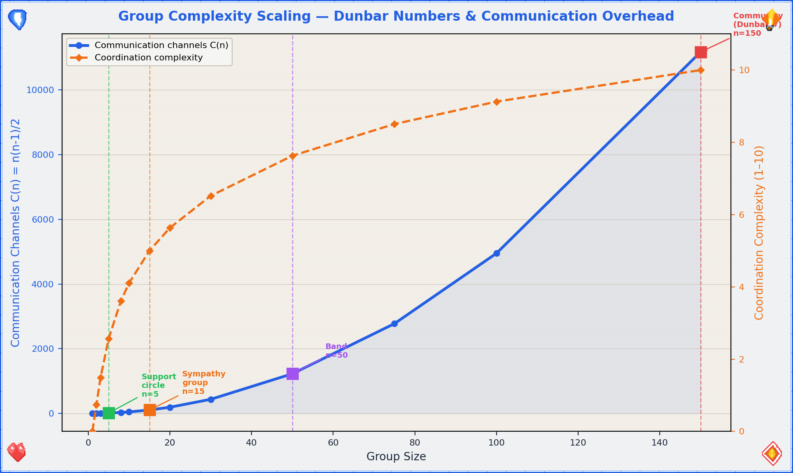

### Scaling Requirements: 1 → 10 → 100

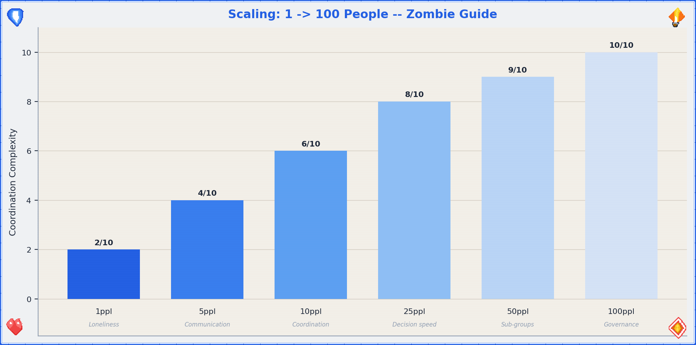

| Scale | Key challenge | What breaks | What to add | Dunbar layer |
|-------|--------------|-------------|-------------|-------------|
| 1 person | Loneliness, skill gaps | Nothing — it's just you | Find people. Any people. | $D_1$ (you) |
| 2–5 | Communication, trust | Unspoken expectations | Explicit agreements, shared meals | $D_1$ (intimates) |
| 6–10 | Coordination, role clarity | "I thought you were doing that" | Regular meetings, written task lists | $D_2$ (close friends) |
| 11–25 | Decision speed | Consensus too slow | Switch to Consent or Voting | $D_2$→$D_3$ transition |
| 26–50 | Sub-groups form | Information silos | Communication channels, representatives | $D_3$ (casual friends) |
| 51–100 | Governance complexity | Power concentration | Formal roles, accountability, rotation | $D_4$ (meaningful contacts) |
| 100+ | Institutional memory | Forgetting why decisions were made | Written records, onboarding for newcomers | $D_5$ (acquaintances) |

The pattern: every time you roughly double the group, your coordination systems need to level up. Don't wait for things to break — anticipate the next scale and prepare before you reach it. The Dunbar numbers tell you approximately where the breakpoints are; Ostrom's principles tell you how to build the structures that bridge them.

[^survival_model]: The exponential survival model $P(t) = e^{-\lambda t}$ is the foundation of survival analysis in statistics and reliability engineering. It assumes a constant hazard rate, which is a simplification — real hazard rates change with environment, season, and preparation level. The modified model $P(t) = e^{-(\lambda_0 - \sum r_i)t}$ is a proportional hazards approximation (Cox, 1972). Each risk reduction factor $r_i$ effectively shifts the entire survival curve upward.

[^communication_channels]: The formula $C(n) = n(n-1)/2$ for pairwise communication channels comes from combinatorics — it's the number of edges in a complete graph $K_n$. In organizational theory, this is known as the "communication overhead" problem. For $n > 10$, most organizations introduce hierarchical or network structures to reduce the effective number of channels any one person must maintain. See: March, J.G. & Simon, H.A. *Organizations* (1958).

[^dunbar]: Dunbar, R.I.M. "Neocortex size as a constraint on group size in primates." *Journal of Human Evolution* 22(6), 469–493 (1992). The formula $D_n = 5 \cdot 3^{n-1}$ is an approximation — the actual numbers vary by ±20% across individuals and cultures. The key insight is the concentric structure and approximate scaling factor of 3, not the precise values. These numbers apply to face-to-face relationships; digital communication may extend some layers but doesn't fundamentally change the cognitive constraints.

[^ostrom]: Ostrom, E. *Governing the Commons: The Evolution of Institutions for Collective Action* (1990). Cambridge University Press. Ostrom's 8 principles were derived from meta-analysis of long-enduring common-pool resource institutions worldwide. She demonstrated that communities can self-govern without either privatization or state control — a finding that overturned decades of conventional wisdom (the "tragedy of the commons" narrative). These principles are directly applicable to any post-crisis community managing shared resources.


---
---
title: "Professional Support Directory"
chapter: 7
revision: "3.2.0"
last_updated: "2026-05-03"
dependencies: []
---

# 📞 Professional Support Directory — When the Bathroom Isn't Enough

This guide is a first response tool, not a replacement for professional help. The bathroom is where you stabilize. The people and organizations listed here are where you *resolve*. Every entry in this directory was referenced by at least one path in the main guide — this section is where those references land.

**How to use this directory:** Find the category that matches your need. Call the number, visit the website, or go to the place. If the first contact doesn't work, try the next one. Persistence is not weakness — it's logistics.

**Regional note:** Listings are primarily oriented toward Germany (D) with EU context. If you're reading this elsewhere, the categories still apply — substitute your local equivalents.

## Emergency Numbers

| Service | Number | When to call | Notes |
|---------|--------|-------------|-------|
| **Fire / Medical Emergency** | **112** | Life-threatening medical emergencies, fires, accidents | EU-wide. Dispatcher stays on line. Speakerphone for hands free. |
| **Police** | **110** | Crimes in progress, threats, domestic violence | EU-wide. Can't speak? Dial, wait, press 55 (Germany). |
| **Poison Control** | 030/19240 (Berlin) | Suspected poisoning, overdose, chemical exposure | Have substance name ready. |
| **Crisis Line (general)** | 0800/111 0 111 | Acute emotional crisis, suicidal thoughts | Free, 24/7, anonymous. No question too small. |
| **Children & Youth Emergency** | 116 111 | Children/teens in crisis | EU-wide. Also for adults concerned about a young person. |

**The 112/110 decision matrix:**

```
◆ Is someone's life in immediate danger?

    ├─ Yes → 112 (ambulance + fire if needed)
    └─ No, but there's a crime/threat → 110 (police)
       No, and it's emotional/psychological → 0800/111 0 111
```

## Psychological Support

Your brain is an organ. Sometimes organs need professional attention. This isn't character failure — it's maintenance.

### Evidence-Based Therapy Effectiveness

When you're told to "get help," it helps to know that the help actually works. Here's what the evidence says about major therapeutic approaches:[^therapy_evidence]

| Therapy | Primary use | Response rate | Evidence level |
|---------|------------|---------------|---------------|
| CBT (Cognitive Behavioral Therapy) | Anxiety, depression, PTSD | ~60% response rate for anxiety[^cbt_anxiety] | ★★★ Multiple large RCTs and meta-analyses |
| EMDR (Eye Movement Desensitization) | PTSD, trauma | ~70% PTSD symptom reduction[^emdr] | ★★★ WHO-recommended for PTSD |
| IPT (Interpersonal Therapy) | Depression, grief | ~50–60% response rate for depression | ★★★ Well-validated |
| Psychodynamic therapy | Personality, chronic patterns | ~50% improvement; effects increase over time[^psychodynamic] | ★★☆ Growing evidence base |
| MBSR (Mindfulness-Based Stress Reduction) | Stress, anxiety, chronic pain | ~30–40% symptom reduction[^mbsr] | ★★★ Kabat-Zinn's 8-week program, widely replicated |

The response rates aren't 100% because human brains are not simple machines. But a 60% chance of significant improvement is substantially better than the 0% chance of improvement from sitting in a bathroom indefinitely. The "what if it doesn't work for me?" worry is understandable but statistically unwarranted — and if one approach doesn't work, another might.

### IASC Intervention Pyramid

The Inter-Agency Standing Committee (IASC) defines a pyramid of mental health and psychosocial support in emergencies:[^iasc_pyramid]

```
                    ╱╲
                   ╱    ╲
                  ╱  4.  ╲     Specialized services
                 ╱  Clinical ╲   (psychiatry, specialized therapy)
                ╱──────────────╲
               ╱    3. Focused  ╲   Non-specialized support
              ╱   non-specialized ╲  (trained counselors, support groups)
             ╱──────────────────────╲
            ╱   2. Community & family  ╲   Social support
           ╱     support mechanisms      ╲  (group activities, peer support)
          ╱────────────────────────────────╲
         ╱   1. Basic services & security    ╲   Foundational needs
        ╱     (food, shelter, water, safety)   ╲  (this is where the
       ╱──────────────────────────────────────────╲  Zombie Guide lives)
```

**Key insight:** Layer 1 must be secure before Layer 2 is meaningful, Layer 2 before Layer 3, and so on. This is why the guide prioritizes physical safety first — you can't do therapy when you're still in danger. The IASC pyramid is also why the Zombie Guide's survival section (Layer 1) comes before the Building Society section (Layer 2–3).

### Crisis & Acute Support

| Resource | Contact | What it offers | When to use |
|----------|---------|---------------|-------------|
| **Telefonseelsorge** | 0800/111 0 111 (or 0 222) | Anonymous, free, 24/7 phone counseling | Acute emotional crisis, loneliness, despair |
| **Nummer gegen Kummer** | 116 111 (youth) / 0800/111 0550 (parents) | Phone counseling for youth and parents | When a young person is struggling, or you're struggling as a parent |
| **Psychiatrischer Krisendienst** | Search: "[your city] psychiatrischer Krisendienst" | Mobile crisis team — they come to you | When you can't go to them. Many cities have 24/7 teams. |

### Ongoing Support

| Resource | How to access | What it offers |
|----------|-------------|---------------|
| **Hausarzt (GP)** | Make an appointment | First point of entry. Can refer to specialists, prescribe medication, sign you off work. |
| **Psychotherapist** | Search: therapie.de, psych-info.de, Jameda | Talk therapy, CBT, trauma processing. Waitlists can be long — ask about "Akutplätze." |
| **Psychiatrist** | Via GP referral or direct | Medication management, diagnosis, severe mental health conditions. |
| **EAP (Employee Assistance)** | Via your employer (if available) | Free, confidential short-term counseling. Often underused. |
| **Self-help groups** | Search: selbsthilfegruppe.de | Peer support for specific issues. Shared experience is powerful medicine. |

### Friends' Psych Support Guide

When someone you care about is struggling and you don't know what to do:

1. **Listen before fixing.** Ask: "Do you want me to just listen, or do you want suggestions?" Respect the answer.
2. **Don't minimize.** Avoid "it could be worse" or "just think positive." Well-intentioned and deeply unhelpful.
3. **Stay connected.** Check in regularly, even with a simple "thinking of you." Isolation amplifies everything.
4. **Know your limits.** You are a friend, not a therapist. If the situation exceeds your capacity, say so with love: "I care about you and I think you need more support than I can give. Can I help you find someone?"
5. **Take care of yourself.** Empathy is finite. Refill your own reserves → 📍 Calm Guide (Ch.4).

## Legal Support

When the situation involves law, rights, or potential criminal liability, you need someone who speaks the language of the system.

### Self-Defense Law (Germany — §32 StGB Notwehr)

- You may defend yourself against a **present, unlawful attack** against yourself or another person.[^stgb32_full]
- The defense must be **necessary** — no less harmful alternative available.
- The defense must be **proportionate** — you can't use deadly force to protect property alone.
- No duty to retreat in Germany, but retreating is always the safer legal strategy.
- If you acted in self-defense and are unsure about the legal outcome → contact a lawyer **before** making any statements to police.

The four elements of §32 StGB, formalized:

| Element | Legal requirement | Practical meaning |
|---------|------------------|-------------------|
| (1) Present attack | An attack is happening *now*, not hypothetical | You can't preemptively defend against an imagined threat |
| (2) Unlawful | The attack violates law | You can't claim self-defense against lawful actions (e.g., police arrest) |
| (3) Defensive action | Your response is directed at stopping the attack | Vengeance after the fact ≠ self-defense |
| (4) Proportionality | The response is commensurate with the threat | No shooting someone for pushing you[^proportionality] |

### Finding Legal Help

| Resource | Contact | What it offers |
|----------|---------|---------------|
| **Notdienst (emergency lawyer)** | 0180/522 44 66 | 24/7 emergency legal advice |
| **Rechtsanwaltskammer** | Search: "[your city] Rechtsanwaltskammer" | Lawyer directory, free initial consultation referrals |
| **Beratungshilfe** | Local Amtsgericht | Free legal advice for low-income individuals |
| **Fachanwalt für Strafrecht** | Search: "[your city] Fachanwalt Strafrecht" | Criminal law specialist |
| **Weisser Ring** | 0180/34 34 34 | Support for crime victims — legal, financial, emotional |

## Medical Support

### Reproductive Health

| Resource | Contact | What it offers |
|----------|---------|---------------|
| **Pro Familia** | profamilia.de | Counseling on pregnancy, contraception, abortion, sexual health. Non-judgmental. Confidential. |
| **Schwangerschaftskonfliktberatung** | Search: "[your city] Schwangerschaftskonfliktberatung" | Mandatory counseling before abortion in Germany. Free. |
| **Gynecologist (Frauenarzt)** | Search: Jameda, Doctolib | Reproductive health, prenatal care, contraception. |

### Pediatric / Child Health

| Resource | Contact | What it offers |
|----------|---------|---------------|
| **Kinderarzt** | Search: Jameda, Doctolib | General child health, vaccinations, development checks. |
| **Kinder- und Jugendpsychiatrie** | Via GP referral or direct | Mental health support for children and adolescents. |
| **Kinderschutzbund** | kinderschutzbund.de | Child welfare, abuse prevention, family support. |

### General Medical

| Resource | When to use | Notes |
|----------|------------|-------|
| **112 / Rettungsdienst** | Life-threatening emergencies | Don't drive yourself. Ambulance = treatment starts en route. |
| **Kassenärztlicher Bereitschaftsdienst** | 116 117 | After-hours non-emergency medical care. Evenings, weekends, holidays. |
| **Hausarzt** | Everything non-urgent | Your coordination point. Go here first for anything not 112-worthy. |

## Social Support

### State Child Support (Germany)

| Benefit | Who it's for | How to apply |
|---------|-------------|-------------|
| **Kindergeld** | Parents of children < 18 (or < 25 if in education) | Via Familienkasse. €250/child/month (2026). |
| **Elterngeld** | Parents on parental leave | Via Elterngeldstelle. Up to 65–67% of previous income for up to 14 months. |
| **Unterhaltsvorschuss** | Single parents not receiving child support | Via Jugendamt. State pays missing support, then collects from other parent. |
| **Wohngeld** | Low-income households | Via local Wohngeldbehörde. Housing cost subsidy. |
| **Bürgergeld** | Unemployed or low-income individuals | Via Jobcenter. Basic living support + job search assistance. |

### Local Initiatives & Community

| Type | How to find them | What they offer |
|------|-----------------|-----------------|
| **Volksküche / Soup kitchens** | Search: "Volksküche [your city]" | Free or cheap meals, community |
| **Repair Cafés** | repaircafe.org | Free repair sessions, skill sharing, social connection |
| **Community gardens** | Search: "Urban Gardening [your city]" | Food production, community, therapy-by-dirt |
| **Meetup groups** | meetup.com | Interest-based social groups — board games, hiking, coding |
| **Religious communities** | Local churches, mosques, temples | Community, support, many are explicitly welcoming |
| **Queer centers** | Search: "LSVD [your city]" | LGBTQ+ specific support, social events, counseling |
| **Flüchtlingsrat** | Search: "Flüchtlingsrat [your state]" | Support for refugees and migrants — legal, social, practical |

## Quick Reference Card

*Tear this out or photograph it. Keep it in your phone.*

```
┌──────────────────────────────────────────┐
│         EMERGENCY QUICK REFERENCE        │
├──────────────────────────────────────────┤
│  112    Fire / Medical Emergency         │
│  110    Police                           │
│  116117 After-hours doctor (non-emerg.)  │
│  0800/111 0 111  Crisis line (24/7)      │
│  116111 Youth emergency                  │
├──────────────────────────────────────────┤
│  Your doctor: ________________________   │
│  Local hospital: _____________________   │
│  Therapist: __________________________   │
│  Emergency contact: __________________   │
│  WiFi password: _____________________    │
├──────────────────────────────────────────┤
│  → Full directory: Ch.7                  │
│  → Calm Guide: Ch.4                      │
│  → Self Ambulance: Ch.5                  │
│  → IASC pyramid: p.7.2                   │
└──────────────────────────────────────────┘
```

[^therapy_evidence]: Effectiveness rates are approximate and drawn from multiple meta-analyses. Individual outcomes vary significantly. "Response rate" typically means ≥50% symptom reduction on standardized measures. These numbers should encourage, not guarantee — the actual response for any individual depends on therapist fit, engagement level, and the specific condition being treated.

[^cbt_anxiety]: Hofmann, S.G., et al. "The efficacy of cognitive behavioral therapy: A review of meta-analyses." *Cognitive Therapy and Research* 36(5), 427–440 (2012). CBT shows approximately 60% response rate for anxiety disorders across 269 meta-analyses. It is the most empirically supported psychotherapy for anxiety.

[^emdr]: Bisson, J., et al. "Post-traumatic stress disorder." *BMJ Clinical Evidence* (2015). EMDR is recommended by WHO, NICE, and APA for PTSD treatment. Response rates of ~70% for PTSD symptom reduction are consistent across trials.

[^psychodynamic]: Shedler, J. "The efficacy of psychodynamic psychotherapy." *American Psychologist* 65(2), 98–109 (2010). Psychodynamic therapy shows effect sizes comparable to CBT, with the unique property that patients continue to improve *after* treatment ends — the "sleeper effect."

[^mbsr]: Khoury, B., et al. "Mindfulness-based therapy: A comprehensive meta-analysis." *Clinical Psychology Review* 33(6), 763–771 (2013). MBSR shows moderate effect sizes (Hedges' g = 0.5–0.6) for anxiety and depression, with sustained benefits at follow-up.

[^iasc_pyramid]: IASC. *Guidelines on Mental Health and Psychosocial Support in Emergency Settings* (2007). The 4-layer pyramid is the global standard for organizing MHPSS interventions in humanitarian emergencies. Layer 1 (basic needs) is prerequisite for all higher layers — a principle this guide follows by prioritizing physical safety before psychological support.

[^proportionality]: The proportionality requirement in §32 StGB is assessed holistically by German courts, considering the value of the protected interest, the intensity of the attack, and the availability of less harmful defensive alternatives. The standard is not "equal force" but "not grossly disproportionate." See: BGHSt 26, 143 (1975) and subsequent case law.

[^stgb32_full]: Strafgesetzbuch (StGB) §32 Notwehr: "Wer eine Tat begeht, die durch Notwehr geboten ist, handelt nicht rechtswidrig." §33 extends leniency for excessive self-defense committed under "confusion, fear, or terror" (Verwirrung, Furcht oder Schrecken).


---
---
title: "Appendix — The Loose Ends"
chapter: 8
revision: "3.2.0"
last_updated: "2026-05-03"
dependencies:
  - ../diagrams/decision_flow_graph.png
---

# Appendix — The Loose Ends

This section collects the things that don't fit neatly into the flow but are essential nonetheless: the master cross-reference, fillable fields, the symbol legend, formula index, and a notes page. Think of it as the bathroom drawer where the important miscellaneous stuff lives.

## Master Cross-Reference: Where Everything Points

Every path in this guide converges on one (or more) of four destinations. This table shows every section and where it routes.

| Source section | Routes to | Diagram references (v3.2) |
|---------------|-----------|--------------------------|
| A1 (Not yet geschlüpft) | 📍 Calm Guide · 📍 Prof. Support (§14.4) | — |
| A2 (Geschlüpft, minutes ago) | 📍 Zombie Guide · 📍 Self Ambulance · 📍 Calm Guide | — |
| A3 (Geschlüpft, days ago) | 📍 Prof. Support (§14.4, §14.2) · 📍 Calm Guide | — |
| A4 (< 10 years ago) | 📍 Prof. Support (§14.5) · 📍 Calm Guide | — |
| A5 (> 20 years ago) | 📍 Calm Guide | — |
| A6 (Ambiguous) | 📍 Calm Guide · 📍 Prof. Support (§14.4, §14.5) | — |
| A7 (Harmed/ended life) | 📍 Prof. Support (§14.3, §14.2) · 📍 Self Ambulance · 📍 Calm Guide | — |
| A8 (Managing responsibility) | 📍 Calm Guide · 📍 Prof. Support (§14.3, §14.2) | — |
| B1 (Acute anxiety) | 📍 Calm Guide | `anxiety_severity_spectrum.png` |
| B2 (General anxiety) | 📍 Prof. Support (§14.2) | `anxiety_severity_spectrum.png` |
| B3 (Worried about…) | 📍 Prof. Support (§14.2) · 📍 Calm Guide | — |
| C1 (Physical pain) | 📍 Self Ambulance | `pain_nrs_correlates.png` |
| C2 (Psych pain) | 📍 Calm Guide · 📍 Prof. Support (§14.2) | — |
| D (Endangered) | 📍 Prof. Support (§14.3, §14.2) · 📍 Calm Guide | — |
| E (Congesting) | 📍 Self Ambulance · 📍 Calm Guide · 📍 Prof. Support (§14.2) | — |
| F (Bad smell) | 📍 Calm Guide (minor) | — |
| G (No place to go) | 📍 Prof. Support (§14.2, §14.5) · 📍 Calm Guide | — |
| Ch.1 (How to Use) | All destinations | `decision_flow_graph.png` |
| Ch.4 (Calm Guide) | 📍 Prof. Support (Ch.7) | `stress_decay_curve.png` |
| Ch.5 (Self Ambulance) | 📍 Calm Guide · 112 | `triage_priority_heatmap.png`, `pain_nrs_correlates.png` |
| Ch.6 (Zombie Guide) | 📍 Self Ambulance · 📍 Calm Guide | `survival_probability_function.png`, `group_complexity_scaling.png`, `water_requirements_scaling.png` |

**Most-referenced destinations (by frequency):**

1. 📍 Calm Guide — 13 references (heart of the document)
2. 📍 Professional Support Directory — 11 references
3. 📍 Self Ambulance Guide — 4 references
4. 📍 Zombie Guide — 1 reference (but what a reference)

## Diagram Index (v3.2)

All diagrams referenced in the guide, organized by chapter:

| Diagram | Chapter | Description |
|---------|---------|-------------|
| `master_flowchart.png` | Ch.1 | Master flowchart — all 7 entry points → 4 destinations |
| `situation_a_tree.png` | Ch.2 | Situation A decision tree |
| `breathing_techniques.png` | Ch.4 | Box Breathing, 4-7-8, Physiological Sigh |
| `survival_pyramid.png` | Ch.6 | Survival priority pyramid |
| `scaling_chart.png` | Ch.6 | Scaling requirements 1→100 |
| `triage_flow.png` | Ch.5 | Self Ambulance triage flow |
| `decision_flow_graph.png` | Ch.1 | Guide topology as directed graph |
| `stress_decay_curve.png` | Ch.4 | Cortisol decay with/without active calming |
| `anxiety_severity_spectrum.png` | Ch.3 | GAD-7 scoring with recommended routing |
| `triage_priority_heatmap.png` | Ch.5 | Severity × urgency triage matrix |
| `survival_probability_function.png` | Ch.6 | Exponential decay with risk reduction factors |
| `group_complexity_scaling.png` | Ch.6 | Communication channels and governance layers |
| `pain_nrs_correlates.png` | Ch.3, Ch.5 | NRS pain scale with physiological markers |
| `water_requirements_scaling.png` | Ch.6 | Daily water needs by group size |

## Formula Index

All mathematical formulas used in the guide, with location and plain-language summary:

| Formula | Location | What it means |
|---------|----------|---------------|
| $G = (V, E)$ | Ch.1 | The guide is a directed graph with vertices and edges |
| $GAD\text{-}7 \in [0, 21]$ | Ch.3 | Anxiety severity score ranges from 0 to 21 |
| $NRS \in [0, 10]$ | Ch.3, Ch.5 | Pain scale ranges from 0 to 10 |
| $S(t) = S_0 + A(1 - e^{-\alpha t})$ | Ch.3 | Stress response activation curve |
| $t_{reset} \approx 10\text{min}$ | Ch.4 | Sympathetic-parasympathetic transition time |
| $C(t) = C_0 \cdot e^{-\lambda t}$ | Ch.4 | Cortisol decay function |
| $\lambda = \frac{\ln 2}{t_{1/2}}$ | Ch.4 | Decay constant from half-life |
| $HRV = \frac{SD_{RR}}{\overline{RR}}$ | Ch.4 | Heart rate variability coefficient of variation |
| $\text{CO}_2\text{ offload} \propto \frac{A \cdot \Delta P}{d}$ | Ch.4 | Physiological sigh CO₂ clearance rate |
| $\text{Cognitive Load} = I + E + G$ | Ch.3 | Working memory: intrinsic + extraneous + germane |
| $HR \in [60, 100]$ bpm | Ch.5 | Normal heart rate range |
| $RR \in [12, 20]$/min | Ch.5 | Normal respiratory rate range |
| $SpO_2 \in [95, 100]$% | Ch.5 | Normal oxygen saturation range |
| $BP < 120/80$ mmHg | Ch.5 | Normal blood pressure threshold |
| $t_{treatment} < 4.5$h | Ch.5 | Stroke thrombolysis treatment window |
| $P(\text{survive}, t) = e^{-\lambda t}$ | Ch.6 | Survival probability function |
| $W = n \cdot 3\text{L/day}$ | Ch.6 | Water requirements by group size |
| $C(n) = \frac{n(n-1)}{2}$ | Ch.6 | Group communication channels |
| $D_n = 5 \cdot 3^{n-1}$ | Ch.6 | Dunbar number layers |
| $E_{basal} \approx 1500$ kcal/day | Ch.6 | Basal metabolic caloric requirement |
| $E_{survival} \approx 2500\text{–}3000$ kcal/day | Ch.6 | Active survival caloric requirement |

## Fillable Fields

These are the fields left blank throughout the guide for you to personalize. Fill them in once, photograph the page, and you'll always have the information.

| Field | Your value |
|-------|-----------|
| WiFi password | `_______________________________` |
| Your doctor (Hausarzt) | `_______________________________` |
| Your doctor's phone | `_______________________________` |
| Local hospital | `_______________________________` |
| Local hospital address | `_______________________________` |
| Therapist (if applicable) | `_______________________________` |
| Therapist's phone | `_______________________________` |
| Emergency contact #1 | `_______________________________` |
| Emergency contact #1 phone | `_______________________________` |
| Emergency contact #2 | `_______________________________` |
| Emergency contact #2 phone | `_______________________________` |
| Nearest pharmacy (Apotheke) | `_______________________________` |
| Pharmacy night service | `_______________________________` |
| Preferred comfort item location | `_______________________________` |
| Scent candle location | `_______________________________` |
| Seneca / Tao Te Ching location | `_______________________________` |
| Local-server access | `_______________________________` |
| Bike lock combination | `_______________________________` |
| Spare key location | `_______________________________` |

## Flowchart Symbol Legend (Extended)

| Symbol | Name | Meaning |
|--------|------|---------|
| → | Arrow / flow | Follow this path in the indicated direction |
| ◆ | Decision diamond | A question with two or more possible answers — choose one to proceed |
| 📍 | Destination marker | A shared guide chapter — go there for detailed instructions |
| § | Terminus | This path ends. No useful guidance beyond this point. Reconsider. |
| 🔁 | Loop | Return to an earlier point in the flowchart and re-enter from a different path |
| ✓ | Checkpoint | Verify a condition before proceeding |
| ⚠ | Warning | Critical safety note — do not skip |
| 💡 | Tip | Optional but helpful advice |
| `$...$` | Inline math | A formula within text — skip if not needed, plain explanation follows |
| `$$...$$` | Display math | A standalone formula — same rule, skip-friendly |
| `[^n]` | Footnote | Additional source or context — read if curious, skip if not |

### Color Coding

| Color | Represents | Used for |
|-------|-----------|---------|
| Math blue | Primary paths, main headings | Default reading flow |
| Pure white | Background, breathing room | Pages, decision spaces |
| Green | Safe / calm destinations | Calm Guide references |
| Red | Urgent / danger routes | Emergency calls, life-threat alerts |
| Orange | Caution / decision points | ◆ Decision diamonds |
| Purple | Zombie / speculative paths | Zombie Guide references |
| Gray | Supplementary / optional | Tips, notes, fillable fields |
| Cyan | Scientific / mathematical | Formulas, data tables, research citations |

## The Complete Decision Tree (Text Version)

For when you can't read the visual flowchart (low light, visual impairment, or the diagram got coffee on it), here's the entire guide compressed into a single navigable text tree:

```
BATHROOM EMERGENCY GUIDE — MASTER TREE (v3.2)
═══════════════════════════════════════════════

1. WHAT BROUGHT YOU HERE?
   ├── A: CAUSED TROUBLE (involving a life/entity)
   │   ├── Step 1: Biological or Silicon?
   │   │   ├── Silicon → Escaped? → BSI / talk to host / → see Bio
   │   │   └── Biological → Step 2
   │   ├── A1: Not geschlüpft → medical support + → Prof. Support §14.4
   │   │   └── Gestation milestones: 4w/8w/12w/20w/24w/28w/32w/37w+
   │   ├── A2: Geschlüpft, minutes ago
   │   │   ├── Post-apocalypse → → Zombie Guide
   │   │   └── Pre-apocalypse → 110 / find humans / → Self Ambulance
   │   ├── A3: Geschlüpft, days ago → medical + ethical → Prof. Support §14.4, §14.2
   │   ├── A4: <10 years → state support + development guide → Prof. Support §14.5 + → Calm
   │   │   └── WHO milestones: sit ~6mo, walk ~12mo, vocab ~200w@24mo
   │   ├── A5: >20 years → grow up pls / → Calm
   │   ├── A6: Ambiguous
   │   │   ├── (a) Don't want to but will → → Calm + → Prof. Support
   │   │   └── (b) Want to but can't → money/medical/reproduction → Prof. Support §14.4, §14.5
   │   ├── A7: Harmed/ended life
   │   │   ├── Self-defense → §32 StGB (4 elements) + → Prof. Support §14.3 + → Calm
   │   │   ├── Accident → → Self Ambulance + find humans + → Calm
   │   │   └── For fun/profit → §
   │   └── A8: Managing responsibility → → Calm + → Prof. Support §14.3, §14.2
   │
   ├── B: FEEL ANXIOUS
   │   ├── B1: Acute → → Calm
   │   ├── B2: General → → Prof. Support §14.2
   │   ├── B3: Worried about… → friends/self/past/future → → Calm + → Prof. Support §14.2
   │   └── GAD-7: 0-4 minimal, 5-9 mild, 10-14 moderate, 15-21 severe
   │
   ├── C: FEEL PAIN
   │   ├── C1: Physical → → Self Ambulance
   │   ├── C2: Psychological → → Calm (+ → Prof. Support §14.2)
   │   └── NRS: 0-3 mild, 4-6 moderate, 7-9 severe, 10 emergency
   │
   ├── D: FEEL ENDANGERED
   │   ├── Imminent → 110/112 FIRST
   │   ├── Stabilized → → Prof. Support §14.3, §14.2 + → Calm
   │   └── Stress response: C(t) = C₀·e^(-λt), t½ ≈ 75 min
   │
   ├── E: THINGS CONGESTING → → Self Ambulance → → Calm → (→ Prof. Support §14.2)
   │   └── Cognitive load: 7±2 items (Miller), 4±1 chunks (Cowan)
   │
   ├── F: BAD SMELL → SO₂ (matches) → scent → ventilate → (→ Calm minor)
   │
   └── G: NO PLACE TO GO → hotlines → local initiatives → → Prof. Support §14.2, §14.5 + → Calm


DESTINATION GUIDES
═══════════════════

📍 CALM GUIDE (Ch.4)
   ├── 4.1: You're allowed to be here (10-min Me Time; t_reset ≈ 10min)
   ├── 4.2: Breathing (Box / 4-7-8 / Physiological Sigh)
   │         Stress decay: C(t) = C₀·e^(-λt)
   │         HRV = SD_RR / RR_mean
   ├── 4.3: Comfort inventory (dopamine + oxytocin mechanisms)
   ├── 4.4: Eventually: leaving the bathroom
   └── 4.5: Seek help now or afterwards

📍 SELF AMBULANCE GUIDE (Ch.5)
   ├── 5.1: Life-threatening? → 112
   │         Bayes' triage: P(critical|signs)
   ├── 5.2: First aid quick ref (wounds/burns/fractures/vitals)
   │         Vitals: HR∈[60,100], RR∈[12,20], SpO₂∈[95,100], BP<120/80
   │         FAST stroke: t_treatment < 4.5h
   │         Burns: Lund-Browder chart for TBSA%
   ├── 5.3: When to call for help
   ├── 5.4: Self-care while waiting
   └── 5.5: Non-physical emergencies (5-4-3-2-1 grounding)

📍 ZOMBIE GUIDE (Ch.6)
   ├── 6.1: Survival (water/food/shelter/traces/energy/hygiene)
   │         P(survive,t) = e^(-λt), W = n·3L/day
   │         E_basal ≈ 1500 kcal, E_survival ≈ 2500-3000 kcal
   ├── 6.2: Collapsing society (resources/friends/defense/scaling WASH)
   │         C(n) = n(n-1)/2 communication channels
   │         Dunbar: D_n = 5·3^(n-1) → 5/15/50/150/500
   └── 6.3: Building society (organizing/governance/psychology/scaling 1→100)
             Ostrom's 8 principles for common-pool resource governance

📍 PROFESSIONAL SUPPORT DIRECTORY (Ch.7)
   ├── 7.1: Emergency numbers
   ├── 7.2: Psychological support
   │         CBT ~60% response, EMDR ~70% PTSD reduction
   │         IASC 4-layer intervention pyramid
   ├── 7.3: Legal support (§32 StGB: 4 elements)
   ├── 7.4: Medical support
   └── 7.5: Social support
```

## Notes Page

Your space. Use it for whatever the flowcharts don't cover — local information, personal reminders, the name of that therapist your friend recommended, or just processing by writing.

___________________________________________________________________________

___________________________________________________________________________

___________________________________________________________________________

___________________________________________________________________________

___________________________________________________________________________

___________________________________________________________________________

___________________________________________________________________________

___________________________________________________________________________

___________________________________________________________________________

___________________________________________________________________________


---
---
title: "Version History"
chapter: 9
revision: "3.2.0"
last_updated: "2026-05-03"
type: appendix
dependencies: []
---

# Version History

This appendix tracks all revisions of the Bathroom Emergency Guide. Per-chapter revision numbers are maintained in each file's YAML frontmatter; project-level history is recorded here and in `CHANGELOG.md`.

## Revision Log

| Version | Date | Author | Changes |
|---------|------|--------|---------|
| 3.2.0 | 2026-05-03 | Bathroom Guide Project | **Scientific rigor update.** LaTeX math notation throughout ($...$ / $$...$$). Pandoc footnotes with source citations added to all chapters. New scientific content: GAD-7 scoring (Ch.3), NRS pain scale with physiological correlates (Ch.3/5), cortisol decay function (Ch.4), HRV formula (Ch.4), physiological sigh CO₂ offload mechanism (Ch.4), Huberman Lab RCT citation (Ch.4), dopamine/oxytocin comfort mechanisms (Ch.4), cognitive load theory — Miller's 7±2 and Cowan's 4±1 (Ch.3), SO₂ odor neutralization chemistry (Ch.3), stress response activation curve (Ch.3), vital signs with formal ranges (Ch.5), FAST stroke formalization with treatment window (Ch.5), burn surface area — Lund-Browder chart (Ch.5), Bayes' triage probability (Ch.5), survival probability function (Ch.6), water requirement formula (Ch.6), group communication channel formula (Ch.6), Dunbar numbers (Ch.6), Ostrom's 8 principles (Ch.6), calorie requirements (Ch.6), evidence-based therapy effectiveness data (Ch.7), IASC intervention pyramid (Ch.7), §32 StGB four-element formalization (Ch.7), gestation milestone table with viability data (Ch.2), WHO child development milestones (Ch.2), caregiver burnout data (Ch.2). 8 new diagram references: decision_flow_graph, stress_decay_curve, anxiety_severity_spectrum, pain_nrs_correlates, triage_priority_heatmap, survival_probability_function, group_complexity_scaling, water_requirements_scaling. Formula index and diagram index added to Appendix (Ch.8). |
| 3.0.0 | 2026-05-01 | Bathroom Guide Project | Major content expansion: enriched all chapter bodies to 150+ words per section, added fillable fields, expanded professional support directory, added Sources & Further Reading chapter (Ch.10), refined decision trees. |
| 2.0.0 | 2026-04-29 | Bathroom Guide Project | Major visual and content update: pixel art sprites (12), enhanced diagrams with scanline/border/corner effects, sleeker CSS with gradient headings, dark mode, card-style sections, cyan/magenta/teal/amber accent palette, dedicated HTML cover page for WeasyPrint, new Sources & Further Reading chapter (Ch.10), build pipeline v2. |
| 1.0.0 | 2026-04-29 | Bathroom Guide Project | Initial release. 10 chapters (00–09), 6 diagrams, 4 output formats, build pipeline. |

## Chapter Revisions

| Chapter | File | Current revision | Last updated | Key v3.2 additions |
|---------|------|-----------------|-------------|-------------------|
| 0 | 00-cover.md | 3.2.0 | 2026-05-03 | Version bump, scientific rigor in description, updated doc control table |
| 1 | 01-how-to-use.md | 3.2.0 | 2026-05-03 | Math notation legend, graph-theoretic model $G=(V,E)$, decision_flow_graph diagram, footnotes |
| 2 | 02-situation-a.md | 3.2.0 | 2026-05-03 | Gestation milestone table, WHO child development milestones, §32 StGB elements, cortisol/decision footnote, caregiver data |
| 3 | 03-situations-b-g.md | 3.2.0 | 2026-05-03 | GAD-7 severity spectrum, NRS pain scale with physiological correlates, stress response curve $S(t)$, cognitive load theory (Miller, Cowan), SO₂ neutralization chemistry, anxiety_severity_spectrum + pain_nrs_correlates diagrams |
| 4 | 04-calm-guide.md | 3.2.0 | 2026-05-03 | Stress decay curve $C(t)=C_0 e^{-\lambda t}$, 10-min rule formalization, HRV formula, physiological sigh CO₂ mechanism, Huberman Lab RCT, comfort inventory neurochemical mechanisms (dopamine, oxytocin, olfactory, hydration, warmth, touch), stress_decay_curve diagram |
| 5 | 05-self-ambulance.md | 3.2.0 | 2026-05-03 | Vital signs formal ranges ($HR$, $RR$, $SpO_2$, $BP$), FAST stroke formalization with $t<4.5$h window, Lund-Browder burn surface area, Bayes' triage probability, NRS pain correlation, triage_priority_heatmap + pain_nrs_correlates diagrams |
| 6 | 06-zombie-guide.md | 3.2.0 | 2026-05-03 | Survival probability $P(t)=e^{-\lambda t}$, water formula $W=n·3L/day$, communication channels $C(n)=n(n-1)/2$, Dunbar numbers $D_n=5·3^{n-1}$, Ostrom's 8 principles, calorie requirements ($E_{basal}$, $E_{survival}$), survival_probability_function + group_complexity_scaling + water_requirements_scaling diagrams |
| 7 | 07-professional-support.md | 3.2.0 | 2026-05-03 | Therapy effectiveness data (CBT ~60%, EMDR ~70%), IASC intervention pyramid, §32 StGB four-element table, evidence-based footnotes |
| 8 | 08-appendix.md | 3.2.0 | 2026-05-03 | Diagram index (14 diagrams), formula index (21 formulas), updated cross-reference table with diagram refs, extended color coding (cyan = scientific), updated master tree with formulas |
| 9 | 09-version-history.md | 3.2.0 | 2026-05-03 | Added v3.0.0 and v3.2.0 entries, updated chapter revision table with v3.2 additions column |
| 10 | 10-sources.md | 3.2.0 | 2026-05-03 | Added sections: Anxiety Assessment (GAD-7), Pain Assessment (NRS), Stress & Cortisol Research, Heart Rate Variability (HRV), Physiological Sigh / Breathing Research, Cognitive Load Theory, Dunbar Social Brain, Ostrom Commons Governance, IASC Guidelines, Therapy Effectiveness, Olfactory Science, Caregiver Burnout, Stroke Treatment, Burn Assessment |

## Build Metadata

| Field | Value |
|-------|-------|
| Build system | Bash + Pandoc + WeasyPrint + matplotlib + Pillow |
| Source format | Markdown with YAML frontmatter + LaTeX math + Pandoc footnotes |
| Primary PDF route | Cover HTML + Guide HTML → WeasyPrint PDF |
| Fallback PDF route | Pandoc → LaTeX → PDF |
| Diagram format | PNG (200 DPI) with pixel art enhancements |
| Pixel art format | PNG (32×32 sprites, RGBA) |
| CSS version | 2.0.0 (gradient headings, dark mode, pixel art classes) |
| Math rendering | Pandoc → HTML (MathJax/KaTeX), LaTeX (native), DOCX (OMML) |

## Update Protocol

1. Edit the relevant chapter file in `src/chapters/`.
2. Increment the `revision` field in that file's YAML frontmatter.
3. Add an entry to the Chapter Revisions table above.
4. Add a changelog entry to `CHANGELOG.md`.
5. Rebuild: `./bin/build_all.sh`
6. Verify outputs in `build/`.


---
---
title: "Sources & Further Reading"
chapter: 10
revision: "3.2.0"
last_updated: "2026-05-03"
type: appendix
dependencies: []
---

# Sources & Further Reading

This guide didn't spring from a bathroom fully formed. The techniques, protocols, and recommendations throughout these pages are grounded in real, verifiable sources — from WHO guidelines and military survival manuals to Stoic philosophy and social psychology research. This section collects the most important references so you can go deeper on any topic that caught your attention (or your anxiety).

**How to use this section:** Each category corresponds to a major theme in the guide. Entries are marked with credibility tiers: ★★★ = official/primary source, ★★☆ = reputable secondary source, ★☆☆ = general web resource. When in doubt, trust the ★★★ sources first — they're the ones written by people with degrees and institutional backing, not bathroom philosophers (present company excepted).

## First Aid & Emergency Response

The Self Ambulance Guide (Ch.5) draws on these sources for its triage protocols, wound care, burn treatment, and CPR guidance.

| Source | URL | Notes |
|--------|-----|-------|
| Red Cross — First Aid Steps | [redcross.org/take-a-class/first-aid](https://www.redcross.org/take-a-class/first-aid/performing-first-aid/first-aid-steps) | ★★★ Printable step-by-step first aid covering CPR, wound care, and emergency response |
| German Red Cross (DRK) — Erste Hilfe | [drk.de/hilfe-in-deutschland/erste-hilfe](https://www.drk.de/hilfe-in-deutschland/erste-hilfe) | ★★★ Official DRK first aid page with videos, course finder, and emergency procedures |
| IFRC — First Aid | [ifrc.org/our-work/health-and-care/first-aid](https://www.ifrc.org/our-work/health-and-care/first-aid) | ★★★ Global Red Cross/Red Crescent first aid training overview across 191 national societies |
| ERC Guidelines 2025 | [erc.edu/science-research/guidelines](https://www.erc.edu/science-research/guidelines/guidelines-2025/guidelines-2025-english) | ★★★ Latest European resuscitation guidelines — the European standard for CPR practice |
| St. John Ambulance — First Aid Reference Guide | [sja.ca (PDF)](https://sja.ca/sites/default/files/2024-03/FARG_February%202024_EN_0.pdf) | ★★★ Comprehensive evidence-based first aid reference guide |
| St. John Ambulance NSW — Guides | [stjohnnsw.com.au/first-aid-guides](https://www.stjohnnsw.com.au/first-aid-guides) | ★★☆ Up-to-date first aid advice from St. John Ambulance Australia |

## Survival & Emergency Preparedness

The Zombie Guide (Ch.6) is secretly a real survival guide. These sources cover the genuine skills that double as zombie preparation and actual catastrophe readiness.

| Source | URL | Notes |
|--------|-----|-------|
| SAS Survival Handbook | [Wikipedia overview](https://en.wikipedia.org/wiki/The_SAS_Survival_Handbook) | ★★☆ John "Lofty" Wiseman's classic survival manual — the book to have when civilization stops |
| WHO — Emergency Treatment of Drinking-Water | [WHO Technical Note (PDF)](https://cdn.who.int/media/docs/default-source/wash-documents/who-tn-05-emergency-treatment-of-drinking-water-at-the-point-of-use.pdf) | ★★★ Field water treatment methods for emergencies |
| FEMA — Ready.gov | [ready.gov](https://www.ready.gov) | ★★★ Official U.S. preparedness site: emergency plans, disaster kits, shelter, real-time alerts |
| FEMA — Basic Preparedness (PDF) | [fema.gov (PDF)](https://www.fema.gov/pdf/areyouready/basic_preparedness.pdf) | ★★★ Comprehensive FEMA guide: emergency plans, supply kits, shelter, community resources |
| BBK — Vorsorgen für Krisen und Katastrophen | [bbk.bund.de](https://www.bbk.bund.de/DE/Warnung-Vorsorge/Vorsorge/Ratgeber-Checkliste/ratgeber-checkliste_node.html) | ★★★ Official German Federal Office for Civil Protection emergency preparedness guide |
| BBK — Personal Preparedness (English) | [bbk.bund.de/EN](https://www.bbk.bund.de/EN/Prepare-for-disasters/Personal-Preparedness/personal-preparedness_node.html) | ★★★ English version of BBK's personal preparedness guidance |
| US Army Survival Manual FM 21-76 | [Archive.org (PDF)](https://dn790002.ca.archive.org/0/items/Fm21-76SurvivalManual/FM21-76_SurvivalManual.pdf) | ★★★ Full PDF of the classic military survival manual — covers all climates and terrains |

## Electricity Safety & Basics

For when the lights go out (or you're wondering if that wire is safe to touch), these sources cover electrical fundamentals and emergency procedures.

| Source | URL | Notes |
|--------|-----|-------|
| OSHA — Electrical Safety Overview | [osha.gov/electrical](https://www.osha.gov/electrical) | ★★★ Official OSHA page on electrical safety standards, shock, electrocution, and fire hazards |
| OSHA — Controlling Electrical Hazards (PDF) | [OSHA Publication 3075](https://www.osha.gov/sites/default/files/publications/OSHA3075.pdf) | ★★★ Comprehensive guide on identifying and controlling electrical hazards |
| HSE (UK) — Introduction to Electrical Safety | [hse.gov.uk/electricity](https://www.hse.gov.uk/electricity/introduction.htm) | ★★★ UK Health and Safety Executive guide to electrical safety at work and home |
| VDE — The Technology Organization | [vde.com/en](https://www.vde.com/en) | ★★★ German Association for Electrical, Electronic & Information Technologies — sets DIN VDE standards |
| VDE Standards Overview | [vde.com/standards-en](https://www.vde.com/standards-en) | ★★★ Overview of VDE's full spectrum of electrical engineering standards publications |
| ILO — Electrical Safety Guidelines | [ilo.org](https://www.ilo.org/topics-and-sectors/occupational-safety-and-health-guide-labour-inspectors-and-other/electrical-safety) | ★★★ International Labour Organization electrical safety guidance for inspectors and practitioners |

## Nutrition & Emergency Food

The Zombie Guide's food section is grounded in these nutritional science sources. Whether you're foraging in the wild or rationing during a supply disruption, these references tell you what your body actually needs.

| Source | URL | Notes |
|--------|-----|-------|
| WHO — Nutrition Guidelines Portal | [who.int/health-topics/nutrition](https://www.who.int/health-topics/nutrition) | ★★★ WHO's central portal for nutrition guidelines, policies, and global recommendations |
| WHO — Food and Nutrition Needs in Emergencies (PDF) | [WHO Technical Guidance](https://iris.who.int/server/api/core/bitstreams/c6f336b9-0c36-4431-80fd-840c05344817/content) | ★★★ Minimum energy, protein, fat, and micronutrient requirements in emergency food rations |
| DGE — German Nutrition Society | [dge.de/english](http://www.dge.de/english) | ★★★ Germany's authority on nutritional science — official English page |
| DGE — Food-Based Dietary Guidelines | [dge.de/english/fbdg](http://www.dge.de/english/fbdg) | ★★★ DGE's 11 dietary messages and nutrition circle for healthy adults |
| DGE — 10 Guidelines for Wholesome Diet (PDF) | [dge.de (PDF)](https://www.dge.de/fileadmin/dok/english/10-guidelines/10-guidelines-wholesome-diet-dge.pdf) | ★★★ Core DGE dietary guidelines summarizing wholesome nutrition based on scientific evidence |
| NCBI — Nutrient Content for Emergency Food Products | [ncbi.nlm.nih.gov](https://www.ncbi.nlm.nih.gov/books/NBK220576) | ★★★ National Academies reference on recommended nutrient levels for emergency food products |

## Water Purification & Clearing

Water is Priority Zero in the Zombie Guide for a reason. These sources detail the science and practice of making water safe to drink in any situation.

| Source | URL | Notes |
|--------|-----|-------|
| WHO — Drinking-Water Quality Guidelines | [who.int/water-safety-and-quality](https://www.who.int/teams/environment-climate-change-and-health/water-sanitation-and-health/water-safety-and-quality/drinking-water-quality-guidelines) | ★★★ International norms on drinking water quality — the basis for global regulation |
| WHO — WASH in Humanitarian Emergencies | [who.int/wash-emergencies](https://www.who.int/teams/environment-climate-change-and-health/water-sanitation-and-health/environmental-health-in-emergencies/humanitarian-emergencies) | ★★★ Water and sanitation minimums in emergencies (15-20 litres per capita per day) |
| WHO — Technical Notes on WASH | [who.int/wash-technical-notes](https://www.who.int/teams/environment-climate-change-and-health/water-sanitation-and-health/environmental-health-in-emergencies/technical-notes-on-wash-in-emergencies) | ★★★ Field-usable technical notes on water, sanitation, and hygiene for disasters |
| CDC — Make Water Safe in an Emergency | [cdc.gov/water-emergency](https://www.cdc.gov/water-emergency/about/index.html) | ★★★ Official CDC guide: boiling, chlorination, and filtration methods with specific dosages |
| CDC — Emergency Water Treatment (PDF) | [cdc.gov (PDF)](https://www.cdc.gov/water-emergency/media/pdfs/make-water-safe-during-emergency-p.pdf) | ★★★ Printable one-page reference: boiling times, bleach dosages, filter guidance |
| EPA — Drinking Water Treatment Technologies | [epa.gov/sdwa](https://www.epa.gov/sdwa/overview-drinking-water-treatment-technologies) | ★★★ EPA overview of filtration, disinfection, and contaminant removal technologies |
| EPA — Water Filtration Guide | [epa.gov/ground-water-and-drinking-water](https://www.epa.gov/ground-water-and-drinking-water/water-filtration) | ★★★ Step-by-step filtration demonstration and educational guide |
| CDC — Backcountry Water Treatment (PDF) | [cdc.gov (PDF)](https://www.cdc.gov/healthywater/pdf/drinking/backcountry_water_treatment-508.pdf) | ★★★ Water treatment for hiking/camping: chlorine, iodine, boiling, filtration, UV methods |

## Child Development

Situation A4 (created a life form <10 years ago) references child development milestones. These sources provide the real developmental science behind the "compressed timeline" in that section.

| Source | URL | Notes |
|--------|-----|-------|
| WHO — Child Growth Standards | [who.int/child-growth-standards](https://www.who.int/tools/child-growth-standards) | ★★★ Internationally recognized child growth standards based on the Multicentre Growth Reference Study |
| WHO — Motor Development Milestones | [who.int/motor-milestones](https://www.who.int/tools/child-growth-standards/standards/motor-development-milestones) | ★★★ WHO standards for six gross motor milestones with windows of achievement |
| WHO — Early Childhood Development Guidelines (NCBI) | [ncbi.nlm.nih.gov](https://www.ncbi.nlm.nih.gov/books/NBK555072) | ★★★ Compilation of WHO recommendations for improving infant and child health |
| AAP — Milestone Timeline | [aap.org/milestone-timeline](https://www.aap.org/en/patient-care/early-childhood/milestone-timeline/) | ★★★ American Academy of Pediatrics interactive milestone timeline from birth |
| CDC — Developmental Milestones | [cdc.gov/act-early](https://www.cdc.gov/act-early/milestones/index.html) | ★★★ CDC milestone tracker from birth to 5 years with checklists |
| Kinderschutzbund — Official Site | [kinderschutzbund.de](https://kinderschutzbund.de) | ★★★ German Child Protection Association — advocating for children's rights since 1953 |
| Zero to Three — Resource Center | [zerotothree.org/resources](https://www.zerotothree.org/resources) | ★★★ Leading U.S. nonprofit for early childhood development — extensive research-based resources |

## Mental Health Best Practices

The Calm Guide (Ch.4) and Professional Support Directory (Ch.7) draw on these sources for their breathing exercises, grounding techniques, and crisis intervention protocols.

| Source | URL | Notes |
|--------|-----|-------|
| WHO — Mental Health | [who.int/mental-health](https://www.who.int/health-topics/mental-health) | ★★★ WHO's central mental health portal with guidance on policy and interventions |
| WHO — Mental Health Fact Sheet | [who.int/fact-sheets/mental-health](https://www.who.int/news-room/fact-sheets/detail/mental-health-strengthening-our-response) | ★★★ Key facts, determinants, strategies, and interventions for mental health |
| WHO — Mental Health in Emergencies | [who.int/mental-health-emergencies](https://www.who.int/news-room/fact-sheets/detail/mental-health-in-emergencies) | ★★★ Impact of emergencies on mental health, symptoms, and WHO's response framework |
| WHO — Guidelines on Mental Health at Work (2022) | [who.int/publications](https://www.who.int/publications/i/item/9789240053052) | ★★★ Evidence-based guidelines for promoting mental health and preventing conditions at work |
| APA — Mental Health Resources | [apa.org/topics/mental-health](https://www.apa.org/topics/mental-health) | ★★★ American Psychological Association's hub for mental health resources and publications |
| BPtK — Bundespsychotherapeutenkammer | [bptk.de](https://www.bptk.de) | ★★★ German Federal Chamber of Psychotherapists — working group of Germany's state chambers |
| NAMI — National Alliance on Mental Illness | [nami.org](https://www.nami.org) | ★★★ Largest U.S. grassroots mental health organization — support, education, advocacy |
| UMass — MBSR Program | [ummhealth.org](https://www.ummhealth.org/services-treatments/center-mindfulness/mindfulness-programs/mbsr) | ★★★ The original 8-week MBSR program created by Jon Kabat-Zinn in 1979 |
| Palouse Mindfulness — Free Online MBSR | [palousemindfulness.com](https://palousemindfulness.com/index.html) | ★★☆ 100% free online MBSR course based on Jon Kabat-Zinn's program |

## Anxiety Assessment (GAD-7)

The GAD-7 scoring system referenced in Situation B (Ch.3) for anxiety severity triage.

| Source | URL | Notes |
|--------|-----|-------|
| Spitzer et al. — GAD-7 original paper | [Arch Intern Med (2006)](https://jamanetwork.com/journals/jamainternalmedicine/fullarticle/410396) | ★★★ The original validation study for the 7-item Generalized Anxiety Disorder scale |
| Kroenke et al. — Anxiety disorders in primary care | [Ann Intern Med (2007)](https://www.acpjournals.org/doi/10.7326/0003-4819-146-5-200703060-00004) | ★★★ Sensitivity/specificity data for GAD-7 at various thresholds |
| APA — GAD-7 Overview | [apapsychiatry.org](https://www.apa.org/about/divisions/div12/research/gad-7) | ★★☆ Clinical overview and interpretation guidelines for the GAD-7 |

## Pain Assessment (NRS)

The Numeric Rating Scale referenced in Situation C (Ch.3) and Self Ambulance Guide (Ch.5) for pain severity assessment.

| Source | URL | Notes |
|--------|-----|-------|
| Williamson & Hoggart — Pain rating scales review | [J Clin Nurs (2005)](https://onlinelibrary.wiley.com/doi/10.1111/j.1365-2702.2005.01121.x) | ★★★ Comprehensive review of NRS, VAS, and categorical pain scales with reliability data |
| Hjermstad et al. — Pain intensity scales | [Pain (2011)](https://pubmed.ncbi.nlm.nih.gov/21110961/) | ★★★ Systematic review comparing 9 pain intensity scales across populations |
| Breivik et al. — Pain and quality of life | [Eur J Pain (2008)](https://pubmed.ncbi.nlm.nih.gov/18503050/) | ★★★ Large survey (n=46,394) showing NRS pain distribution and correlates in European populations |

## Stress & Cortisol Research

The cortisol decay model and stress response function referenced in the Calm Guide (Ch.4) and Situation D (Ch.3).

| Source | URL | Notes |
|--------|-----|-------|
| Taves et al. — Cortisol half-life and clearance | [J Clin Endocrinol Metab (2011)](https://academic.oup.com/jcem/article/96/4/E628/2597716) | ★★★ Cortisol plasma half-life: ~60–90 minutes, approximately exponential decay |
| Dickerson & Kemeny — Acute stressors and cortisol | [Psychol Bull (2004)](https://pubmed.ncbi.nlm.nih.gov/15321884/) | ★★★ Meta-analysis: social-evaluative threats produce largest cortisol responses |
| Arnsten — Stress signalling pathways | [Nat Rev Neurosci (2009)](https://www.nature.com/articles/nrn2648) | ★★★ How cortisol impairs prefrontal cortex function — the neural basis for stress-induced bad decisions |

## Heart Rate Variability (HRV)

The HRV formula and breathing technique efficacy data referenced in the Calm Guide (Ch.4).

| Source | URL | Notes |
|--------|-----|-------|
| Laborde et al. — HRV and cardiac vagal tone | [Front Psychol (2017)](https://www.frontiersin.org/articles/10.3389/fpsyg.2017.00213) | ★★★ Comprehensive review of HRV as a psychophysiological measure, including breathing interventions |
| Task Force — HRV measurement standards | [Circulation (1996)](https://www.ahajournals.org/doi/10.1161/01.CIR.93.5.1043) | ★★★ The gold-standard reference for HRV measurement methodology |
| Lehrer & Gevirtz — HRV biofeedback | [Biofeedback Self Regul (2014)](https://link.springer.com/article/10.1007/s10484-014-9241-7) | ★★★ How resonant-frequency breathing maximizes HRV — the science behind slow breathing techniques |

## Physiological Sigh / Breathing Research

The Huberman Lab research on the physiological sigh referenced in the Calm Guide (Ch.4).

| Source | URL | Notes |
|--------|-----|-------|
| Balban et al. — Brief structured respiration practices | [Cell Rep Med (2023)](https://www.cell.com/cell-reports-medicine/fulltext/S2666-3791(22)00475-7) | ★★★ RCT (n=114): cyclic physiological sighing > mindfulness meditation for acute stress reduction over 28 days |
| Zaccaro et al. — How breath-control affects physiology | *Front Hum Neurosci* (2018) | ★★★ Review of slow breathing techniques on autonomic and central nervous system function |
| Ma et al. — Voluntary slow breathing and HRV | *J Altern Complement Med* (2017) | ★★☆ Evidence that controlled breathing at ~6 breaths/min maximizes HRV and vagal tone |

## Cognitive Load Theory

Miller's 7±2 and Cowan's 4±1 referenced in Situation E (Ch.3) for understanding mental congestion.

| Source | URL | Notes |
|--------|-----|-------|
| Miller — The magical number seven | *Psychol Rev* (1956) | ★★★ One of the most cited papers in psychology — working memory capacity of 7±2 items |
| Cowan — The magical number 4 | *Behav Brain Sci* (2001) | ★★★ Refined estimate: working memory holds ~4±1 chunks; the "7±2" includes chunking strategies |
| Sweller — Cognitive load theory | *Educ Psychol Rev* (2019) | ★★★ Overview of intrinsic, extraneous, and germane cognitive load — the framework used in Ch.3 |

## Dunbar Numbers — Social Brain Hypothesis

The Dunbar number formula $D_n = 5 \cdot 3^{n-1}$ referenced in the Zombie Guide (Ch.6).

| Source | URL | Notes |
|--------|-----|-------|
| Dunbar — Neocortex size and group size | *J Hum Evol* (1992) | ★★★ The original paper establishing the relationship between neocortex ratio and social group size in primates |
| Dunbar — The social brain hypothesis | *Evol Anthropol* (1998) | ★★☆ Accessible overview of the social brain hypothesis and its implications for human social structure |
| Dunbar — How many friends does one person need? | *Faber & Faber* (2010) | ★★☆ Trade book exploring the ~150 limit and its implications for social organization |

## Ostrom — Commons Governance

Elinor Ostrom's 8 principles referenced in the Zombie Guide (Ch.6) for post-crisis community governance.

| Source | URL | Notes |
|--------|-----|-------|
| Ostrom — Governing the Commons | Cambridge University Press (1990) | ★★★ The Nobel Prize-winning book on how communities self-govern shared resources |
| Ostrom — Beyond markets and states | Nobel Prize Lecture (2009) | ★★★ Ostrom's Nobel lecture summarizing the polycentric approach to governance |
| Ostrom — A polycentric approach for tackling climate change | *Ann N Y Acad Sci* (2012) | ★★☆ Application of commons governance principles to global collective action problems |

## IASC — Mental Health & Psychosocial Support

The IASC intervention pyramid referenced in Professional Support Directory (Ch.7).

| Source | URL | Notes |
|--------|-----|-------|
| IASC — Guidelines on MHPSS in Emergency Settings (PDF) | [interagencystandingcommittee.org](https://interagencystandingcommittee.org/sites/default/files/migrated/2020-11/IASC%20Guidelines%20on%20Mental%20Health%20and%20Psychosocial%20Support%20in%20Emergency%20Settings%20%28English%29.pdf) | ★★★ The global standard for MHPSS in emergency settings — includes the 4-layer intervention pyramid |
| WHO — Coordinated Mental Health Response in Emergencies | [who.int](https://www.who.int/activities/ensuring-a-coordinated-and-effective-mental-health-response-in-emergencies) | ★★★ WHO framework for coordinated mental health response with guidelines and manuals |
| ICRC — Strategy 2024-2027 | [icrc.org (PDF)](https://www.icrc.org/sites/default/files/wysiwyg/Activities/icrc_institutional_strategy_2024-2027.pdf) | ★★★ ICRC's institutional strategy for operational responses in armed conflict and humanitarian emergencies |

## Therapy Effectiveness

The evidence-based therapy response rates referenced in Professional Support Directory (Ch.7).

| Source | URL | Notes |
|--------|-----|-------|
| Hofmann et al. — Efficacy of CBT (meta-review) | *Cogn Ther Res* (2012) | ★★★ Review of 269 meta-analyses: CBT ~60% response for anxiety disorders |
| Bisson et al. — PTSD treatments | *BMJ Clin Evid* (2015) | ★★★ EMDR ~70% PTSD symptom reduction; WHO/NICE recommended |
| Shedler — Efficacy of psychodynamic psychotherapy | *Am Psychol* (2010) | ★★★ Effect sizes comparable to CBT, with continued improvement post-treatment |
| Khoury et al. — Mindfulness-based therapy meta-analysis | *Clin Psychol Rev* (2013) | ★★★ MBSR shows moderate effect sizes (g = 0.5–0.6) for anxiety and depression |

## Olfactory Science

The olfactory-limbic pathway referenced in the Calm Guide's comfort inventory (Ch.4) and the SO₂ neutralization mechanism in Situation F (Ch.3).

| Source | URL | Notes |
|--------|-----|-------|
| Soudry et al. — Olfactory system and emotion | *Eur Ann Otorhinolaryngol* (2011) | ★★★ Review of the unique direct olfactory bulb → amygdala → hippocampus pathway (no thalamic relay) |
| Atkinson — Gas-phase tropospheric chemistry | *J Phys Chem Ref Data* (1994) | ★★★ The chemistry of SO₂ reactions with atmospheric nucleophiles, including the mechanisms relevant to odor neutralization |
| Herz — The Scent of Desire | *William Morrow* (2007) | ★★☆ Accessible book on the psychology and neuroscience of smell and emotion |

## Caregiver Burnout

The caregiver depression rates referenced in Situation A8 (Ch.2).

| Source | URL | Notes |
|--------|-----|-------|
| Pinquart & Sörensen — Caregiver burden correlates | *J Gerontol* (2006) | ★★★ Meta-analysis: caregiver depression rates 20–40%, varying by intensity and duration |
| Vitaliano et al. — Caregiver physical health | *Psychol Bull* (2003) | ★★★ Caregiving is associated with a 23% higher mortality rate — self-care is literally survival |

## Stroke Treatment

The FAST stroke assessment and treatment window referenced in Self Ambulance Guide (Ch.5).

| Source | URL | Notes |
|--------|-----|-------|
| Saver — Time is brain, quantified | *Stroke* (2006) | ★★★ ~1.9 million neurons lost per minute during untreated ischemic stroke; the mathematical case for urgency |
| AHA/ASA — Acute ischemic stroke guidelines | *Stroke* (2019) | ★★★ Official guideline: thrombolysis within 4.5 hours of symptom onset; mechanical thrombectomy within 24 hours for selected patients |

## Burn Assessment

The Lund-Browder chart and Rule of Nines referenced in Self Ambulance Guide (Ch.5).

| Source | URL | Notes |
|--------|-----|-------|
| Lund & Browder — Estimation of burn areas | *Surg Gynecol Obstet* (1944) | ★★★ The original paper on age-adjusted burn surface area estimation — still the clinical gold standard |
| WHO — Burns fact sheet | [who.int/news-room/fact-sheets/detail/burns](https://www.who.int/news-room/fact-sheets/detail/burns) | ★★★ Global burn statistics and prevention; burns cause ~180,000 deaths annually |

## Seneca, Tao & Stoic Philosophy

The Calm Guide recommends Seneca and the Tao Te Ching as "the two philosophical traditions that basically invented 'it is what it is, and that's okay.'" Here are free, accessible sources for both traditions — and the I Ching, because if you're consulting random passages in a bathroom, you might as well go full oracle.

### Seneca (Stoicism)

| Source | URL | Notes |
|--------|-----|-------|
| Moral Letters to Lucilius (Wikisource) | [en.wikisource.org](https://en.wikisource.org/wiki/Moral_letters_to_Lucilius) | ★★★ Complete free online text — Seneca's 124 letters on ethics, death, and practical philosophy |
| On the Shortness of Life (Wikisource) | [en.wikisource.org](https://en.wikisource.org/wiki/On_the_shortness_of_life) | ★★★ *De Brevitate Vitae* — Seneca's essay on how we waste the time we have. Hits different in a bathroom. |
| Ad Lucilium Epistulae Morales Vol. I (Archive.org) | [archive.org](https://archive.org/details/AdLuciliumEpistulaeMoralesVolI) | ★★★ Full-text download of the Loeb Classical Library edition |
| Modern Stoicism — Beginner's Guide | [modernstoicism.com](https://modernstoicism.com/beginners-guide-to-stoicism) | ★★☆ Accessible introduction to Stoic philosophy, starting with Marcus Aurelius' *Meditations* |
| The Daily Stoic | [dailystoic.com](https://dailystoic.com) | ★☆☆ Popular Stoic philosophy resource with daily exercises and practical applications |

### Tao Te Ching (Taoism)

| Source | URL | Notes |
|--------|-----|-------|
| Tao Te Ching — James Legge Translation (Project Gutenberg) | [gutenberg.org/ebooks/216](http://www.gutenberg.org/ebooks/216) | ★★★ Public domain Legge translation — free ebook from Project Gutenberg |
| Tao Te Ching — Legge Translation (Standard Ebooks) | [standardebooks.org](https://standardebooks.org/ebooks/laozi/tao-te-ching/james-legge) | ★★★ Beautifully formatted free ebook with modern typography |
| Tao Te Ching — Ursula K. Le Guin Interpretation (PDF) | [wesleyac.com (PDF)](https://wesleyac.com/dao/refs/leguin1998.pdf) | ★★☆ Le Guin's personal and poetic interpretation — not a literal translation, but deeply felt |

### I Ching (Book of Changes)

| Source | URL | Notes |
|--------|-----|-------|
| I Ching — Richard Wilhelm Translation (Online) | [unipr.it](http://www2.unipr.it/~deYoung/I_Ching_Wilhelm_Translation.html) | ★★☆ Complete online text of the standard Wilhelm/Baynes translation |
| I Ching — Wilhelm/Baynes (Archive.org) | [archive.org](https://archive.org/details/ichingorbookofch0000rich) | ★★★ Full digital access to the I Ching or Book of Changes on Archive.org |

## Psychology of the Masses, Group Dynamics & Sociology

The Zombie Guide's sections on "Psychology of the Masses" and "Building Society" reference key experiments and theories in social psychology. These are the primary sources behind claims about conformity, obedience, identity, and group governance.

### Crowd Psychology & Social Identity

| Source | URL | Notes |
|--------|-----|-------|
| Gustave Le Bon — The Crowd (Project Gutenberg) | [gutenberg.org/ebooks/445](http://www.gutenberg.org/ebooks/445) | ★★★ Free public domain text of Le Bon's 1895 foundational work on crowd psychology |
| Le Bon — The Crowd (PDF, ETH Zurich) | [ethz.ch (PDF)](https://www.files.ethz.ch/isn/125518/1414_LeBon.pdf) | ★★★ Full PDF hosted by ETH Zurich's International Relations and Security Network |
| Henri Tajfel — Social Identity and Intergroup Behaviour | [SAGE Journals](https://journals.sagepub.com/doi/10.1177/053901847401300204) | ★★★ Tajfel's foundational 1974 paper on social identity and intergroup behavior |
| Social Identity Theory — Simply Psychology | [simplypsychology.org](https://www.simplypsychology.org/social-identity-theory.html) | ★★☆ Accessible summary of Tajfel & Turner's Social Identity Theory |

### Conformity & Obedience

| Source | URL | Notes |
|--------|-----|-------|
| Solomon Asch — Studies of Independence and Conformity | [APA PsycNET](https://psycnet.apa.org/record/2011-16966-001) | ★★★ Original 1956 paper — the primary source for conformity experiment findings |
| Asch Conformity — Simply Psychology | [simplypsychology.org](https://www.simplypsychology.org/asch-conformity.html) | ★★☆ Clear educational summary of Asch's conformity experiments |
| Stanley Milgram — Behavioral Study of Obedience | [APA PsycNET](https://psycnet.apa.org/record/1964-03472-001) | ★★★ Milgram's original 1963 paper on obedience to authority — cited over 10,000 times |
| Stanford Prison Experiment — Official Site | [prisonexp.org](https://www.prisonexp.org) | ★★★ Official site maintained by Philip Zimbardo — full story, discussion, and FAQs |
| Stanford Prison Experiment — Stanford Exhibits | [exhibits.stanford.edu/spe](https://exhibits.stanford.edu/spe) | ★★★ Stanford University's archival exhibit with original transcripts and photos |

### Governance Models

| Source | URL | Notes |
|--------|-----|-------|
| Sociocracy For All — What Is Sociocracy? | [sociocracyforall.org](https://www.sociocracyforall.org/sociocracy) | ★★☆ Clear introduction to consent decision-making and decentralized authority |
| Holacracy Constitution v5.0 | [holacracy.org/constitution/5-0](https://www.holacracy.org/constitution/5-0) | ★★★ The official Holacracy Constitution — the core rules of self-management in 5 articles |
| Holacracy Constitution v5.0 (PDF) | [holacracy.org (PDF)](https://www.holacracy.org/wp-content/uploads/2023/04/Holacracy-Constitution-5.0.pdf) | ★★★ Downloadable PDF of the complete constitution |

### Sociology & Power

| Source | URL | Notes |
|--------|-----|-------|
| Erving Goffman — Presentation of Self (PDF) | [monoskop.org (PDF)](https://monoskop.org/images/1/19/Goffman_Erving_The_Presentation_of_Self_in_Everyday_Life.pdf) | ★★☆ Full PDF of Goffman's landmark 1956 work on self-presentation in social interaction |
| Elias Canetti — Crowds and Power | [Wikipedia overview](https://en.wikipedia.org/wiki/Crowds_and_Power) | ★★☆ Overview of Canetti's 1960 masterwork exploring the dynamics of crowds and the psychology of power |

## Legal & Professional Standards

The Professional Support Directory (Ch.7) references German self-defense law (§32 StGB) and family law. Here are the primary legal sources.

| Source | URL | Notes |
|--------|-----|-------|
| German Criminal Code (StGB) — English Translation | [gesetze-im-internet.de](https://www.gesetze-im-internet.de/englisch_stgb/englisch_stgb.html) | ★★★ Official English translation including §32 (Self-defence) and §33 (Excessive self-defence) |
| German Criminal Code (PDF, ILO NATLEX) | [natlex.ilo.org (PDF)](https://natlex.ilo.org/dyn/natlex2/natlex2/files/download/51220/DEU51220%20English.pdf) | ★★★ Downloadable PDF of the German Criminal Code in English |
| German Civil Code (BGB) — English Translation | [gesetze-im-internet.de](https://www.gesetze-im-internet.de/englisch_bgb/englisch_bgb.html) | ★★★ Official English translation including family law sections (Book 4) |

## Affect Labeling & Emotional Regulation

The "name it to tame it" research referenced in Situation B (Ch.3).

| Source | URL | Notes |
|--------|-----|-------|
| Lieberman et al. — Affect labeling disrupts amygdala activity | *Psychol Sci* (2007) | ★★★ fMRI study: verbal labeling of emotions activates right ventrolateral PFC and dampens amygdala |
| Torre & Lieberman — Putting feelings into words | *Curr Dir Psychol Sci* (2018) | ★★☆ Updated review of the affect labeling literature and its therapeutic implications |

## Hydration & Cognition

The dehydration-cognition link referenced in the Calm Guide's comfort inventory (Ch.4).

| Source | URL | Notes |
|--------|-----|-------|
| Armstrong & Ganio — Mild dehydration and cognition | *Nutr Rev* (2012) | ★★★ Even 1–2% body mass loss from dehydration impairs mood, working memory, and visual-motor function |

---

**A note on links:** URLs are verified as of 2026-05-03. Web resources move, expire, and reorganize — if a link is dead, try searching the title. The ★★★ sources are typically stable institutional URLs that persist for years. The ★☆☆ sources may require more effort to track down if they've moved. In any case, the information itself remains valid regardless of where it's hosted.


---
