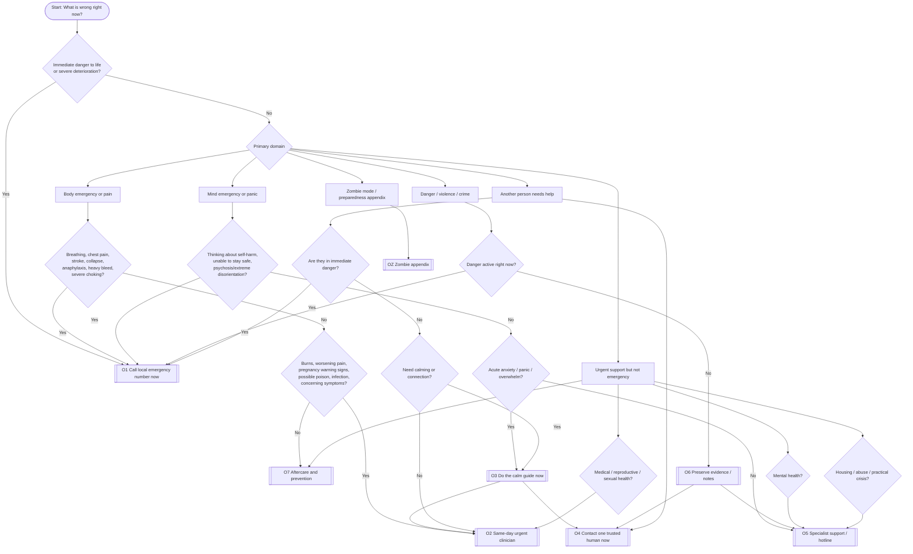
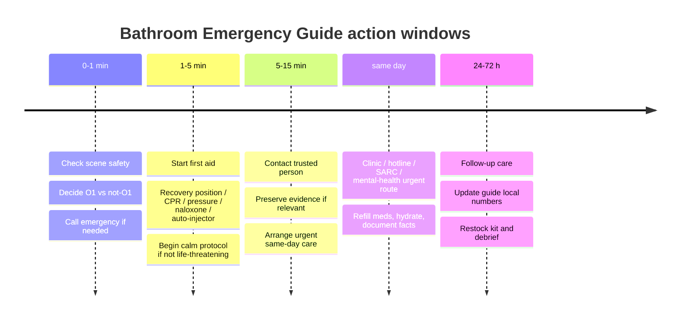

# Bathroom Emergency Guide Revision 1.1.1

## Executive summary

The strongest version of this project is **not** a giant all-purpose bathroom manifesto. It is a **triage-first wall guide** with a small number of clearly labeled entry points, a shared set of outcome destinations, and companion cards for specialized subjects. That structure matches how people behave under stress: they need immediate orientation, simple next actions, and low-friction escalation routes, not a long argument about every possible scenario. The best evidence base for the core guide is a blend of guidance from the entity["organization","World Health Organization","un health agency"] on psychological first aid and stress management, the entity["organization","American Red Cross","us humanitarian org"] on lay first aid, the UK’s entity["organization","National Health Service","uk public health service"] on urgent symptoms and service routing, the entity["organization","National Institute for Health and Care Excellence","uk care guideline body"] on stepped anxiety and panic care, the entity["organization","Centers for Disease Control and Prevention","us public health agency"] on overdose, water, and food safety, and the entity["organization","National Institute of Mental Health","us mental health institute"] on suicide-support actions. citeturn19view0turn18view0turn16view3turn20view1turn20view7turn20view10turn35search2turn33view2turn33view1

For content design, the main poster should resolve to a few shared outcomes: **call emergency now, get same-day urgent care, do the calm guide, contact a trusted person, contact a specialist hotline, preserve evidence, and follow up later**. Large or morally complicated topics from the brainstorm—especially pregnancy options, long-term parenting, detailed law, or societal collapse—should live on **separate companion sheets** or an appendix. That reduces wall clutter and prevents the guide from becoming unsafe by overgeneralizing medical or legal decisions that are time-sensitive and jurisdiction-specific. WHO’s abortion-care guidance explicitly notes that legal and service-delivery contexts vary by country, while NHS pages on ectopic pregnancy and emergency contraception show that reproductive situations also have distinct time windows and symptom escalations; that is a strong reason to separate them from the main emergency poster. citeturn32view0turn32view1turn32view2

Visually, the user’s “math-blue + white + graph paper + formula” instinct is good, but the composition should remain accessibility-first. The poster should use **dark text on a light background**, keep decorative grid lines faint, avoid images of text, and preserve a minimum text/background contrast of at least 4.5:1 for normal text, as recommended by the entity["organization","W3C","web standards consortium"]. A practical palette that fits the requested vibe and meets that threshold is: math blue `#0B57D0` for headings on white (about 6.4:1 contrast), deep navy `#123B7A` for body text on white (about 10.9:1), white `#FFFFFF`, graph-paper blue `#EAF1FB`, and restrained accents reserved for category tags rather than main text. citeturn25view0turn24view0

The printable/digital build should be **HTML-first**, not PDF-first. HTML gives you paged print control through `@media print` and `@page`, allows dual A4/Letter support when paper size is unspecified, and supports accessible math with MathJax’s assistive MathML component. Chrome’s print model also supports margin content in recent versions, but the guide should still degrade gracefully without it. citeturn24view1turn24view3turn24view4turn24view2

## Evidence base and design synthesis

The most defensible content strategy is to divide the main guide into **six top-level entry categories**:

1. **Body emergency now**
2. **Mind emergency now**
3. **Danger / violence / police / evidence**
4. **Another person needs help**
5. **Urgent but not life-threatening support**
6. **Appendix / zombie mode**

That structure reflects official emergency-routing logic: first determine whether a situation is immediately life-threatening, then route to the relevant specialized action. WHO’s risk-communication guidance emphasizes giving people practical information that enables informed decisions in hazards, and Red Cross first-aid guidance similarly starts with checking the scene, calling emergency services, and then providing care. citeturn16view7turn20view1

The user’s original brainstorm contains valuable creativity, but several branches should be **moved out of the core poster**:

- **Pregnancy creation / abortion / parenthood-choice branches** should live on a separate “reproductive decisions and urgent pregnancy symptoms” card, because they combine medical, ethical, and legal context in ways that vary by country and time window. citeturn32view0turn32view1turn32view2
- **Child development, state support, and long-term family ethics** should become a separate “new dependent / future planning” booklet rather than a bathroom emergency flowchart.
- **Detailed self-defense law** should not be summarized as substantive legal advice on the wall. Instead, the wall guide should say “if danger is active: emergency/police now; if danger has passed: preserve evidence, record facts, seek trauma support, get local legal advice.” One government example, from the UK, makes clear that “reasonable force” is highly circumstance-dependent; that is exactly why the poster should signpost rather than litigate. citeturn29view0turn28view2

The visual language can still be unmistakably “mathy” without becoming cold. The successful pattern is:

| Design layer | Recommendation | Why |
|---|---|---|
| Geometry | Use centered circles, blockers, arrows, number lines, and function-curve motifs as **framing devices**, not as information containers | Helps the aesthetic without reducing legibility; avoids images-of-text problems. citeturn25view0turn24view0 |
| Graph paper | Light background grid only, about 5–8% tint, never under dense paragraphs | Faint backgrounds preserve contrast and avoid the WCAG failure pattern of background textures fighting foreground text. citeturn25view0 |
| Typography | Modern sans-serif headings and readable body text; in digital form, prefer real text over baked graphics | Section 508 guidance stresses clear, consistent headings and highly legible text; WCAG does not prescribe a font but does require accessible presentation. citeturn24view5turn24view0 |
| Math | Use MathJax for decorative-but-readable formulas, with assistive MathML enabled | MathJax’s `assistive-mml` component embeds visually hidden MathML for screen readers. citeturn24view2 |
| Print | Build with HTML/CSS using `@media print` and `@page` | MDN documents print media queries and page sizing for paper/PDF output. citeturn24view1turn24view3 |

The page architecture should therefore be:

- **Page one**: “What is wrong right now?” flow graph + emergency numbers + shared outcomes.
- **Page two**: calm guide, first-aid red flags, and “get help now / later”.
- **Page three or foldout back**: hotlines, legal/assault support, and zombie appendix.
- **Digital version**: same content, but with tap targets, timers, `tel:` links, optional collapsibles, and locale packs.

That arrangement is consistent with modern accessibility guidance and is more robust than a single dense poster. citeturn24view0turn24view1turn24view5

## Logic architecture and full flow graph

The cleanest way to interlink everything is to define **shared outcomes** and reuse them from every branch.

### Shared outcomes

| Code | Shared outcome | Intended use |
|---|---|---|
| **O1** | Call local emergency number now | Life-threatening symptoms, immediate danger, collapse, serious violence, suspected stroke, severe bleeding, choking, anaphylaxis, unresponsiveness, severe overdose. citeturn20view7turn20view8turn20view5turn20view0turn22view0turn35search2 |
| **O2** | Same-day urgent clinician / urgent-care route | Urgent mental-health help, possible ectopic pregnancy without rupture signs, worsening injuries, sexual-health follow-up, poisoning questions, urgent but not immediately life-threatening symptoms. citeturn16view4turn32view1turn23search3 |
| **O3** | Do the calm guide now | Panic, anxiety, acute overwhelm, shame spiral, non-danger rumination. citeturn18view0turn16view2turn19view0turn16view3 |
| **O4** | Contact one trusted human now | Isolation, panic, shame, aftercare, practical escort, someone else is worried. citeturn18view0turn19view0 |
| **O5** | Contact a specialist hotline / service | Suicide risk support, domestic abuse, sexual assault, poison, crisis support. citeturn20view10turn28view0turn27view2turn23search3 |
| **O6** | Preserve evidence / notes / meds / identifiers | Assault, spiking, home break-in, legal dispute, treatment history, allergies, medication list. citeturn27view2turn34view0 |
| **O7** | Aftercare and prevention | Follow-up appointments, sleep, routine, kit refill, guide localization, debrief. citeturn18view0turn34view0turn33view2 |
| **OZ** | Zombie appendix | Disaster-preparedness translation for humor + utility. citeturn34view0turn33view2turn33view1turn16view7 |

### Full logical flow graph



This graph deliberately makes many branches converge into the same few destinations. That is the core design improvement over the brainstorm: the wall poster should be a **decision router**, not a storage locker for every full guide. WHO’s risk-communication framing and first-aid triage logic both support that simplification. citeturn16view7turn20view1

### Timeline visual



The time windows above reflect the official emphasis on immediate action for emergency symptoms, fast hotline or urgent-care escalation for crisis states, and later follow-up for prevention and continuity. citeturn20view7turn16view4turn27view2turn34view0

## Guides and shared outcomes

### Calm guide

This section should be titled something like **“Bathroom Reset: 10 Minutes of Legally Permitted Existing”** on the final poster. The tone can be lightly humorous, but the method should remain clinically conservative.

1. **Check reality first.** If there is active danger, collapse, chest pain, stroke signs, heavy bleeding, choking, suicidal intent with inability to stay safe, or another life-threatening emergency, stop the calm guide and go to **O1** immediately. citeturn20view7turn20view8turn20view0turn22view0turn20view10  
2. **Orient to the present.** Say the date, location, and the next tiny task out loud: “I am in the bathroom. It is April 2026. My next job is to stay still for one minute.” This is consistent with psychological first aid’s focus on practical, supportive, dignity-preserving help. citeturn19view0  
3. **Breathe slowly, favoring a longer exhale.** WHO’s current anxiety guidance supports relaxation and/or mindfulness techniques for generalized anxiety and panic disorder, and WHO’s stress guide recommends brief daily self-help skills for stress. A practical poster version is 4 seconds in, 6 seconds out, repeated for 1–2 minutes. citeturn16view2turn16view1turn18view0  
4. **Ground using the room.** Count five visible shapes, four touch sensations, three sounds, two smells, one next action. This is a low-complexity grounding variant suitable for a wall guide; it fits WHO’s practical-stabilization approach even though exact counting variants differ across programs. citeturn19view0turn18view0  
5. **Reduce stress inflow.** Put the phone in “do not scroll” mode for ten minutes. WHO explicitly advises limiting news and social-media exposure when it increases stress. citeturn18view0  
6. **Reconnect.** Text or call one trusted person: “I am overloaded and need a short grounding call.” WHO’s stress guidance recommends maintaining contact with trusted people and sharing concerns. citeturn18view0  
7. **Choose the next rung.** After ten minutes, route to **O4**, **O5**, or **O2** rather than looping endlessly in the bathroom. NICE’s stepped-care model also supports moving from low-intensity self-help to more formal care when symptoms are moderate, severe, persistent, or impairing. citeturn16view3

A good wall subtitle is:  
**“Ten minutes is for stabilizing, not for solving the universe.”**

### Self-ambulance and first-response guide

The universal frame should be the Red Cross “three Cs”: **check, call, care**. That phrasing is short enough for a poster and consistent with first-aid best practice. citeturn20view1

#### Core first-response rules

- **If unresponsive and not breathing or only gasping:** start CPR; Red Cross guidance places this threshold at unresponsive + not breathing/gasping, with 100–120 compressions per minute. citeturn20view4turn7search0  
- **If unresponsive but breathing:** use the recovery position unless you suspect head, neck, or back injury and must move for safety or CPR/bleeding control. citeturn20view2turn20view3  
- **If choking severely:** call emergency help and give 5 back blows plus 5 abdominal thrusts; continue until the person can cough/speak or becomes unresponsive. In pregnancy or when abdominal thrusts are not feasible, use chest thrusts. citeturn22view0  
- **If life-threatening external bleeding:** apply firm direct pressure; use a tourniquet on a limb only if trained and if the bleeding is life-threatening. Continue until the bleeding stops, help arrives, another person relieves you, or the scene becomes unsafe. citeturn20view0  
- **If anaphylaxis is suspected:** use the adrenaline auto-injector if available, call emergency services, and lie flat with legs raised unless breathing difficulty makes slow upright positioning necessary. citeturn20view5turn16view5  
- **If stroke signs appear:** remember FAST—face droop, arm weakness, speech difficulty, time to call emergency services. Do not drive yourself. citeturn20view8  
- **If there is new chest pain suggestive of heart attack:** treat it as an emergency. NHS guidance routes sudden chest pain, pressure, radiation, sweating, nausea, lightheadedness, or shortness of breath to immediate emergency care. citeturn20view6turn7search7  
- **If burned:** cool the skin with cool clean running water as quickly as possible, then escalate for burns involving face, hands, genitals, large surface area, electrical/chemical mechanism, deep tissue, or circumferential burns. citeturn21view0  
- **If opioid overdose is possible:** if naloxone is available, give it and call emergency services; try to keep the person breathing, lay them on their side, and stay with them. Naloxone is safe and can reverse opioid overdose. citeturn35search2turn35search4  
- **If poisoning is suspected:** contact local poison services immediately; in the United States, Poison Help is 1-800-222-1222 nationwide. citeturn23search3turn23search11  
- **If nosebleed only:** sit forward slightly and pinch the nostrils. citeturn20view9

### Medical escalation and specialist signposts

A good emergency guide should also say, very clearly, when the bathroom wall stops being enough.

#### Mental-health escalation

If the person **cannot stay safe**, is actively suicidal, is psychotic or grossly disoriented, or there is immediate danger, route to **O1**. If urgent mental-health help is needed but it is not yet an immediate emergency, use the local urgent route. In England, for example, NHS 111 now includes a mental-health option; in the United States, 988 provides crisis support. NIMH’s “5 Action Steps” is the best evidence-based micro-guide for “someone else might be suicidal”: **Ask, Be There, Help Keep Them Safe, Help Them Connect, Follow Up**. citeturn16view4turn20view10turn2search1

#### Sexual assault, spiking, and forensic considerations

This topic belongs on the main guide because people often first notice something is wrong in a bathroom. The correct poster guidance is:

- get medical help for injuries and STI/pregnancy risk,
- if evidence preservation matters, **try not to wash or change clothes immediately**,
- specialist sexual-assault services can still help even if you already have washed,
- specialist centers can provide medical, practical, emotional, and forensic support whether or not you decide to report to police immediately. citeturn27view2turn27view3

That is a good place for **O6 → O5** cross-linking.

#### Pregnancy, emergency contraception, and early-pregnancy warning signs

Pregnancy-related content should be a **companion card**, not a large branch in the main triage chart. The main poster should only carry a short signpost:

- **Possible ruptured ectopic pregnancy** with sudden severe abdominal pain, dizziness/fainting, sickness, and pallor is an emergency. citeturn32view1  
- **Emergency contraception** has time windows of 3–5 days after unprotected sex depending on method; sooner is generally more effective. citeturn32view2  
- **Abortion and pregnancy-option guidance** should be localized to law and service availability; WHO’s guideline stresses that legal, regulatory, policy, and service-delivery contexts vary across countries. citeturn32view0

### Legal and ethical signposts

The legal layer of this guide should be framed as **routing**, not substantive advice.

If there is active danger or a crime in progress, the poster should say **“call emergency / police now”**. If danger has passed, it should say **“preserve evidence if safe, record facts, seek trauma support, seek local legal advice.”** UK government guidance is a good example of why nuance is necessary: it says a person may use reasonable force to protect self or others in the home, but what counts as reasonable depends on the circumstances, and continued attack after danger has passed may be unlawful. citeturn29view0turn28view2

A clean legal/ethical box for the poster is:

- **Active danger:** O1  
- **Danger ended, evidence matters:** O6  
- **Need police but not emergency:** local non-emergency police route  
- **Need survivor services:** O5  
- **Need a lawyer:** local directory / legal aid, not the bathroom wall

This is methodically safer than trying to summarize homicide, self-defense, reporting duties, child-protection law, or abortion law in poster form.

### Social support and hotline layer

The poster should include a **localization bar** at the top with blanks for local emergency, urgent care, poison, crisis line, domestic abuse, and one trusted contact. Because the user explicitly left location unspecified, the guide should ship with placeholders plus a small comparison table.

| Region / service pack | Emergency | Urgent mental-health or crisis support | Notes |
|---|---|---|---|
| entity["organization","European Union","political union"] | 112, free across the EU. citeturn30view0 | Varies by country; localize in build | 112 operators in many countries can answer in national language and often English or French. citeturn30view0 |
| entity["country","United Kingdom","britain and ni"] | 999 or 112. citeturn30view9 | NHS 111 for urgent help, including mental-health routing in England; entity["organization","Samaritans","uk and roi charity"] 116 123 for free 24/7 emotional support. citeturn16view4turn30view5 | Non-emergency police: 101. If calling 999 from a mobile and unable to speak, press 55 when prompted in the UK. citeturn28view0turn28view1 |
| entity["country","United States","north america"] | 911. citeturn30view8 | 988 for call/text crisis support. citeturn2search1turn20view10 | Poison Help: 1-800-222-1222 nationwide. citeturn23search3 |
| entity["country","Canada","north america"] | 9-1-1. citeturn30view3 | 9-8-8 call/text, 24/7. citeturn30view3 | Provincial violence resources vary; localize by province/territory. citeturn30view3 |
| entity["country","Australia","oceania"] | 000; 112 also works on some mobile services. citeturn30view4 | entity["organization","Lifeline","australia crisis service"] 13 11 14, 24/7 crisis support. citeturn30view4turn14search14 | 106 exists for TTY emergency access; localize if relevant. citeturn30view4 |

## Severity and timeline tables

### Emergency action by severity

| Severity band | Typical examples | Immediate action | Shared outcome |
|---|---|---|---|
| **Red** | Unresponsive and not breathing/gasping; stroke signs; severe choking; heavy bleeding; anaphylaxis; chest pain suggestive of heart attack; severe overdose; immediate violence. citeturn20view4turn20view8turn22view0turn20view0turn20view5turn20view6turn35search2turn28view2 | Call emergency services now. Start first aid within training: CPR, recovery position, direct pressure, naloxone, auto-injector, choking care. citeturn20view1turn20view2turn20view0turn35search2 | **O1** |
| **Amber** | Urgent mental-health deterioration without immediate danger; worsening burns; possible ectopic pregnancy without collapse; poisoning question; concerning symptoms needing same-day medical review. citeturn16view4turn21view0turn32view1turn23search3 | Same-day urgent clinician, urgent line, or poison service; do not let the problem drift. citeturn16view4turn23search3 | **O2** |
| **Blue** | Panic, anxiety spike, dissociation, shame spiral, “I need ten minutes to stop escalating.” citeturn18view0turn16view2 | Do the 10-minute calm guide; then contact one trusted person or a crisis line if the state does not settle. citeturn18view0turn20view10 | **O3 → O4/O5** |
| **Purple** | Assault/spiking/abuse aftermath; danger may have passed, but safety, support, or evidence preservation matters. citeturn27view2turn28view0 | Secure safety, preserve evidence if wanted, seek specialist service, get trauma-informed support, contact police if desired or necessary. citeturn27view2turn27view3 | **O6 → O5/O4** |
| **Green** | Minor issue settled; no current danger; follow-up, restocking, planning, localization, debrief. citeturn18view0turn34view0 | Rest, hydrate, note what helped, refill supplies, book follow-up. citeturn18view0turn34view0 | **O7** |

### Timeline comparison

| Time window | Priority | Examples |
|---|---|---|
| **First minute** | Decide if this is **O1** | Red-flag symptoms, active danger, collapse, stroke FAST, severe overdose, choking, heavy bleed. citeturn20view8turn20view0turn22view0turn35search2 |
| **First five minutes** | First aid or stabilization | CPR, recovery position, direct pressure, auto-injector, naloxone, slow breathing, grounding. citeturn20view4turn20view2turn20view0turn20view5turn35search2turn16view2 |
| **Five to fifteen minutes** | Route, connect, preserve | Call trusted person, urgent line, poison center, SARC, or police; preserve clothes/notes if relevant. citeturn27view2turn23search3turn16view4 |
| **Same day** | Clinical and practical follow-up | Urgent clinic, sexual-health support, early-pregnancy review, mental-health urgent route. citeturn16view4turn32view1turn32view2turn27view3 |
| **Within 24–72 hours** | Prevention and continuity | Refill kit, localize numbers, update medication list, rebuild routine, arrange continuing care. citeturn18view0turn34view0turn33view2 |

## Print and digital implementation

### UX/content layout for printable HTML/PDF and optional digital version

The print architecture should use a **modular card system**:

- **Top bar:** “If life-threatening, call [LOCAL EMERGENCY] now.”
- **Left column:** flow graph
- **Center column:** calm guide
- **Right column:** first-aid red flags
- **Footer strip:** trusted contact, urgent care, poison, crisis, abuse, local address
- **Back/foldout:** hotlines, legal/ethical routes, zombie appendix

In digital form, add:

- `tel:` links for emergency and crisis numbers
- one-tap timers for 1-minute and 10-minute breathing/reset windows
- locale-switch YAML/JSON pack
- collapsible companion cards for “pregnancy”, “someone else”, and “after violence”
- keyboard focus states and motion-reduced mode

These recommendations follow the accessibility baseline from WCAG, Section 508 typography guidance, and browser print guidance from MDN. citeturn24view0turn24view5turn24view1turn24view3

### Accessibility notes

- Keep body text as actual HTML text, not baked into images. WCAG’s contrast and text guidance explicitly favor readable real text over stylized image text. citeturn25view0  
- Use at least AA contrast for normal text and avoid letting the graph-paper background carry meaning. citeturn25view0  
- Offer visible headings, short paragraphs, and consistent landmarks. WCAG 2.2 is the current recommended baseline from W3C. citeturn24view0  
- For formulas, use MathJax with `assistive-mml` so the digital version remains accessible to screen readers. citeturn24view2  
- Because paper size was unspecified, build with `@page { size: auto; }` and provide A4 and Letter variants as optional overrides. citeturn24view3

### Directory tree

```text
bathroom-emergency-guide/
├─ README.md
├─ docs/
│  ├─ research-report-v1.1.1.md
│  └─ localization-notes.md
├─ src/
│  ├─ content/
│  │  ├─ guide.md
│  │  ├─ calm-guide.md
│  │  ├─ first-aid-cards.md
│  │  ├─ legal-ethical-signposts.md
│  │  ├─ zombie-appendix.md
│  │  └─ local-pack.template.yml
│  ├─ diagrams/
│  │  ├─ flowgraph.mmd
│  │  ├─ timeline.mmd
│  │  ├─ flowgraph.svg
│  │  ├─ timeline.svg
│  │  └─ icons/
│  │     ├─ emergency.svg
│  │     ├─ calm.svg
│  │     ├─ hotline.svg
│  │     └─ zombie.svg
│  ├─ assets/
│  │  ├─ graph-paper.svg
│  │  ├─ logo-math-blue.svg
│  │  └─ formulas/
│  │     └─ urgency-badge.svg
│  ├─ css/
│  │  ├─ screen.css
│  │  └─ print.css
│  └─ js/
│     └─ mathjax.config.js
└─ dist/
   ├─ bathroom-emergency-guide-v1.1.1.html
   ├─ assets/
   │  ├─ flowgraph.svg
   │  ├─ timeline.svg
   │  └─ graph-paper.svg
   └─ bathroom-emergency-guide-v1.1.1.pdf
```

### Sample print CSS snippet

```css
/* src/css/print.css */
@page {
  size: auto;
  margin: 12mm;
}

:root {
  --math-blue: #0B57D0;
  --deep-ink: #123B7A;
  --paper: #FFFFFF;
  --grid: #EAF1FB;
  --safe: #E8F5EE;
  --warn: #FFF6DA;
  --danger: #FDECEC;
  --support: #EEF3FF;
}

html, body {
  color: var(--deep-ink);
  background: var(--paper);
  font-family: Inter, "Public Sans", "Source Sans 3", system-ui, sans-serif;
  line-height: 1.4;
  -webkit-print-color-adjust: exact;
  print-color-adjust: exact;
}

body::before {
  content: "";
  position: fixed;
  inset: 0;
  background-image:
    linear-gradient(to right, var(--grid) 1px, transparent 1px),
    linear-gradient(to bottom, var(--grid) 1px, transparent 1px);
  background-size: 12mm 12mm;
  opacity: 0.45;
  pointer-events: none;
  z-index: -1;
}

h1, h2, h3 {
  color: var(--math-blue);
  line-height: 1.15;
}

.card, .table-wrap, figure {
  break-inside: avoid;
  page-break-inside: avoid;
}

@media print {
  .screen-only { display: none !important; }
  a[href^="tel:"]::after { content: ""; }
}
```

This print approach follows MDN’s `@media print`/`@page` model. If you want generated margin content for page numbers in current Chrome builds, you can add margin-box rules as an enhancement rather than a dependency. citeturn24view1turn24view3turn24view4

### Sample MathJax approach

```html
<script>
window.MathJax = {
  tex: {
    inlineMath: [['\\(','\\)'], ['$', '$']],
    displayMath: [['\\[','\\]'], ['$$','$$']]
  },
  loader: { load: ['input/tex', 'output/chtml', '[tex]/ams', 'a11y/assistive-mml'] },
  tex: { packages: { '[+]': ['ams'] } }
};
</script>
<script defer src="https://cdn.jsdelivr.net/npm/mathjax@4/tex-chtml.js"></script>
```

MathJax’s accessibility component can expose hidden MathML to assistive technology while keeping visual rendering readable. citeturn24view2

### Sample SVG export stub

```svg
<svg xmlns="http://www.w3.org/2000/svg" width="1200" height="600" viewBox="0 0 1200 600" role="img" aria-labelledby="title desc">
  <title id="title">Bathroom Emergency Guide flowgraph preview</title>
  <desc id="desc">A centered logical diagram routing body, mind, danger, and support issues to shared outcomes.</desc>
  <rect width="1200" height="600" fill="#FFFFFF"/>
  <g stroke="#0B57D0" fill="none" stroke-width="3">
    <circle cx="600" cy="80" r="52"/>
    <path d="M600 132 L600 190"/>
    <rect x="430" y="190" width="340" height="76" rx="18"/>
    <path d="M600 266 L250 350 M600 266 L470 350 M600 266 L730 350 M600 266 L950 350"/>
  </g>
  <g fill="#123B7A" font-family="Inter, sans-serif" text-anchor="middle">
    <text x="600" y="88" font-size="26">Start</text>
    <text x="600" y="235" font-size="24">Immediate danger?</text>
    <text x="250" y="390" font-size="22">Body</text>
    <text x="470" y="390" font-size="22">Mind</text>
    <text x="730" y="390" font-size="22">Danger</text>
    <text x="950" y="390" font-size="22">Support</text>
  </g>
</svg>
```

### Compiled revisioned HTML ready to print from Chrome

```html
<!doctype html>
<html lang="en-US">
<head>
  <meta charset="utf-8" />
  <meta name="viewport" content="width=device-width,initial-scale=1" />
  <meta name="color-scheme" content="light only" />
  <title>Bathroom Emergency Guide v1.1.1</title>

  <style>
    @page { size: auto; margin: 12mm; }

    :root{
      --math-blue:#0B57D0;
      --deep-ink:#123B7A;
      --paper:#FFFFFF;
      --grid:#EAF1FB;
      --safe:#E8F5EE;
      --warn:#FFF6DA;
      --danger:#FDECEC;
      --support:#EEF3FF;
      --muted:#5A6B8A;
      --line:#C7D7F2;
      --radius:14px;
    }

    *{ box-sizing:border-box; }
    html,body{
      margin:0;
      padding:0;
      color:var(--deep-ink);
      background:var(--paper);
      font-family:Inter,"Public Sans","Source Sans 3",system-ui,sans-serif;
      line-height:1.38;
      -webkit-print-color-adjust:exact;
      print-color-adjust:exact;
    }

    body::before{
      content:"";
      position:fixed;
      inset:0;
      z-index:-1;
      background-image:
        linear-gradient(to right, var(--grid) 1px, transparent 1px),
        linear-gradient(to bottom, var(--grid) 1px, transparent 1px);
      background-size:12mm 12mm;
      opacity:.45;
      pointer-events:none;
    }

    .page{
      max-width:1120px;
      margin:0 auto;
      padding:18mm 12mm 14mm;
    }

    h1,h2,h3{
      margin:.2rem 0 .5rem;
      line-height:1.12;
      color:var(--math-blue);
      font-weight:800;
      letter-spacing:.01em;
    }

    h1{ font-size:28pt; }
    h2{ font-size:18pt; margin-top:1rem; }
    h3{ font-size:13pt; margin-top:.8rem; }

    p, li, td, th{
      font-size:10.5pt;
    }

    .hero{
      display:grid;
      grid-template-columns: 1.25fr .95fr;
      gap:14px;
      align-items:start;
    }

    .card{
      background:rgba(255,255,255,.92);
      border:1px solid var(--line);
      border-radius:var(--radius);
      padding:12px 14px;
      break-inside:avoid;
      page-break-inside:avoid;
    }

    .emergency-bar{
      display:grid;
      grid-template-columns:repeat(3,1fr);
      gap:10px;
      margin:10px 0 14px;
    }

    .pill{
      display:inline-block;
      padding:.2rem .55rem;
      border-radius:999px;
      font-weight:700;
      font-size:9pt;
      border:1px solid currentColor;
    }

    .safe{ background:var(--safe); color:#145C34; }
    .warn{ background:var(--warn); color:#7A5600; }
    .danger{ background:var(--danger); color:#8A1D1D; }
    .support{ background:var(--support); color:#274D9B; }

    .grid-2{
      display:grid;
      grid-template-columns:1fr 1fr;
      gap:14px;
    }

    .grid-3{
      display:grid;
      grid-template-columns:1fr 1fr 1fr;
      gap:10px;
    }

    .outcomes{
      display:grid;
      grid-template-columns:repeat(4,1fr);
      gap:8px;
      margin-top:10px;
    }

    .outcome{
      border:1px solid var(--line);
      border-radius:12px;
      padding:9px 10px;
      background:#fff;
    }

    .outcome strong{
      display:block;
      color:var(--math-blue);
      margin-bottom:.2rem;
    }

    .small{
      color:var(--muted);
      font-size:9pt;
    }

    .tight ol, .tight ul{ margin:.45rem 0 .1rem 1.1rem; }
    .tight li{ margin:.2rem 0; }

    table{
      width:100%;
      border-collapse:collapse;
      margin-top:8px;
    }

    th,td{
      border:1px solid var(--line);
      vertical-align:top;
      padding:8px 9px;
      text-align:left;
    }

    th{
      background:#F7FAFF;
      font-weight:800;
    }

    figure{
      margin:.4rem 0 0;
      break-inside:avoid;
      page-break-inside:avoid;
    }

    figcaption{
      font-size:8.8pt;
      color:var(--muted);
      margin-top:6px;
    }

    .number-line{
      width:100%;
      height:auto;
      display:block;
    }

    .footer-bar{
      display:grid;
      grid-template-columns:2fr 1fr 1fr;
      gap:10px;
      margin-top:12px;
    }

    .screen-only{ display:block; }

    @media print{
      .screen-only{ display:none !important; }
      a[href^="tel:"]::after{ content:""; }
      .page{ padding:0; max-width:none; }
    }
  </style>

  <script>
    window.MathJax = {
      loader: { load: ['input/tex', 'output/chtml', 'a11y/assistive-mml'] },
      tex: {
        inlineMath: [['\\(','\\)'], ['$', '$']],
        displayMath: [['\\[','\\]'], ['$$','$$']]
      }
    };
  </script>
  <script defer src="https://cdn.jsdelivr.net/npm/mathjax@4/tex-chtml.js"></script>
</head>
<body>
  <main class="page">
    <header class="hero">
      <section class="card">
        <h1>Bathroom Emergency Guide</h1>
        <p><strong>Revision 1.1.1</strong> · printable, digital-friendly, and localizable</p>
        <p class="small">Visual formula motif only, not a clinical score:
          \[
            U = f(\text{danger}, \text{speed}, \text{loss of function})
          \]
          If \(U\) crosses the red threshold, call emergency now.
        </p>

        <div class="emergency-bar">
          <div class="card" style="padding:10px">
            <strong>Emergency</strong><br>[LOCAL EMERGENCY]
          </div>
          <div class="card" style="padding:10px">
            <strong>Urgent care / advice</strong><br>[LOCAL URGENT LINE]
          </div>
          <div class="card" style="padding:10px">
            <strong>Trusted contact</strong><br>[NAME / NUMBER]
          </div>
        </div>

        <div class="outcomes">
          <div class="outcome"><strong>O1</strong>Call emergency now</div>
          <div class="outcome"><strong>O2</strong>Same-day urgent clinician</div>
          <div class="outcome"><strong>O3</strong>Calm guide now</div>
          <div class="outcome"><strong>O4</strong>Contact one human</div>
          <div class="outcome"><strong>O5</strong>Use specialist support</div>
          <div class="outcome"><strong>O6</strong>Preserve evidence / notes</div>
          <div class="outcome"><strong>O7</strong>Aftercare / prevention</div>
          <div class="outcome"><strong>OZ</strong>Zombie appendix</div>
        </div>
      </section>

      <figure class="card">
        <svg viewBox="0 0 520 360" width="100%" height="auto" role="img" aria-label="Centered flow diagram">
          <rect width="520" height="360" fill="#FFFFFF"/>
          <defs>
            <style>
              .s{stroke:#0B57D0;stroke-width:3;fill:none}
              .f{fill:#123B7A;font:700 15px Inter,sans-serif;text-anchor:middle}
              .g{fill:#5A6B8A;font:600 12px Inter,sans-serif;text-anchor:middle}
            </style>
          </defs>
          <circle cx="260" cy="42" r="28" class="s"/>
          <text x="260" y="47" class="f">Start</text>
          <line x1="260" y1="70" x2="260" y2="102" class="s"/>
          <rect x="180" y="102" width="160" height="48" rx="14" class="s"/>
          <text x="260" y="131" class="f">Immediate danger?</text>
          <line x1="260" y1="150" x2="260" y2="186" class="s"/>
          <line x1="260" y1="186" x2="92" y2="228" class="s"/>
          <line x1="260" y1="186" x2="204" y2="228" class="s"/>
          <line x1="260" y1="186" x2="316" y2="228" class="s"/>
          <line x1="260" y1="186" x2="428" y2="228" class="s"/>
          <rect x="24" y="228" width="136" height="52" rx="12" class="s"/>
          <rect x="160" y="228" width="136" height="52" rx="12" class="s"/>
          <rect x="296" y="228" width="136" height="52" rx="12" class="s"/>
          <rect x="392" y="228" width="104" height="52" rx="12" class="s"/>
          <text x="92" y="259" class="f">Body</text>
          <text x="228" y="259" class="f">Mind</text>
          <text x="364" y="259" class="f">Danger</text>
          <text x="444" y="259" class="f">Support</text>
          <text x="92" y="304" class="g">O1 or O2</text>
          <text x="228" y="304" class="g">O3 → O4 / O5</text>
          <text x="364" y="304" class="g">O1 or O6</text>
          <text x="444" y="304" class="g">O2 / O5 / OZ</text>
        </svg>
        <figcaption>Use exported SVGs in production; keep this box centered and visually quiet.</figcaption>
      </figure>
    </header>

    <section class="grid-2" style="margin-top:14px">
      <section class="card tight">
        <h2>What is wrong right now?</h2>
        <ol>
          <li><span class="pill danger">Body emergency</span> Pain, bleeding, breathing trouble, chest pain, stroke signs, burns, collapse, choking.</li>
          <li><span class="pill support">Mind emergency</span> Panic, acute anxiety, shame spiral, can’t think straight.</li>
          <li><span class="pill danger">Danger / crime</span> Violence, abuse, break-in, assault, spiking.</li>
          <li><span class="pill warn">Someone else</span> A friend, guest, child, or neighbor needs help.</li>
          <li><span class="pill safe">Urgent but not emergency</span> Need support, a plan, or same-day care.</li>
          <li><span class="pill support">Zombie mode</span> Preparedness appendix for unusually dramatic days.</li>
        </ol>
      </section>

      <section class="card tight">
        <h2>Calm guide</h2>
        <ol>
          <li>If danger is real, stop and go to <strong>O1</strong>.</li>
          <li>Name where you are and today’s date.</li>
          <li>Breathe: in 4, out 6, for 10 rounds.</li>
          <li>Count 5 things you see, 4 you feel, 3 you hear.</li>
          <li>Do not doom-scroll for 10 minutes.</li>
          <li>Text one trusted person.</li>
          <li>Choose the next rung: <strong>O4</strong>, <strong>O5</strong>, or <strong>O2</strong>.</li>
        </ol>
      </section>
    </section>

    <section class="card">
      <h2>Body red flags</h2>
      <table>
        <thead>
          <tr>
            <th>Problem</th>
            <th>Do now</th>
            <th>Route</th>
          </tr>
        </thead>
        <tbody>
          <tr>
            <td>Unresponsive, not breathing, or only gasping</td>
            <td>Start CPR; get AED if available</td>
            <td>O1</td>
          </tr>
          <tr>
            <td>Unresponsive but breathing</td>
            <td>Recovery position unless spinal risk</td>
            <td>O1</td>
          </tr>
          <tr>
            <td>Heavy bleeding</td>
            <td>Firm direct pressure; tourniquet only if trained</td>
            <td>O1</td>
          </tr>
          <tr>
            <td>Choking</td>
            <td>5 back blows + 5 thrusts</td>
            <td>O1</td>
          </tr>
          <tr>
            <td>Stroke FAST or chest pain</td>
            <td>Call emergency now</td>
            <td>O1</td>
          </tr>
          <tr>
            <td>Anaphylaxis</td>
            <td>Use auto-injector if available; call emergency</td>
            <td>O1</td>
          </tr>
          <tr>
            <td>Burns</td>
            <td>Cool running water; assess size/location</td>
            <td>O1 or O2</td>
          </tr>
          <tr>
            <td>Possible opioid overdose</td>
            <td>Naloxone, keep breathing, side position, stay</td>
            <td>O1</td>
          </tr>
        </tbody>
      </table>
    </section>

    <section class="grid-3" style="margin-top:14px">
      <section class="card tight">
        <h3>Danger / violence</h3>
        <ul>
          <li>Active danger: O1</li>
          <li>After danger: O6</li>
          <li>Preserve clothes / notes if useful</li>
          <li>Specialist support: O5</li>
        </ul>
      </section>

      <section class="card tight">
        <h3>Someone else may be suicidal</h3>
        <ul>
          <li>Ask directly</li>
          <li>Be there</li>
          <li>Help keep them safe</li>
          <li>Help them connect</li>
          <li>Follow up</li>
        </ul>
      </section>

      <section class="card tight">
        <h3>Zombie mode</h3>
        <ul>
          <li>If institutions work: use them</li>
          <li>If power fails: water, meds, food, hygiene</li>
          <li>If chaos grows: people, comms, plan, roles</li>
          <li>If fiction becomes reality: still sanitize hands</li>
        </ul>
      </section>
    </section>

    <section class="card" style="margin-top:14px">
      <h2>Action timeline</h2>
      <svg class="number-line" viewBox="0 0 1100 160" role="img" aria-label="Timeline number line">
        <rect width="1100" height="160" fill="#FFFFFF"/>
        <line x1="80" y1="92" x2="1020" y2="92" stroke="#0B57D0" stroke-width="4"/>
        <g fill="#0B57D0" font-family="Inter, sans-serif" font-size="14" text-anchor="middle">
          <circle cx="120" cy="92" r="8"/><text x="120" y="124">0–1 min</text>
          <circle cx="290" cy="92" r="8"/><text x="290" y="124">1–5 min</text>
          <circle cx="470" cy="92" r="8"/><text x="470" y="124">5–15 min</text>
          <circle cx="690" cy="92" r="8"/><text x="690" y="124">same day</text>
          <circle cx="930" cy="92" r="8"/><text x="930" y="124">24–72 h</text>
        </g>
        <g fill="#123B7A" font-family="Inter, sans-serif" font-size="12" text-anchor="middle">
          <text x="120" y="50">danger check</text>
          <text x="290" y="50">first aid or calm</text>
          <text x="470" y="50">route + connect</text>
          <text x="690" y="50">urgent care / hotline</text>
          <text x="930" y="50">aftercare + refill</text>
        </g>
      </svg>
    </section>

    <footer class="footer-bar">
      <section class="card">
        <strong>Local address</strong><br>[YOUR ADDRESS HERE]<br>
        <span class="small">Useful for emergency calls and stressed brains.</span>
      </section>
      <section class="card">
        <strong>Medication / allergies</strong><br>[OPTIONAL LOCAL NOTE]
      </section>
      <section class="card">
        <strong>Revision</strong><br>v1.1.1
      </section>
    </footer>
  </main>
</body>
</html>
```

The file above is intentionally **single-file, Chrome-printable, locale-friendly, and easy to fork**. It uses `@page size: auto` because target paper size was unspecified, and it keeps local numbers as placeholders for safe deployment. The accessibility and print choices are grounded in W3C, Section 508, MDN, MathJax, and Chrome print guidance. citeturn24view0turn24view5turn24view1turn24view3turn24view2turn24view4

## Zombie appendix and open questions

### Zombie appendix

The playful appendix works best when it is obviously a joke in framing but serious in content. It should be labeled something like **“If civilization appears to be collapsing, do the non-cinematic things first.”**

A practical three-stage appendix is:

| Zombie label | Real preparedness meaning |
|---|---|
| **Stage one: society still exists** | Call professionals first. Use emergency services, public-health info, and official hazard guidance before improvising. WHO’s risk-communication guidance is explicit that trusted, timely information is essential in emergencies. citeturn16view7 |
| **Stage two: power/infrastructure disruption** | Prioritize water, medications, food, lighting, communication, hygiene, and documents. Ready/Red Cross guidance supports at least 1 gallon of water per person per day, non-perishable food, meds, first aid, sanitation items, chargers, and key documents. CDC guidance gives specific food and water safety thresholds for outages and emergencies. citeturn34view0turn33view2turn33view1 |
| **Stage three: longer disruption / group survival** | Shift from “gear” to “coordination”: people, roles, information, sanitation, and vulnerable-person support. WHO’s RCCE guidance supports community-centered communication and participation; preparedness is social, not just individual. citeturn16view7 |

That means the appendix can humorously say:

- **Find water before discourse.**
- **Collect meds before collectibles.**
- **Secure people before props.**
- **Hygiene is civilization.**
- **If the fridge was warm for 4 hours, stop pretending leftovers are immortal.** citeturn33view1

### Open questions and limitations

A few items remain intentionally unresolved because the request left them unspecified:

- **Local emergency numbers are unspecified.** The guide should ship with placeholders and a small locale pack, not hard-coded assumptions. Emergency numbers differ across regions. citeturn30view0turn30view3turn30view4turn30view8turn30view9  
- **Target paper size is unspecified.** The implementation should therefore default to `@page size: auto` and offer A4 and Letter presets. citeturn24view3  
- **Legal rules are jurisdiction-specific.** The poster should route to professional help instead of trying to encode detailed substantive law. citeturn29view0turn28view2  
- **This is a lay-response guide, not a replacement for professional medical care, crisis care, or certified first-aid training.** That limitation is consistent with the official sources used throughout. citeturn20view1turn19view0turn16view4